# ☣️ Grupo Corrupção (Corruption)

A **Corrupção** oferece os maiores multiplicadores do jogo, mas a um custo terrível. Estes Curingas podem destruir suas próprias cartas, consumir seu dinheiro ou até mesmo "corromper" outros Curingas, tornando-os negativos ou inúteis após um tempo. É o caminho do risco absoluto para quem busca o poder proibido.

| Imagem | Detalhes do Curinga |
| :---: | :--- |
| 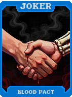 | **Pacto de Sangue (Blood Pact)** **+30 Multi**, mas perde 1 de Vida (mãos) por rodada. |
| 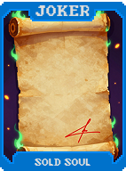 | **Alma Vendida (Sold Soul)** **+100 Fichas**, mas define seu dinheiro para **$0** ao comprar. |
| 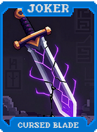 | **Lâmina Maldita (Cursed Blade)** **+15 Multi**. Destrói a carta mais à direita da mão jogada. |
| 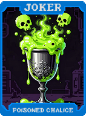 | **Cálice Envenenado (Poisoned Chalice)** **X2 Multi**, mas perde **$2** por mão jogada. |
| 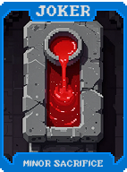 | **Sacrifício Menor (Minor Sacrifice)** Destrua uma carta da mão para ganhar **$3**. |
| 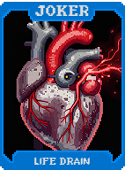 | **Drenar Vida (Life Drain)** **+10 Multi** por cada mão restante. Perde **1 mão** máxima. |
| 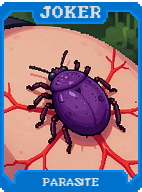 | **Parasita (Parasite)** **+5 Multi** para cada outro Curinga. Os outros Curingas são anulados. |
| 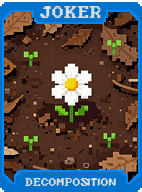 | **Decomposição (Decomposition)** Cartas descartadas são destruídas. Ganha **+5 Multi** permanente por carta destruída. |
| 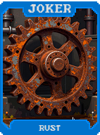 | **Ferrugem (Rust)** Curingas de Aço dão **X1.5 Multi**, mas têm chance de serem destruídos. |
| 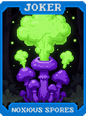 | **Esporos Nocivos (Noxious Spores)** **+20 Multi**. Cartas jogadas perdem seu naipe. |
| 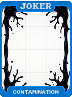 | **Contaminação (Contamination)** Transforma cartas jogadas em **Espadas** após pontuar e dá **+10 Fichas**. |
| 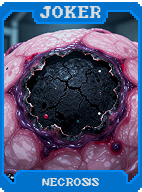 | **Necrose (Necrosis)** Cartas de Realeza dão **-10 Fichas**, cartas numéricas dão **+20 Fichas**. |
|  | **Peste (Plague)** **1 em 3** chance de destruir uma carta descartada. |
|  | **Mão Podre (Rotten Hand)** Jogar a mesma mão 2x seguidas faz a segunda não pontuar, mas dá **$10**. |
| 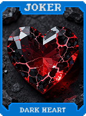 | **Coração Sombrio (Dark Heart)** **+15 Multi** se não tiver cartas de Copas no baralho. |
| 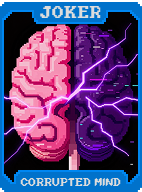 | **Mente Corrompida (Corrupted Mind)** **-1 Tamanho de Mão**. **+25 Multi**. |
| 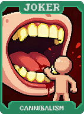 | **Canibalismo (Cannibalism)** Destrói um Curinga aleatório para ganhar **X3 Multi** nesta rodada. |
| 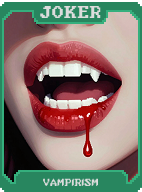 | **Vampirismo (Vampirism)** Remove a Melhoria de cartas jogadas para ganhar **+2 Multi** permanente. |
| 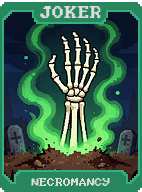 | **Necromancia (Necromancy)** Traz de volta a última carta destruída para a sua mão. |
|  | **Oferenda (Offering)** Se descartar um **Royal Flush**, ganhe **$50**. |
| 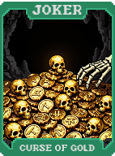 | **Maldição do Ouro (Curse of Gold)** Ganha **$1** por carta jogada, mas elas não dão Fichas. |
| 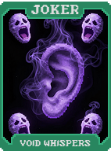 | **Sussurros do Vazio (Void Whispers)** **X2.5 Multi** se tiver menos de 20 cartas no baralho. |
| 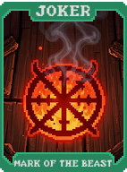 | **Marca da Besta (Mark of the Beast)** **666 Fichas**. Define suas mãos para **1**. |
| 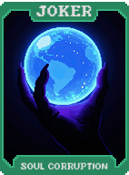 | **Corrupção da Alma (Soul Corruption)** Transforma cartas de Tarô em cartas Espectrais. |
| 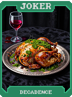 | **Decadência (Decadence)** **X4 Multi** na primeira Aposta, diminuindo a cada Aposta seguinte. |
| 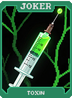 | **Toxina (Toxin)** Cartas recebem debuff permanente, mas dão **+50 Multi** nesta mão. |
| 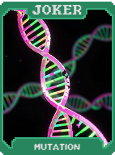 | **Mutação (Mutation)** Ao final da rodada, transforma uma carta aleatória em outra e dá **+15 Multi**. |
| 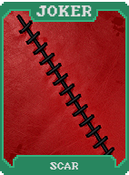 | **Cicatriz (Scar)** Ganha **+10 Fichas** para cada carta destruída nesta partida. |
| 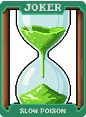 | **Veneno Lento (Slow Poison)** **X3 Multi**, mas você perde se não vencer em 3 mãos. |
| 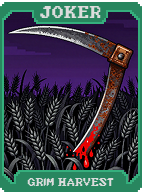 | **Colheita Sombria (Grim Harvest)** Ganha **$1** por cada carta destruída nesta partida. |
| 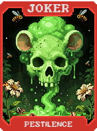 | **Peste (Pestilence)** Ao jogar um **Flush**, transforma todas as cartas da mão no mesmo naipe. |
| 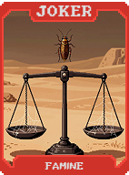 | **Fome (Famine)** Reduz o tamanho da mão para **3**. **X5 Multi**. |
| 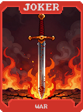 | **Guerra (War)** Destrói todas as cartas não jogadas e ganha **+10 Multi** por cada uma. |
| 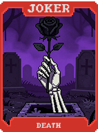 | **Morte (Death)** Se for a última mão, transforma as cartas em **Ouro** e vence automaticamente. |
| 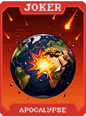 | **Apocalipse (Apocalypse)** Ao vender, destrói todos os Curingas e ganha **X10 Multi** permanente. |
| 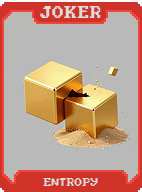 | **Entropia (Entropy)** Embaralha os naipes e valores da mão após jogar. |
| 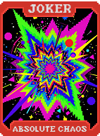 | **Caos Absoluto (Absolute Chaos)** **X2 Multi** para cada naipe diferente na mão jogada. |
| 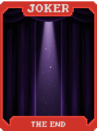 | **O Fim (The End)** Se for a última mão e tiver 0 descartes, ganhe **X100 Multi**. |
| 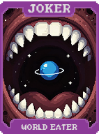 | **O Devorador de Mundos (World Eater)** Destrói o baralho ao vencer e ganha **X0.5 Multi** por carta destruída. |
| 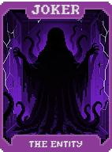 | **A Entidade (The Entity)** Copia o efeito de todos os seus Curingas **Negativos**. |
