# 🔮 Grupo Dimensional (Dimensional)

A geometria do jogo se torna fluida no grupo **Dimensional**. Estes Curingas focam em posições, adjacência, slots extras e manipulação da estrutura fundamental do tabuleiro e do baralho.

| Imagem | Detalhes do Curinga |
| :---: | :--- |
| 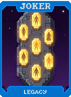 | **Legado (Legacy)** **+5 Multi** por cada Curinga vendido nesta partida. |
| 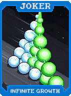 | **Crescimento Infinito (Infinite Growth)** **X1.0 (escalável) Multi**. Aumenta em **X0.05** a cada rodada vencida. |
| 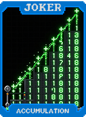 | **Acumulação (Accumulation)** Ganha **+1 Multi** permanente por cada 2 cartas jogadas. |
| 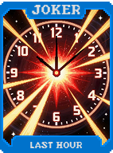 | **Última Hora (Last Hour)** Na última mão da rodada, ganhe **X1.5 Multi**. |
| 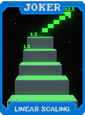 | **Scaling Linear (Linear Scaling)** **X0.2 Multi** por cada Aposta completa. |
| 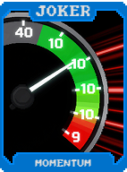 | **Momentum (Momentum)** Cada carta pontuada aumenta o Multi em **+3** durante a mão. |
| 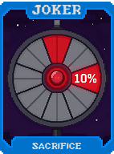 | **Sacrifício (Sacrifice)** **1 em 10** chance de destruir uma carta pontuada e ganhar **X1.5 Multi** permanente. |
| 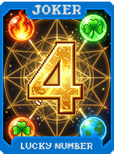 | **Número da Sorte (Lucky Number)** Se tiver exatamente 4 cartas na mão final, ganhe **X2 Multi**. |
| 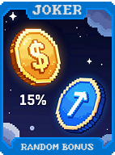 | **Bonus Aleatório (Random Bonus)** Ao descartar, **15%** chance de ganhar **$2** ou **+1 descarte**. |
| 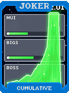 | **Cumulativo (Cumulative)** **X1 Multi**. Aumenta **X0.1** por Blind derrotado. |
| 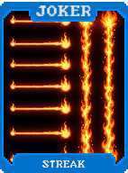 | **Sequência (Streak)** **+10 Multi** por cada mão consecutiva jogada sem descartar. |
| 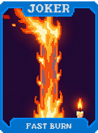 | **Queima Rápida (Fast Burn)** **X2 Multi**, mas perde **X0.2** a cada rodada. |
| 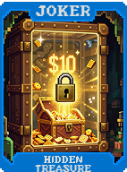 | **Tesouro Escondido (Hidden Treasure)** Se não usar nenhum descarte na rodada, ganhe **$5**. |
| 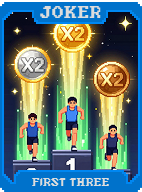 | **Primeiras Três (First Three)** Primeiras 3 mãos da rodada ganham **+15 Multi**. |
| 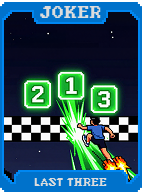 | **Últimas Três (Last Three)** Últimas 3 mãos da rodada ganham **+20 Multi**. |
| 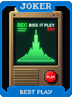 | **Melhor Jogada (Best Play)** Guarda Multi e Fichas da melhor mão da rodada e as aplica no fim. |
| 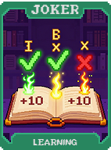 | **Aprendizado (Learning)** Ganhe **+5 Multi** permanente se não vencer nem perder na primeira tentativa. |
| 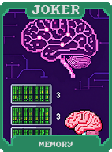 | **Memória (Memory)** Cartas descartadas dão **+2 Multi** quando jogadas nesta rodada. |
| 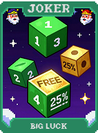 | **Sorte Grande (Big Luck)** **1 em 4** chance de não consumir uma mão quando jogada. |
| 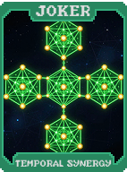 | **Sinergia Temporal (Temporal Synergy)** **+3 Multi** permanente por cada Curinga temporal que você possui. |
| 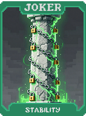 | **Estabilidade (Stability)** Fixa mãos e descartes no valor inicial da rodada. **+20 Multi**. |
| 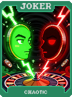 | **Caótico (Chaotic)** No fim da rodada, **50%** chance de dobrar ou zerar o Multi. |
| 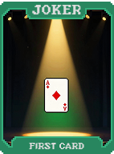 | **Primeira Carta (First Card)** Primeira carta jogada em cada mão ganha **+50 Fichas**. |
| 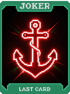 | **Última Carta (Last Card)** Última carta jogada em cada mão ganha **+20 Multi**. |
| 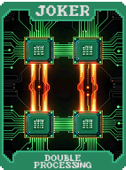 | **Duplo Processamento (Double Processing)** Todas as cartas jogadas pontuam duas vezes. Perde **$2** por rodada. |
| 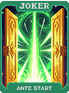 | **Começo de Aposta (Aposta Start)** **X1.5 Multi** na primeira rodada de cada Aposta. |
| 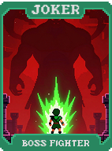 | **Lutador de Chefes (Boss Fighter)** **X2 Multi** no Boss Blind. **+15 Multi** caso contrário. |
|  | **Observador de Blind (Blind Watcher)** Quando um Blind é definido, ganhe **+10 Multi** permanente. |
| 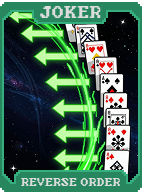 | **Ordem Reversa (Reverse Order)** Cartas jogadas de trás para frente dão **+15 Fichas** cada. |
| 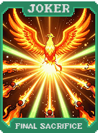 | **Sacrifício Final (Final Sacrifice)** Cada vez que qualquer Curinga é vendido, este ganha **X0.1 Multi** permanente. |
| 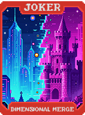 | **Fusão Dimensional (Dimensional Merge)** Se a mão jogada contém exatamente 2 Pares, eles pontuam como uma Quadra. |
| 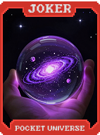 | **Universo de Bolso (Pocket Universe)** Cria uma carta de **Planeta** aleatória ao vender um Curinga. |
| 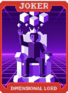 | **Senhor Dimensional (Dimensional Lord)** **X0.5 Multi** (aditivo) por cada slot de Curinga vazio. |
| 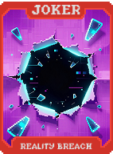 | **Ruptura da Realidade (Reality Breach)** Destrua todas as cartas descartadas. Ganhe **+1 Multi** por carta destruída (Reseta após Boss). |
| 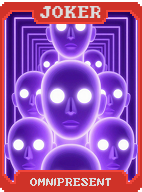 | **Onipresente (Omnipresent)** Reativa todas as cartas jogadas **1 vez**. |
| 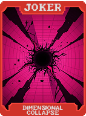 | **Colapso Dimensional (Dimensional Collapse)** Quando o Boss Blind é selecionado, destrua um Curinga aleatório para ganhar **X3 Multi** pelo resto da Aposta. |
| 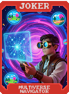 | **Navegador do Multiverso (Multiverse Navigator)** Se você jogar um **Flush**, crie uma carta de **Tarô** aleatória. |
| 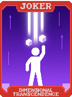 | **Transcendência Dimensional (Dimensional Transcendence)** **+1 Slot de Curinga**, mas **-1 Tamanho de Mão**. |
| 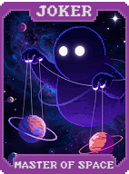 | **Mestre do Espaço (Master of Space)** Todas as cartas jogadas contam como **Cartas Selvagens** (qualquer naipe). |
| 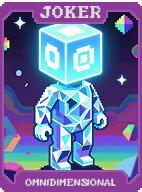 | **Onidimensional (Omnidimensional)** **X5 Multi**. **-1 Aposta** ao ser adquirido (estende a partida). |
