# 💰 Grupo Economia (Economy)

O grupo **Economia** é focado em transformar fichas em dinheiro e dinheiro em poder. Com Curingas que geram juros, oferecem descontos na loja ou escalam multiplicadores baseados na sua fortuna, este grupo é essencial para quem busca dominar a loja e o mercado de Balatro.

| Imagem | Detalhes do Curinga |
| :---: | :--- |
| 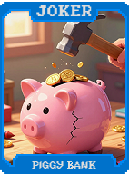 | **Cofrinho (Piggy Bank)** Ganha **$1** para cada mão restante ao vencer a rodada. |
|  | **Investidor Anjo (Angel Investor)** Ganha **$2** por rodada. Aumenta em **+$1** a cada rodada vencida. |
| 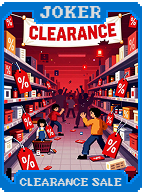 | **Liquidação (Clearance Sale)** Todos os itens na loja recebem um desconto de **$1**. |
|  | **Cupom (Coupon)** O próximo item comprado na loja é grátis (recupera a cada Aposta). |
| 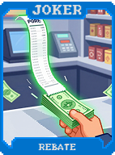 | **Reembolso (Rebate)** Ganha **$1** por carta descartada (máximo de **$5** por rodada). |
| 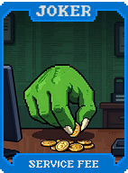 | **Taxa de Serviço (Service Fee)** Ganha **$1** para cada mão de pôquer jogada. |
| 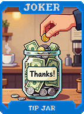 | **Gorjeta (Tip Jar)** Ganha **$1** se jogar uma mão contendo exatamente 1 carta. |
|  | **Mercado Negro (Black Market)** Itens na loja são mais caros, mas aparecem com edições raras. |
|  | **Agiota (Loan Shark)** Recebe **$20** imediatos, mas perde **$2** em todas as próximas rodadas. |
| 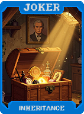 | **Herança (Inheritance)** Ganha **$10** instantaneamente se o seu dinheiro chegar a **$0**. |
| 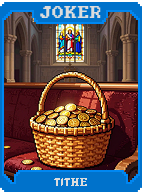 | **Dízimo (Tithe)** No fim da rodada, perca 10% (se > $20) para ganhar **+10 Multi**. |
| 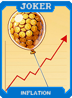 | **Inflação (Inflation)** **X2 Multi**, mas todos os preços da loja aumentam **$1** por rodada. |
| 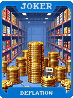 | **Deflação (Deflation)** **+50 Fichas**. Todos os preços da loja diminuem **$1** por rodada. |
| 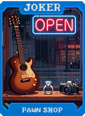 | **Casa de Penhores (Pawn Shop)** Permite vender cartas consumíveis pelo valor fixo de **$5**. |
| 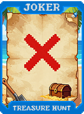 | **Caça ao Tesouro (Treasure Hunt)** **1 em 5** chance de ganhar **$5** ao pontuar com cartas de **Ouros**. |
| 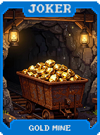 | **Mina de Ouro (Gold Mine)** Cartas de **Pedra** concedem **$2** ao pontuar. |
| 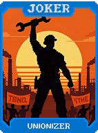 | **Sindicalista (Unionizer)** Ganha **$1** por rodada para cada Curinga que você possui. |
|  | **Contador (Accountant)** **+15 Multi** se o seu saldo bancário terminar em 0 ou 5. |
|  | **Auditor (Auditor)** **+20 Fichas** permanentes sempre que você sai da loja sem comprar nada. |
| 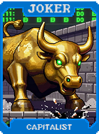 | **Capitalista (Capitalist)** **X1.5 Multi**. Reduz o requisito para ganhar juros de $5 para **$4**. |
| 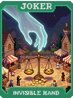 | **Mão Invisível (Invisible Hand)** Se tiver menos de $5, todos os seus Curingas tornam-se **50% mais fortes**. |
| 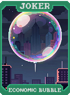 | **Bolha Econômica (Economic Bubble)** Ganha **$5** por rodada. Se chegar a **$50**, estoura (zerando seu dinheiro). |
|  | **Criptomoeda (Cryptocurrency)** O valor de venda deste Curinga flutua entre **$0 e $50** a cada rodada. |
| 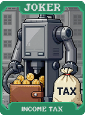 | **Imposto de Renda (Income Tax)** Perde 20% do capital atual para ganhar **X3 Multi** na rodada atual. |
| 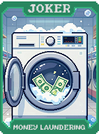 | **Lavagem de Dinheiro (Money Laundering)** Cartas de Ouro perdem o bônus em dinheiro mas dão **+20 Multi**. |
|  | **Suborno (Bribery)** Permite pagar **$5** para trocar (reroll) o Boss Blind atual. |
| 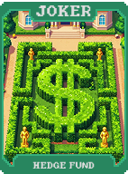 | **Fundo de Hedge (Hedge Fund)** Remove o limite máximo de juros ganhos por rodada. |
| 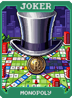 | **Monopólio (Monopoly)** Ganha **$10** se tiver 3 cartas de Ouro na sua mão atual. |
| 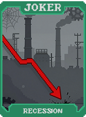 | **Recessão (Recession)** **X4 Multi** se o seu saldo for exatamente **$0**. |
| 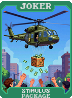 | **Estímulo Econômico (Stimulus Package)** Ganha **$10** se entrar na loja com menos de **$10**. |
| 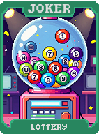 | **Loteria (Lottery)** **1 em 100** chance de ganhar **$100** ao final da rodada. |
|  | **Seguro (Insurance)** Garante **$20** se você perder a rodada (útil para continuar com itens). |
|  | **Aposentadoria (Retirement)** Ao vender, ganha **$1** por cada rodada que esteve no inventário. |
| 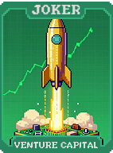 | **Investimento de Risco (Venture Capital)** Pague **$10** para ter **50%** chance de ganhar **$30**. |
| 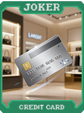 | **Cartão de Crédito (Credit Card)** Permite que seu saldo fique negativo até **-$20**. |
| 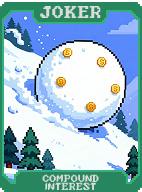 | **Juros Compostos (Compound Interest)** Aumenta o limite máximo de juros ganhos em **$5** por rodada. |
| 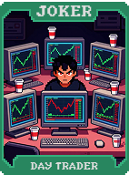 | **Day Trader** Ganha **$2** para cada reroll realizado na loja. |
| 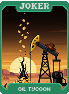 | **Magnata do Petróleo (Oil Tycoon)** Cartas Pretas (Espadas/Paus) concedem **$1** ao pontuar. |
| 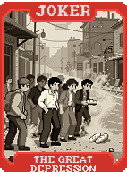 | **A Grande Depressão (The Great Depression)** Zera seu dinheiro e ganha **X1 Multi** para cada $5 perdidos. |
| 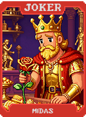 | **Midas (Midas)** Todas as cartas de Realeza jogadas tornam-se **Cartas de Ouro**. |
| 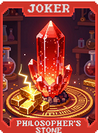 | **Pedra Filosofal (Philosopher's Stone)** Transforma cartas descartadas em **Cartas de Ouro** instantaneamente. |
| 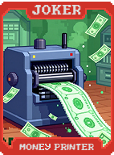 | **Impressora de Dinheiro (Money Printer)** **1 em 3** chance de duplicar todo dinheiro ganho na rodada. |
| 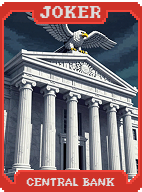 | **Banco Central (Central Bank)** Aumenta o limite de juros ganhos base para **$50**. |
| 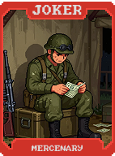 | **Mercenário (Mercenary)** **X5 Multi**, mas remove **$1** para cada carta jogada pontuada. |
| 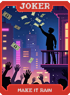 | **Chuva de Dinheiro (Make it Rain)** Ganha **$1** para cada ponto de Multi que passar o necessário para vencer. |
| 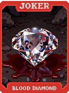 | **Diamante de Sangue (Blood Diamond)** Ganha **$50** imediatos, mas perde **-1 Mão** máxima para sempre. |
| 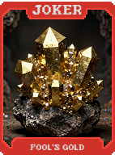 | **Ouro de Tolo (Fool's Gold)** Cartas de Ouro deixam de dar dinheiro e passam a dar **+50 Multi**. |
| 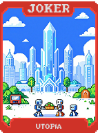 | **Utopia (Utopia)** Tudo na loja é **Grátis**. Se destrói após a primeira compra. |
| 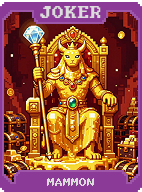 | **Mammon (Mammon)** **X5 Multi**. No final da rodada, dobra todo o seu dinheiro acumulado. |
| 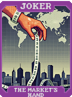 | **A Mão do Mercado (The Market's Hand)** Permite comprar qualquer Curinga da coleção por **2x o preço**. |
