# 🗣️ Grupo Interação Social e Meta (Social & Meta)

O grupo **Meta** brinca com a "quarta parede" e a cultura de jogos. De referências a streamers e redes sociais a modificações que afetam o próprio código do jogo (de forma visual ou mecânica), estes Curingas oferecem uma experiência única e bem-humorada que transcende as regras tradicionais de Balatro.

| Imagem | Detalhes do Curinga |
| :---: | :--- |
| 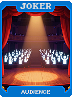 | **Torcida (Audience)** **+1 Multi** para cada vez que você clicou no botão "Jogar Mão" nesta partida. |
| 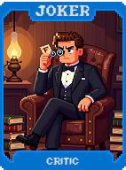 | **Crítico (Critic)** **+10 Multi**. Se você jogar uma mão de pontuação baixa, ele exibe insultos na tela. |
| 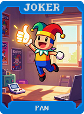 | **Fã (Fan)** **+5 Multi**. Comemora suas vitórias com mensagens de incentivo. |
| 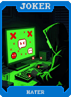 | **Hater** **+20 Multi**, mas exibe mensagens pessimistas prevendo sua derrota. |
| 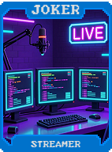 | **Streamer** Gera **$1** a cada 10 segundos de tempo real passados na partida. |
| 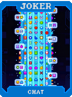 | **Chat** Exibe mensagens aleatórias de um chat fictício na tela. Concede **+10 Fichas**. |
|  | **Moderador (Moderator)** Impede que "mãos proibidas" (mãos muito ruins) sejam jogadas por acidente. |
| 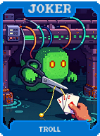 | **Troll** **1 em 10** chance de descartar sua mão aleatoriamente, mas dá **+30 Multi**. |
| 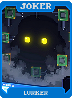 | **Lurker** Permanece inativo por 10 rodadas e então desbloqueia um bônus de **X3 Multi**. |
| 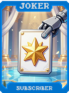 | **Inscrito (Subscriber)** Gera **$5** de renda passiva a cada 4 rodadas jogadas. |
| 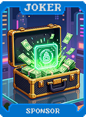 | **Patrocinador (Sponsor)** Concede automaticamente **$10** de bônus no início de cada nova Aposta. |
| 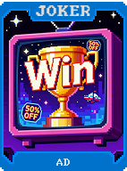 | **Anúncio (Ad)** Bloqueia brevemente a visão das cartas. Ganha **$5** por cada "exibição". |
|  | **Clickbait** Promete bônus astronômicos, mas na verdade concede **+10 Multi**. |
| 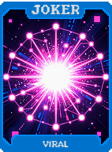 | **Viral** Se você jogar uma mão que pontue mais de 10.000 fichas, ganha **$10**. |
| 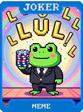 | **Meme** Se você jogar uma mão contendo 6 e 9, ganha **+69 Fichas**. |
| 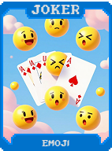 | **Emoji** Substitui visualmente os naipes das cartas por emojis. Concede **+10 Multi**. |
| 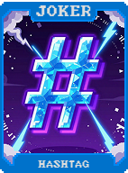 | **Hashtag** **+15 Multi**. Adiciona tags virtuais às suas jogadas de maior sucesso. |
| 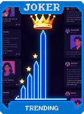 | **Trending** O naipe mais utilizado na rodada anterior recebe um bônus de **X1.5 Multi**. |
| 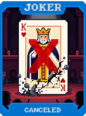 | **Cancelado (Canceled)** Se você jogar uma carta de Figura específica, este Curinga perde seu efeito temporariamente. |
| 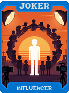 | **Influencer** **+2 Multi** para cada outro Curinga que você possui (seus seguidores). |
| 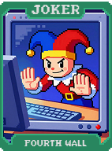 | **Quarta Parede (Fourth Wall)** O Curinga segue o cursor do mouse. Ganha **+20 Multi** se o mouse estiver sobre ele. |
|  | **Desenvolvedor (Developer)** Exibe hitboxes de depuração na tela e concede **+50 Fichas**. |
|  | **Beta Tester** Tem chance de encontrar "bugs" que geram efeitos positivos aleatórios. |
| 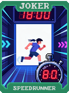 | **Speedrunner** Ativa um cronômetro na tela. Dá **+10 Multi** se você jogar rápido. |
| 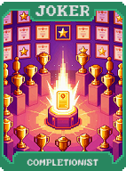 | **Completionist** **X2 Multi** se você já tiver jogado todos os tipos de mãos de pôquer nesta partida. |
|  | **Lore Master** Adiciona descrições narrativas longas às cartas. Concede **+20 Multi**. |
| 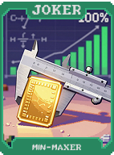 | **Min-Maxer** **X3 Multi** se o seu baralho for altamente otimizado (menos de 40 cartas). |
| 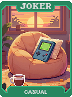 | **Casual** Concede **+15 Multi** se você levar seu tempo para jogar (ritmo lento). |
| 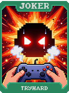 | **Tryhard** **+30 Multi**, acompanhado de efeitos visuais e sonoros intensos de "esforço". |
| 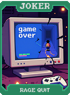 | **Rage Quit** Se você perder, reinicia o Blind atual uma vez, mas zera seu dinheiro. |
| 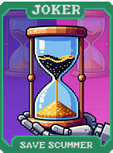 | **Save Scummer** Permite reiniciar a rodada atual uma vez por partida (Reload). |
| 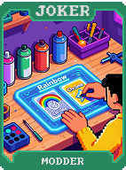 | **Modder** Permite alterar a cor de fundo do jogo e concede **+10 Multi**. |
| 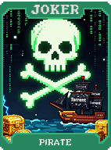 | **Pirata (Pirate)** "Você não baixaria um carro". Concede bônus de **X1.5 Multi**. |
| 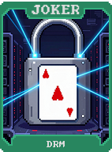 | **DRM** Impede que seus outros Curingas sejam copiados, mas concede **+40 Multi**. |
|  | **Microtransação (Microtransaction)** Permite pagar **$1** do jogo para ganhar um bônus imediato de **+5 Multi**. |
| 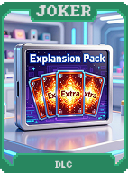 | **DLC** "Desbloqueia" bordas e artes alternativas para as cartas. Concede **+20 Fichas**. |
| 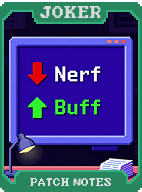 | **Patch Notes** Exibe as mudanças da última atualização e concede **+10 Multi**. |
| 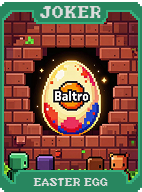 | **Easter Egg** Se você clicar no Curinga 10 vezes seguidas, ele concede **$10**. |
| 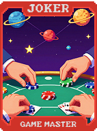 | **Game Master** Tem o poder de alterar as regras ou trocar o Boss Blind atual. |
| 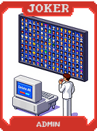 | **Admin** Ao ser vendido, abre um menu especial de "trapaça" com recompensas poderosas. |
| 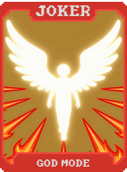 | **God Mode** Concede imortalidade total por uma única rodada. |
| 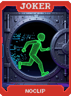 | **Noclip** Ignora restrições impostas por Boss Blinds que limitam suas jogadas. |
| 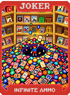 | **Infinite Ammo** Concede permanentemente **+5 Descartes** adicionais por rodada. |
| 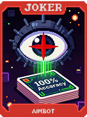 | **Aimbot** Se você tiver 4 cartas de um naipe, ele compra a 5ª carta automaticamente. |
| 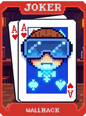 | **Wallhack** Revela quais são as próximas 3 cartas que estão no topo do baralho. |
| 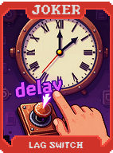 | **Lag Switch** Faz com que Boss Blinds com limite de tempo fiquem **50% mais lentos**. |
| 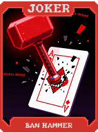 | **Ban Hammer** Destrói um de seus Curingas (sua escolha) para ganhar **X5 Multi**. |
| 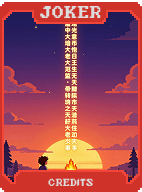 | **Credits** Exibe os créditos. Se usado no Ante 8, vence a partida instantaneamente. |
| 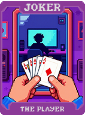 | **O Jogador (The Player)** **X5 Multi**. O efeito exato pode ser escolhido através de um menu. |
|  | **LocalThunk** **X10 Multi**. Homenagem ao criador do jogo. Torna todos os Curingas Policromados. |
