# 🌀 Grupo Paradoxo (Paradox)

O grupo **Paradoxo** subverte as regras de Balatro. Com efeitos que invertem valores, recompensam o fracasso e criam loops lógicos, estes Curingas forçam o jogador a pensar de forma não linear para extrair o máximo potencial do baralho.

| Imagem | Detalhes do Curinga |
| :---: | :--- |
|  | **Menos é Mais (Less is More)** **+20 Multi** se jogar menos de 3 cartas. |
| 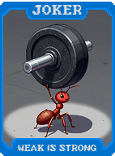 | **Fraco é Forte (Weak is Strong)** **2s, 3s e 4s** dão **+10 Multi**. |
| 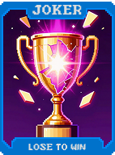 | **Perder para Ganhar (Lose to Win)** Se a mão pontuar menos de 10% do Blind, ganhe **$3**. |
| 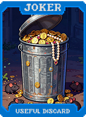 | **Descarte Útil (Useful Discard)** Descartar cartas dá **+2 Fichas** permanente (por rodada). |
| 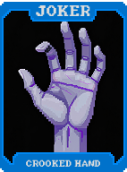 | **Mão Torta (Crooked Hand)** Sequências podem ter "buracos" (ex: 2-4-5-7-8) e dão **+10 Multi**. |
| 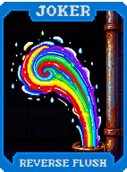 | **Flush Reverso (Reverse Flush)** Pontua como Flush se tiver **5 naipes diferentes**. |
| 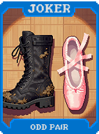 | **Par Ímpar (Odd Pair)** Pares de cartas ímpares dão **+15 Multi**. |
| 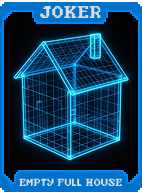 | **Full House Vazio (Empty Full House)** Jogar 3 e 2 cartas (mesmo sem formar Full House) dá **+10 Multi**. |
| 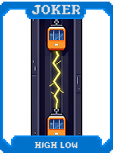 | **High Low (High Low)** A carta mais baixa pontua como a mais alta e vice-versa. |
| 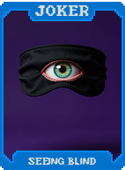 | **Cego que Vê (Seeing Blind)** **+15 Multi** durante o Boss Blind. |
| 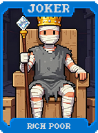 | **Pobre Rico (Rich Poor)** Ganha **+1 Multi** para cada **$1** abaixo de $10 que você possui. |
| 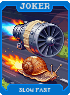 | **Lento Rápido (Slow Fast)** Se demorar mais de 10 segundos para jogar, ganhe **+10 Multi**. |
| 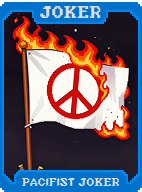 | **Curinga Pacifista (Pacifist Joker)** Se jogar uma mão que não vença o Blind, ganhe **X1.2 Multi** na próxima. |
|  | **Paradoxo do Mentiroso (Liar's Paradox)** "Este Curinga não dá Multi" (Dá **+20 Multi**). |
| 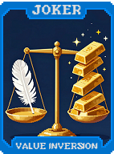 | **Inversão de Valor (Value Inversion)** Cartas de Realeza valem 0 Fichas. Ases valem 20. |
| 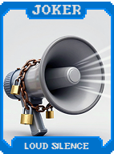 | **Silêncio Ruidoso (Loud Silence)** **+30 Fichas** se não jogar cartas de Realeza. |
| 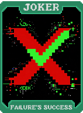 | **Sucesso do Fracasso (Failure's Success)** Se você perder a rodada, ganhe **$10** (útil com Mr. Bones). |
| 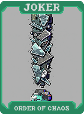 | **Ordem do Caos (Order of Chaos)** Se o baralho **não** estiver ordenado, **X1.5 Multi**. |
| 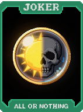 | **Tudo ou Nada (All or Nothing)** **50%** chance de **X4 Multi**, **50%** chance de **X0.5 Multi**. |
| 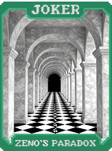 | **Paradoxo de Zenão (Zeno's Paradox)** Cada mão dá metade dos pontos da anterior, mas começa com **X8 Multi**. |
| 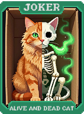 | **Gato Vivo e Morto (Alive and Dead Cat)** Se for a última jogada com 0 descartes e 0 mãos, **X5 Multi**. |
| 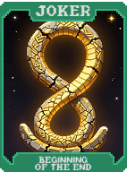 | **Início do Fim (Beginning of the End)** A última mão conta como a primeira para ativar efeitos. |
| 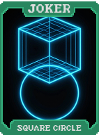 | **Círculo Quadrado (Square Circle)** Cartas de Ouros contam como cartas pretas. |
| 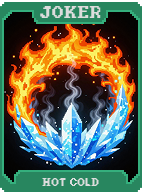 | **Frio Quente (Hot Cold)** Cartas de Copas e Espadas trocam de naipe para a pontuação. |
| 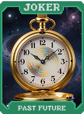 | **Passado Futuro (Past Future)** O Blind anterior conta como o atual para efeitos. |
| 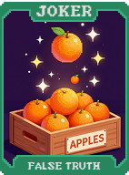 | **Verdade Falsa (False Truth)** Cartas de Vidro não quebram, mas perdem o X2 (Dão **+20 Multi**). |
| 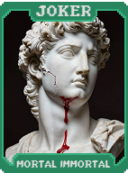 | **Imortal Mortal (Mortal Immortal)** Curingas Eternos podem ser vendidos, mas não dão dinheiro. |
| 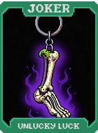 | **Sorte Azarada (Unlucky Luck)** Lucky Cards nunca ativam, mas dão **+20 Multi** passivo. |
|  | **Crescimento Decrescente (Shrinking Growth)** Começa com **+50 Multi** e perde **-2** a cada rodada. |
| 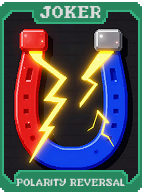 | **Inversão de Polaridade (Polarity Reversal)** Cartas Pretas dão Multi, Cartas Vermelhas dão Fichas. |
| 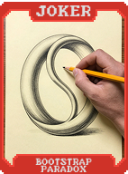 | **Paradoxo de Bootstrap (Bootstrap Paradox)** Cria uma cópia de si mesmo. Cada um dá **X1.5 Multi**. |
| 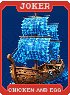 | **Ovo e Galinha (Chicken and Egg)** A primeira carta jogada é reativada pela última. |
| 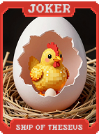 | **Navio de Teseu (Ship of Theseus)** Se trocou todas as cartas iniciais do baralho, ganhe **X5 Multi**. |
| 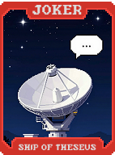 | **Paradoxo de Fermi (Fermi's Paradox)** Se não houver cartas de Planeta usadas, **X3 Multi**. |
| 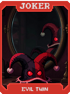 | **Gêmeo Maligno (Evil Twin)** Copia outro Curinga, mas inverte o sinal (ex: Multi vira divisor). |
| 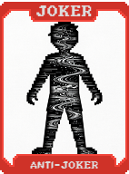 | **Anti-Curinga (Anti-Joker)** Transforma todo seu Multi em Fichas e vice-versa. |
| 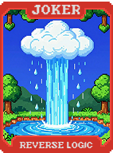 | **Lógica Reversa (Reverse Logic)** Mãos de nível baixo pontuam como nível alto e vice-versa. |
| 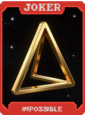 | **Impossível (Impossible)** Ao jogar 5 cartas iguais de naipes diferentes, ganha **X100 Multi**. |
| 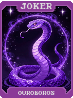 | **Ouroboros (Ouroboros)** **X3 Multi**. No fim (Aposta 8), reinicia no Aposta 1 com o deck atual. |
| 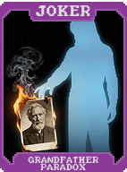 | **Paradoxo Grandfather (Grandfather Paradox)** Se perder, volta no tempo para o início da Aposta (1 uso). |
