# ⚡ Quântico (Quantum)

No reino quântico, nada é estático. Estes Curingas mudam seus valores, raridades ou até mesmo seus efeitos a cada mão jogada. Prepare-se para lidar com o "Colapso de Onda" e a "Superposição", onde a sorte é uma variável que você deve aprender a navegar.

---

## 🃏 Lista de Curingas

| Imagem | Descrição |
| :---: | :--- |
|  | **Superposição (Superposition)** 50/50 de chance: **+10 Multi** OU **+40 Fichas**. |
| 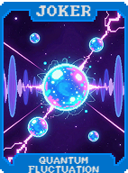 | **Flutuação Quântica (Quantum Fluctuation)** O valor muda aleatoriamente entre **5-25 Multi** a cada rodada. |
| 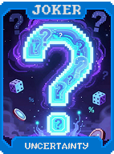 | **Incerteza (Uncertainty)** 25% de chance de algo bom acontecer: **+50 Multi**, **$5** ou **Reroll grátis**. |
| 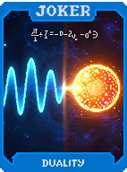 | **Dualidade (Duality)** Duas naturezas em um ser. **+15 Multi** e **+50 Fichas**. |
| 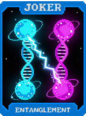 | **Emaranhamento (Entanglement)** Partículas entrelaçadas em sincronia. **+15 Multi**. |
| 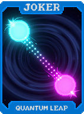 | **Salto Quântico (Quantum Leap)** Bloqueia habilidades de Curingas adjacentes mas ganha **+15 Multi**. |
| 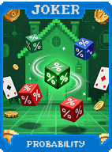 | **Probabilidade (Probability)** **+5 Multi** para cada Curinga Comum. |
| 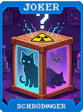 | **Schrödinger (Schrödinger)** Até ativar, possui todos os efeitos simultâneos. **+20 Multi**. |
| 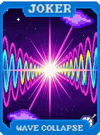 | **Colapso de Onda (Wave Collapse)** Escolhe 1 de 3 efeitos aleatórios por rodada: **Multi**, **Fichas** ou **Dinheiro**. |
| 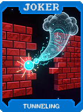 | **Tunelamento (Tunneling)** 5% de chance de descartes não consumirem contagem. **+15 Multi**. |
| 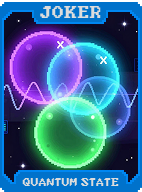 | **Estado Quântico (Quantum State)** Alterna entre **+15 Multi** e **X1.5 Multi** a cada mão. |
| 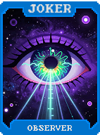 | **Observador (Observer)** Olhar para este Curinga colapsa o estado: **X2 Multi** (funciona 1x por rodada). |
| 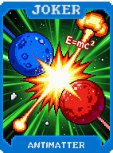 | **Antimatéria (Antimatter)** Cada carta descartada concede **+10 Multi** permanente. |
| 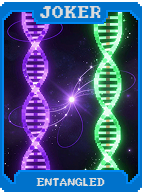 | **Entrelaçado (Entangled)** Se outro Curinga idêntico existir, ambos ganham **X2.5 Multi**. |
| 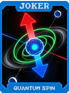 | **Spin Quântico (Quantum Spin)** 1 em 3 de chance de rotacionar efeitos dos Curingas. Dá **+30 Multi** se ativar. |
| 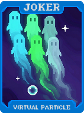 | **Partícula Virtual (Virtual Particle)** Existe por apenas 3 rodadas, mas dá **X3 Multi**. |
| 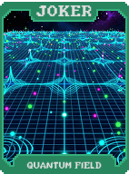 | **Campo Quântico (Quantum Field)** Todos os Curingas adjacentes ganham **+20 Multi** extra. |
| 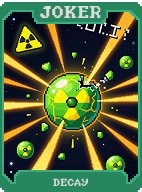 | **Decaimento (Decay)** Começa com **X4 Multi**. Perde **X0.2** por rodada. |
| 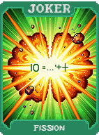 | **Fissão (Fission)** Instabilidade nuclear. **+30 Multi**. |
| 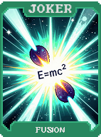 | **Fusão (Fusion)** No fim da rodada, absorve Curingas idênticos e ganha **+X1.5 Multi** por cada. |
| 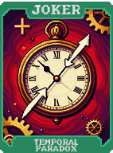 | **Paradoxo Temporal (Temporal Paradox)** Aplica o bônus da última mão jogada novamente. **X2 Multi**. |
| 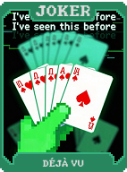 | **Déjà Vu (Déjà Vu)** Se jogar a mesma mão 2x seguidas, **X2.5 Multi**. |
| 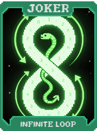 | **Loop Infinito (Infinite Loop)** Cada 3ª mão jogada é repetida automaticamente. **+30 Multi**. |
| 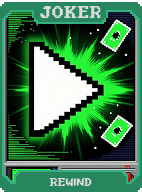 | **Rewind (Rewind)** Reativa a última mão jogada uma vez. |
| 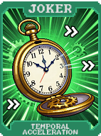 | **Aceleração Temporal (Temporal Acceleration)** Ganha **+X0.1 Multi** a cada mão jogada. |
| 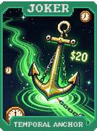 | **Âncora Temporal (Temporal Anchor)** Redefine dinheiro para **$15** no fim de cada rodada. **X3 Multi**. |
| 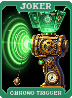 | **Chrono Trigger (Chrono Trigger)** A cada 5 mãos, ganha **+100 Multi** na próxima. |
| 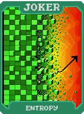 | **Entropia (Entropy)** Efeito aleatório a cada mão: **+25 Multi**, **X1.5 Multi** ou **+50 Fichas**. |
| 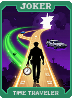 | **Viajante do Tempo (Time Traveler)** Navega entre passado, presente e futuro. **+40 Multi**. |
| 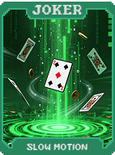 | **Câmera Lenta (Slow Motion)** Ganha **+1 descarte** por rodada. **X2 Multi**. |
| 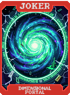 | **Portal Dimensional (Dimensional Portal)** 10% de chance de uma carta mudar de naipe permanentemente. **+40 Multi**. |
| 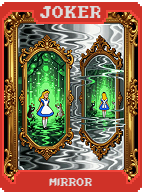 | **Espelho (Mirror)** Quando adquirido, cria reflexo com metade do Multi. **+50 Multi**. |
| 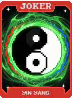 | **Yin Yang (Yin Yang)** Alterna entre **+80 Multi** e **+150 Fichas** a cada rodada. |
| 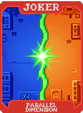 | **Dimensão Paralela (Parallel Dimension)** Existe simultaneamente em realidades alternativas. **X2.5 Multi**. |
| 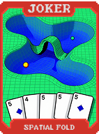 | **Dobra Espacial (Spatial Fold)** Curingas adjacentes compartilham 1 slot. **+50 Multi**. |
|  | **Buraco de Minhoca (Wormhole)** Túnel através do espaço-tempo. **X2.5 Multi**. |
| 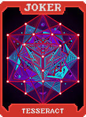 | **Tesseract (Tesseract)** **+20 Multi** para cada naipe diferente na mão. |
| 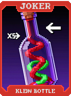 | **Garrafa de Klein (Klein Bottle)** Curingas ativam da direita para a esquerda. **X3 Multi**. |
| 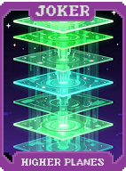 | **Planos Superiores (Higher Planes)** Transcende os limites da realidade comum. **+100 Multi**. |
| 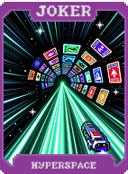 | **Hiperespaço (Hyperspace)** Cartas existem em 4D. Cada carta vale **+15 Multi** extra (Máx 5 cartas). |

---

### Ver Também
* [Visão Geral dos Curingas](../jokers_overview.md)
* [Grupo Singularidade](./singularity.md)
