# 🌌 Singularidade (Singularity)

Estes Curingas recompensam o jogador solitário. Eles oferecem bônus massivos se você tiver poucos Curingas, slots vazios ou se este for o único Curinga de uma determinada raridade. É o caminho perfeito para quem prefere qualidade extrema em vez de quantidade.

---

## 🃏 Lista de Curingas

| Imagem | Descrição |
| :---: | :--- |
|  | **Solitário (Solitary)** Se você tem apenas 1 Curinga, ganhe **+12 Multi**. |
| 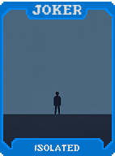 | **Isolado (Isolated)** Por cada slot vazio de Curinga, ganhe **+8 Fichas**. |
|  | **Eremita (Hermit)** Cada rodada sem comprar nada na loja, ganhe **+2 Multi** permanente. |
| 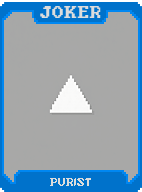 | **Purista (Purist)** Se o baralho tem exatamente 52 cartas, ganhe **+15 Multi**. |
| 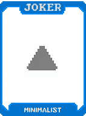 | **Minimalista (Minimalist)** Por cada carta abaixo de 52 no baralho, ganhe **+4 Multi**. |
| 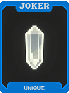 | **Único (Unique)** Se não há outro Curinga igual a este, ganhe **+10 Multi**. |
| 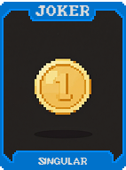 | **Singular (Singular)** O primeiro Curinga de cada raridade que você compra é **gratuito**. |
|  | **Monopolista (Monopolist)** Se você tem pelo menos 3 Curingas caros ($8+), ganhe **X1.5 Multi**. |
|  | **Exclusivo (Exclusive)** Limita a 3 Curingas no máximo, mas cada um tem **X1.5 Multi**. |
| 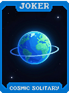 | **Solitário Cósmico (Cosmic Solitary)** Se jogou sozinho (sem outros Curingas ativos), ganhe **X2 Multi**. |
| 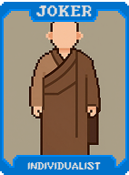 | **Asceta (Ascetic)** Se não comprou nada na loja, ganhe **+10 Multi** e **$2**. |
| 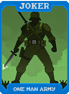 | **Exército de Um Homem Só (One Man Army)** Se é o único Curinga, ganhe **X2 Multi**. |
| 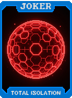 | **Isolamento Total (Total Isolation)** Não pode comprar mais Curingas, mas este dá **X3 Multi**. |
| 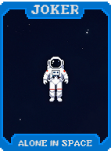 | **Sozinho no Espaço (Alone in Space)** Cada slot vazio de Curinga dá **$2** no fim da rodada. |
| 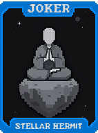 | **Ermitão Estelar (Stellar Hermit)** Se não usou consumíveis na rodada, ganhe **+50 Fichas**. |
| 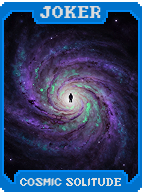 | **Solidão Cósmica (Cosmic Solitude)** Por cada Aposta sem comprar Curingas, ganhe **+X0.2 Multi** permanente. |
|  | **Singularidade Crescente (Growing Singularity)** Se é o único Curinga, ganha **+X0.2 Multi** por rodada permanente. |
| 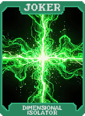 | **Isolador Dimensional (Dimensional Isolator)** Se NÃO houver Curingas adjacentes: **+30 Multi** e **X1.5 Multi**. |
| 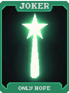 | **Única Esperança (Only Hope)** Se restar 1 mão e este for o único Curinga, ganhe **X5 Multi**. |
| 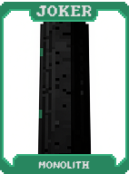 | **Monólito (Monolith)** Ocupa 2 slots mas dá **X2.5 Multi**. |
| 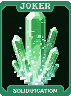 | **Solidificação (Solidification)** Se não mover ou vender este Curinga por 5 rodadas, ganhe **X2.5 Multi**. |
| 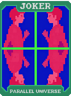 | **Universo Paralelo (Parallel Universe)** No fim da rodada, se houver apenas 1 deste Curinga, cria uma cópia espelhada e ganha **+20 Multi**. |
| 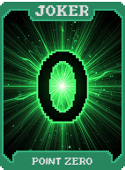 | **Ponto Zero (Point Zero)** Se dinheiro = $0 e é o único Curinga, ganhe **X3 Multi**. |
| 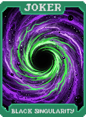 | **Singularidade Negra (Black Singularity)** Quando você vende um Curinga, ganha **+5 Multi** permanente. |
|  | **Estrela Solitária (Solitary Star)** Se for o único Curinga e vencer toda a rodada: **+X0.2 Multi** permanente. |
|  | **Individualismo (Individualism)** Curingas adjacentes não afetam este, mas ganha **+50 Multi**. |
| 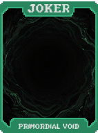 | **Vazio Primordial (Primordial Void)** Destrua todos outros Curingas ao adquirir e ganhe **X5 Multi** permanente. |
| 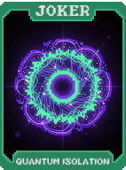 | **Isolamento Quântico (Quantum Isolation)** Se for o único Curinga, 25% chance de se duplicar no fim da rodada. **+20 Multi**. |
| 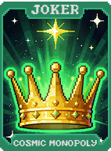 | **Monopólio Cósmico (Cosmic Monopoly)** Se todos os Curingas tiverem a mesma raridade, ganhe **X3 Multi**. |
| 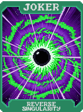 | **Singularidade Reversa (Reverse Singularity)** Quanto mais Curingas você tem, MENOS Multi: **X0.8** por Curinga. |
| 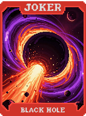 | **Buraco Negro (Black Hole)** Absorve 1 Curinga aleatório por Aposta e ganha seus efeitos + **+10 Multi** por absorção. |
| 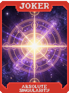 | **Singularidade Absoluta (Absolute Singularity)** Se é o único Curinga Lendário, ganhe **X10 Multi**. |
| 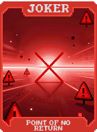 | **Ponto de Não Retorno (Point of No Return)** Ao ser adquirido, destrói todos Curingas e ganha **+X5 Multi** por cada destruído. |
| 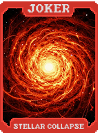 | **Colapso Estelar (Stellar Collapse)** **+10 Multi** por cada Curinga ativado antes dele na ordem da esquerda. |
| 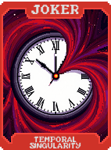 | **Singularidade Temporal (Temporal Singularity)** O tempo se dobra em torno deste Curinga. **X2.5 Multi**. |
| 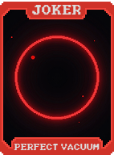 | **Vácuo Perfeito (Perfect Vacuum)** O vazio consome tudo. **X4 Multi**. |
| 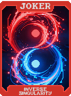 | **Singularidade Inversa (Inverse Singularity)** Quanto MENOS recursos, cartas e Curingas você tem, mais forte fica: até **X10 Multi**. |
| 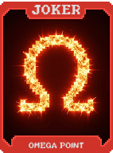 | **Ponto Ômega (Omega Point)** O fim inevitável de todas as coisas. **X2.5 Multi**. |
| 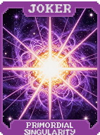 | **Singularidade Primordial (Primordial Singularity)** Se é literalmente o único Curinga no jogo inteiro, ganhe **X25 Multi**. |
| 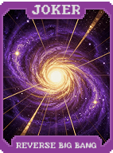 | **Big Bang Reverso (Reverse Big Bang)** A contração final antes de um novo universo. **X5 Multi**. |

---

### Ver Também
* [Visão Geral dos Curingas](../jokers_overview.md)
* [Guia de Estratégias](../../strategies/singularity-mastery.md)
