# ⏳ Grupo Tempo e Turnos (Time & Turns)

O grupo **Tempo e Turnos** explora a mecânica fundamental do ritmo do jogo. Alguns Curingas recompensam a velocidade, outros a paciência, e os mais poderosos permitem manipular o próprio fluxo das rodadas, pulando Blinds ou reiniciando o tempo para evitar a derrota.

| Imagem | Detalhes do Curinga |
| :---: | :--- |
| 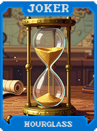 | **Ampulheta (Hourglass)** **+20 Multi**, perde **-2 Multi** por mão jogada na rodada. |
| 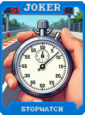 | **Cronômetro (Stopwatch)** **+30 Fichas** se vencer na primeira mão. |
| 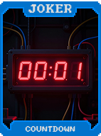 | **Contagem Regressiva (Countdown)** Começa em 10. Reduz 1 por rodada. Quando chegar a 0, ganhe **$50**. |
|  | **Paciência (Patience)** Se não jogar nenhuma mão por 30 segundos (no relógio real), **+20 Multi**. |
| 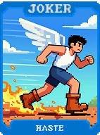 | **Pressa (Haste)** **+10 Multi** se jogar em menos de 5 segundos. |
| 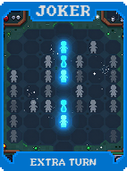 | **Turno Extra (Extra Turn)** **+1 Mão** por rodada. **-1 Descarte**. |
| 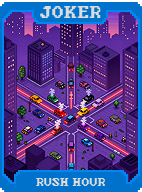 | **Hora do Rush (Rush Hour)** **+50 Fichas** se tiver 0 descartes restantes. |
| 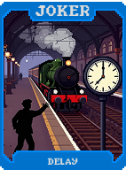 | **Atraso (Delay)** O efeito deste Curinga ativa no final da rodada (dá dinheiro igual ao Multi da última mão). |
|  | **Ciclo (Cycle)** A cada 4 rodadas, ganhe um **Pacote Arcano** grátis. |
| 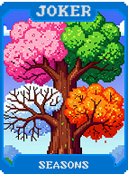 | **Estações (Seasons)** Muda de naipe bônus a cada rodada (Copas -> Espadas -> Ouros -> Paus). |
|  | **Dia e Noite (Day and Night)** Alterna entre **+50 Fichas** e **+10 Multi** a cada mão. |
| 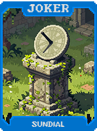 | **Relógio de Sol (Sundial)** Ganhe **+1 Multi** para cada carta no baralho (tamanho do deck). |
| 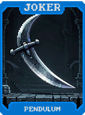 | **Pêndulo (Pendulum)** Oscila entre **X0.5** e **X2.0 Multi** a cada carta jogada. |
| 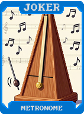 | **Metrônomo (Metronome)** Se jogar mãos em ritmo constante (mesma quantidade de cartas), **+20 Multi**. |
| 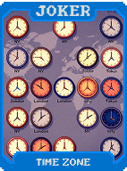 | **Fuso Horário (Time Zone)** Cartas de Espadas e Copas pontuam em momentos diferentes (trigger duplo visual). |
|  | **Era Glacial (Ice Age)** Congela o valor de venda de todos os Curingas (não diminui nem aumenta). |
| 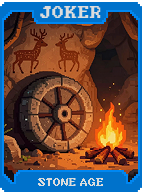 | **Idade da Pedra (Stone Age)** Transforma uma carta em **Pedra** a cada rodada. |
| 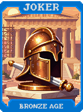 | **Idade do Bronze (Bronze Age)** Cartas de número (2-10) dão **+5 Fichas**. |
|  | **Idade do Ferro (Iron Age)** Cartas de Aço dão **+10 Fichas**. |
| 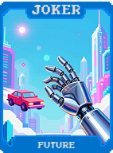 | **Futuro (Future)** **+15 Multi**. Revela qual será a próxima mão de pôquer (texto de dica). |
|  | **Máquina do Tempo (Time Machine)** Ao vender, reinicia o Blind atual (como se nunca tivesse jogado). |
| 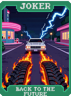 | **De Volta para o Futuro (Back to the Future)** Se a mão jogada for igual à primeira mão da partida, **X3 Multi**. |
| 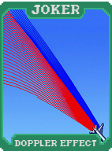 | **Efeito Doppler (Doppler Effect)** Cartas de valor alto dão mais Multi no início da mão, cartas baixas no final. |
| 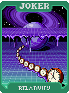 | **Relatividade (Relativity)** Quanto mais rápido você joga, mais Fichas ganha. Quanto mais devagar, mais Multi. |
| 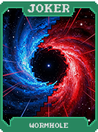 | **Buraco de Minhoca (Wormhole)** Pula o próximo Small Blind (ganha recompensas base). |
| 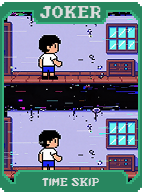 | **Salto Temporal (Time Skip)** Pula o próximo Big Blind (ganha recompensas base). |
| 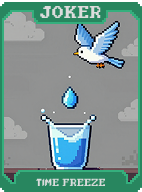 | **Congelar Tempo (Time Freeze)** O Blind não aumenta na próxima rodada. (Destrói-se). |
| 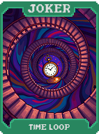 | **Loop Temporal (Time Loop)** Reativa a primeira carta jogada **3 vezes**. |
| 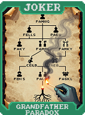 | **Paradoxo do Avô (Grandfather Paradox)** Se perder, reinicia a Aposta atual (1 vida extra). Destrói-se. |
| 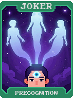 | **Precognição (Precognition)** Mostra quais cartas serão compradas se você descartar. |
| 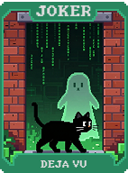 | **Déjà Vu (Déjà Vu)** Se jogar a mesma mão 2 vezes seguidas, a segunda ganha **X2 Multi**. |
| 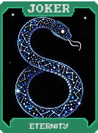 | **Eternidade (Eternity)** Curingas "Perecíveis" não expiram. |
| 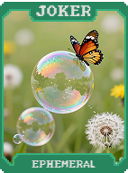 | **Efêmero (Ephemeral)** **+50 Multi**, mas desaparece após 3 rodadas. |
| 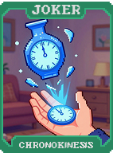 | **Cronocinese (Chronokinesis)** Pode trocar 1 Mão por 1 Descarte e vice-versa. |
| 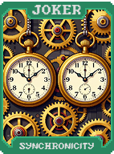 | **Sincronicidade (Synchronicity)** Se todas as cartas da mão tiverem o mesmo rank, **X3 Multi**. |
| 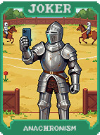 | **Anacronismo (Anachronism)** Permite usar cartas de Tarô durante a pontuação da mão. |
| 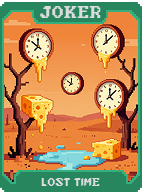 | **Tempo Perdido (Lost Time)** **+100 Fichas**, mas visual distorcido ou tempo reduzido. |
| 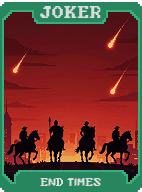 | **Fim dos Tempos (End Times)** **X4 Multi** na última mão da última rodada da Aposta. |
| 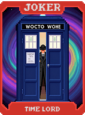 | **Senhor do Tempo (Time Lord)** **+1 Mão**, **+1 Descarte**, **+1 Slot de Curinga**. |
| 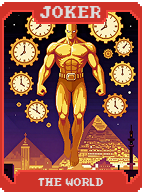 | **O Mundo (The World)** Para o tempo (Boss Blinds com timer não funcionam). **X2 Multi**. |
| 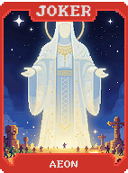 | **Aeon (Aeon)** Escala **X0.1 Multi** a cada rodada jogada. (Sem limite). |
| 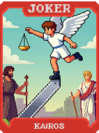 | **Kairós (Kairos)** Se vencer na última mão possível, ganhe **X5 Multi**. |
| 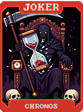 | **Chronos (Chronos)** Ganhe **$1** para cada segundo que você economizou. |
| 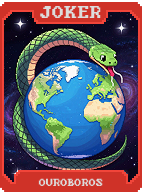 | **Ouroboros (Ouroboros)** Reinicia o baralho para o estado inicial (52 cartas) a cada Aposta. |
| 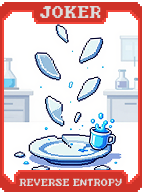 | **Entropia Reversa (Reverse Entropy)** Cartas descartadas voltam para o fundo do baralho em vez da pilha de descarte. |
| 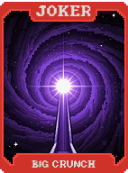 | **Big Crunch** Reduz o tamanho da mão para 1. **X10 Multi**. |
|  | **Big Bang** Aumenta o tamanho da mão para 10. **-2 Multi** por carta. |
| 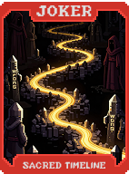 | **Linha do Tempo Sagrada (Sacred Timeline)** Previne que cartas sejam destruídas ou modificadas por Bosses. |
|  | **Pai Tempo (Father Time)** **X5 Multi**. Se não vencer o Blind, pode pagar **$10** para tentar de novo (não morre). |
| 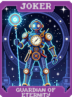 | **Guardião da Eternidade (Guardian of Eternity)** **X4 Multi**. Todos os seus Curingas tornam-se "Eternos". |
