# 🦋 Grupo Transformações e Mutações (Transformations & Mutations)

Este grupo é focado na alteração das propriedades fundamentais das cartas. De metamorfos que mudam de naipe a feras míticas que transformam cartas em ouro ou pedra, o grupo **Transformações** permite que você adapte seu baralho dinamicamente às necessidades da rodada.

| Imagem | Detalhes do Curinga |
| :---: | :--- |
|  | **Camaleão (Chameleon)** Copia o naipe da carta à sua esquerda na mão. |
| 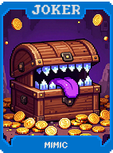 | **Mímico (Mimic)** Copia o rank da carta à sua direita na mão. |
| 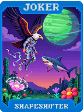 | **Metamorfo (Shapeshifter)** Muda de naipe aleatoriamente a cada mão jogada. Concede **+10 Multi**. |
| 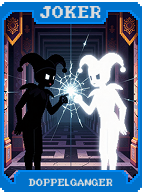 | **Doppelganger** Se jogar 2 cartas iguais, a segunda delas ganha **+20 Fichas**. |
| 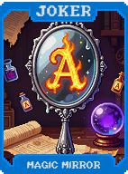 | **Espelho Mágico (Magic Mirror)** Inverte o rank das cartas na mão (Ases tornam-se 2s e vice-versa). |
|  | **Prisma (Prism)** Transforma cartas jogadas em versões **Policromadas** temporárias. |
| 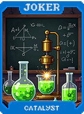 | **Catalisador (Catalyst)** Acelera o crescimento de Curingas que escalam (ganham bônus em dobro). |
| 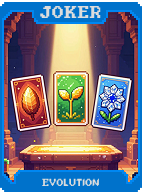 | **Evolução (Evolution)** Se jogar 3 cartas em sequência, elas aumentam permanentemente de rank. |
| 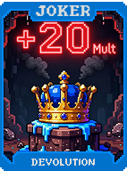 | **Devolução (Devolution)** Se jogar 3 cartas em sequência, elas diminuem de rank, mas concedem **+20 Multi**. |
| 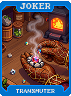 | **Transmutador (Transmuter)** Transforma todas as cartas de Ouros em Copas ao serem jogadas. |
| 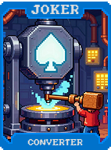 | **Conversor (Converter)** Transforma todas as cartas de Espadas em Paus ao serem jogadas. |
| 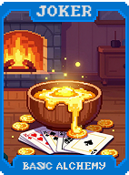 | **Alquimia Básica (Basic Alchemy)** Transforma cartas baixas (2, 3, 4) em **Cartas de Ouro** ao descartar. |
| 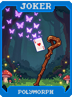 | **Polimorfia (Polymorph)** Randomiza o rank de cartas de Figura ao serem jogadas. |
| 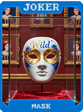 | **Máscara (Mask)** Cartas de Figura contam como qualquer naipe para formações de mãos. |
| 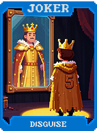 | **Disfarce (Disguise)** Cartas numéricas passam a contar como **Cartas de Figura**. |
|  | **Fantasia (Costume)** **+10 Multi**. Altera visualmente as cartas para combinarem com o tema do Curinga. |
| 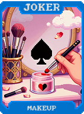 | **Maquiagem (Makeup)** Cartas vermelhas contam como pretas e vice-versa. |
| 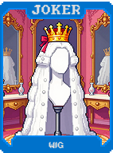 | **Peruca (Wig)** Cartas de Rei passam a contar como Rainhas. |
|  | **Barba Falsa (Fake Beard)** Cartas de Rainha passam a contar como Reis. |
| 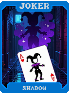 | **Sombra (Shadow)** Cria uma cópia fantasma da carta jogada anteriormente. |
|  | **Vampiro (Vampire)** Remove bônus de cartas aprimoradas para ganhar **X0.2 Multi** permanente. |
| 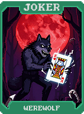 | **Lobisomem (Werewolf)** Cartas de Figura tornam-se **Cartas Silvestres (Wild)** e ganham **+50 Fichas**. |
| 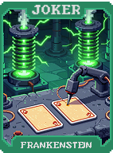 | **Frankenstein** Combina duas cartas descartadas para criar uma nova carta na mão. |
| 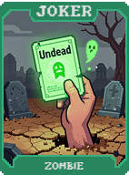 | **Zumbi (Zombie)** Cartas descartadas podem voltar como "Mortas-Vivas", sem naipe mas com bônus Multi. |
| 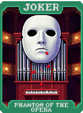 | **Fantasma da Ópera (Phantom of the Opera)** **X2 Multi** se jogar exatamente uma única carta de Figura. |
|  | **Jekyll & Hyde** Alterna drasticamente entre **X0.5 Multi** e **X4 Multi** a cada mão jogada. |
| 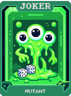 | **Mutante (Mutant)** **+10 Multi**. Ganha um efeito aleatório adicional a cada nova rodada. |
| 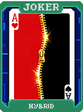 | **Híbrido (Hybrid)** Permite que cartas contem como dois naipes simultaneamente. |
| 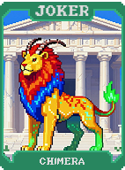 | **Quimera (Chimera)** Cartas de Figura concedem bônus variados baseados em seu naipe. |
| 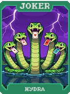 | **Hidra (Hydra)** Ao descartar cartas, você compra o dobro de cartas de volta. |
| 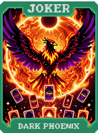 | **Fênix Negra (Dark Phoenix)** Destrói cartas jogadas para criar novas **Cartas de Aço** no baralho. |
| 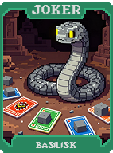 | **Basilisco (Basilisk)** Transforma cartas jogadas em **Cartas de Pedra** após a pontuação. |
| 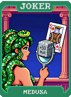 | **Medusa (Medusa)** Transforma cartas de Figura em sua mão em **Cartas de Pedra** com **+50 Multi**. |
|  | **Sereia (Siren)** Atrai cartas do mesmo naipe para sua mão durante a compra. |
| 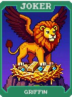 | **Grifo (Griffin)** Dobra os bônus concedidos por Cartas de Ouro e de Aço. |
| 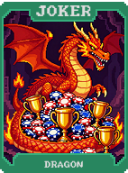 | **Dragão (Dragon)** Destrói cartas aleatórias no baralho para ganhar **X3 Multi**. |
|  | **Unicórnio (Unicorn)** **X2.5 Multi** se jogar uma mão contendo os quatro naipes diferentes. |
| 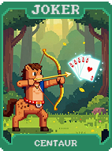 | **Centauro (Centaur)** Mãos com 4 cartas pontuam como se tivessem 5 (adiciona média das cartas). |
| 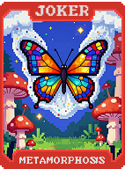 | **Metamorfose (Metamorphosis)** Transforma-se em um Curinga aleatório da mesma raridade no fim da rodada. |
| 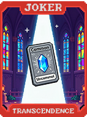 | **Transcendência (Transcendence)** Transforma todos os seus Curingas **Comuns** em **Incomuns**. |
| 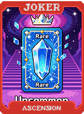 | **Ascensão (Ascension)** Transforma todos os seus Curingas **Incomuns** em **Raros**. |
| 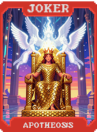 | **Apoteose (Apotheosis)** Transforma todo o seu baralho em um único naipe e rank específico. |
| 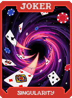 | **Singularidade (Singularity)** Funde todos os seus Curingas atuais em um único super-curinga massivo. |
| 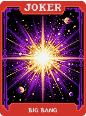 | **Big Bang** Substitui todo o seu baralho atual por 52 novas cartas totalmente aleatórias. |
| 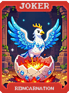 | **Reencarnação (Reincarnation)** Se for vendido, reaparece na loja com um efeito aprimorado. |
| 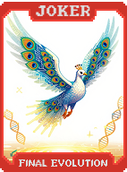 | **Evolução Final (Final Evolution)** **X5 Multi** se você possuir 5 Curingas que utilizam mecânicas de escala. |
| 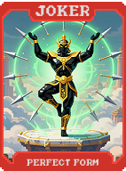 | **Forma Perfeita (Perfect Form)** **X4 Multi**. Torna você imune a qualquer efeito negativo de Blinds. |
| 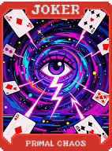 | **Caos Primordial (Primal Chaos)** Randomiza ranks e naipes de todo o baralho a cada rodada. Concede **X5 Multi**. |
| 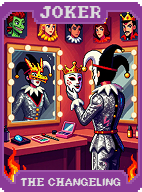 | **O Transformista (The Changeling)** Copia o efeito de um Curinga Lendário aleatório a cada rodada. |
|  | **Proteus (Proteus)** **X5 Multi**. Permite alterar naipe e rank de qualquer carta na mão livremente. |
