# ⚔️ Grupo Tribal (Tribal)

O grupo **Tribal** organiza o baralho em classes clássicas de RPG. Ao focar em bônus para cartas de Figura (Reis, Damas e Valetes) e especializações para cada "classe" (Guerreiro, Mago, Ladrão), este grupo permite criar builds temáticas com alta sinergia interna.

| Imagem | Detalhes do Curinga |
| :---: | :--- |
| 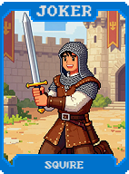 | **Escudeiro (Squire)** **+10 Multi** se jogar com um **Valete**. |
|  | **Dama de Companhia (Lady in Waiting)** **+10 Multi** se jogar com uma **Dama**. |
| 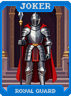 | **Guarda Real (Royal Guard)** **+10 Multi** se jogar com um **Rei**. |
|  | **Bobo da Corte (Jester)** **+10 Multi** se jogar com um **Ás**. |
| 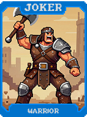 | **Guerreiro (Warrior)** **+20 Fichas** para cada carta de **Espadas** jogada. |
|  | **Mago (Mage)** **+4 Multi** para cada carta de **Paus** jogada. |
| 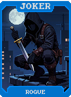 | **Ladrão (Rogue)** Ganha **$1** para cada carta de **Ouros** jogada. |
|  | **Clérigo (Cleric)** **+1 Mão** se jogar 5 cartas de Copas (1x por rodada). |
| 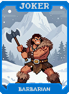 | **Bárbaro (Barbarian)** **+30 Multi** se a mão não contiver cartas de Realeza. |
| 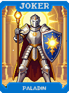 | **Paladino (Paladin)** **+50 Fichas** se a mão contiver apenas cartas de Realeza. |
|  | **Druida (Druid)** **+15 Multi** se jogar cartas de naipes diferentes. |
|  | **Necromante (Necromancer)** Traz de volta a última carta de Realeza destruída para sua mão. |
| 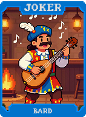 | **Bardo (Bard)** **+10 Multi**. Reativa a última carta de Realeza jogada. |
| 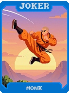 | **Monge (Monk)** **+20 Fichas** para cada carta 2, 3 ou 4 jogada. |
|  | **Caçador (Hunter)** **+15 Multi** durante Boss Blinds. |
|  | **Ferreiro (Blacksmith)** Cartas de **Aço** concedem **+10 Multi** adicional. |
|  | **Mercador (Merchant)** Cartas de **Ouro** concedem **$2** adicional. |
|  | **Alquimista (Alchemist)** **1 em 5** chance de transformar a carta jogada em **Carta de Ouro**. |
| 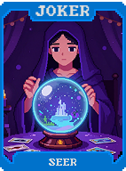 | **Vidente (Seer)** Mostra o naipe da próxima carta e dá **+5 Multi**. |
| 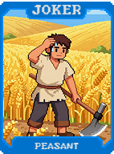 | **Camponês (Peasant)** **+5 Multi** para cada carta 2, 3, 4 ou 5 jogada. |
| 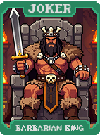 | **Rei Bárbaro (Barbarian King)** **X2 Multi** se jogar apenas cartas Pretas. |
|  | **Rainha das Fadas (Fairy Queen)** **X2 Multi** se jogar apenas cartas Vermelhas. |
| 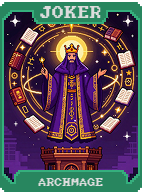 | **Arquimago (Archmage)** **+10 Multi** para cada carta de Paus presente no baralho. |
| 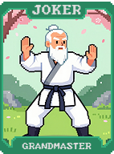 | **Grão-Mestre (Grandmaster)** **X1.5 Multi** para cada Valete, Dama e Rei na mão. |
| 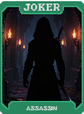 | **Assassino (Assassin)** Destrói a carta de menor valor da mão para conceder **X2 Multi**. |
| 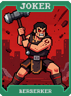 | **Berserker (Berserker)** **+50 Multi**, mas perde **-1 Descarte**. |
|  | **Xamã (Shaman)** Transforma cartas da mão em um naipe aleatório ao pontuar. |
| 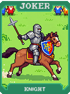 | **Cavaleiro (Knight)** Cartas de Realeza ganham **+50 Fichas** permanentes ao vencer um Boss. |
| 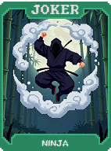 | **Ninja (Ninja)** **1 em 4** chance de duplicar uma carta de Realeza jogada. |
| 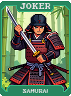 | **Samurai (Samurai)** Se jogar apenas 1 carta (**Carta Alta**), ela recebe **X3 Multi**. |
| 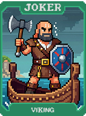 | **Viking (Viking)** Ganha **$1** por cada carta destruída durante a partida. |
|  | **Pirata (Pirate)** Ganha **$3** ao completar qualquer **Flush**. |
| 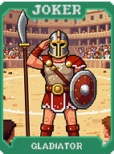 | **Gladiador (Gladiator)** **+10 Multi** para cada carta que permaneceu na mão (não jogada). |
| 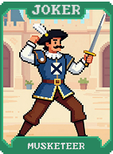 | **Mosqueteiro (Musketeer)** Se jogar uma **Trinca**, concede **X2 Multi**. |
|  | **Legionário (Legionnaire)** Se jogar uma **Quadra**, concede **X3 Multi**. |
| 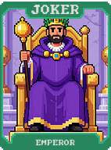 | **Imperador (Emperor)** Cria a carta de Tarô **O Imperador** se vencer em apenas 1 mão. |
| 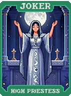 | **Sacerdotisa (High Priestess)** Cria a carta de Tarô **A Sacerdotisa** se vencer sem descartar. |
| 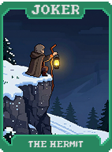 | **Eremita (The Hermit)** Cria a carta de Tarô **O Eremita** se o dinheiro estiver em **$0**. |
| 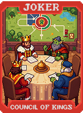 | **Conselho dos Reis (Council of Kings)** **X4 Multi** se tiver 4 Reis na mão. |
| 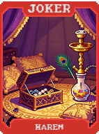 | **Harém (Harem)** **X4 Multi** se tiver 4 Damas na mão. |
| 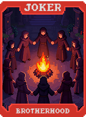 | **Irmandade (Brotherhood)** **X4 Multi** se tiver 4 Valetes na mão. |
| 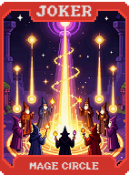 | **Círculo de Magos (Mage Circle)** **+1 Slot de Consumível**. Tarôs aparecem com o dobro de frequência. |
|  | **Guilda dos Ladrões (Thieves Guild)** Ganha **$1** (roubado do Blind) para cada mão jogada. |
| 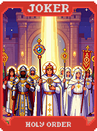 | **Ordem Sagrada (Holy Order)** Anula todos os debuffs de cartas na mão e dá **+20 Multi**. |
| 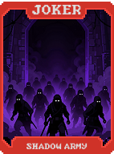 | **Exército das Sombras (Shadow Army)** Duplica cada carta de Realeza jogada no seu baralho. |
| 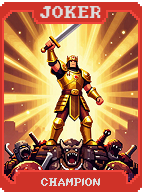 | **Campeão (Champion)** **X3 Multi**. Cada Boss Blind vencido aumenta o bônus em **+X0.5**. |
| 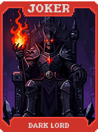 | **Lorde das Trevas (Dark Lord)** Destrói todas as figuras do baralho para conceder **X5 Multi**. |
| 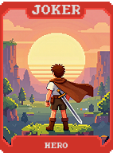 | **Herói (Hero)** **X5 Multi** se estiver com apenas **1 Mão** restante na rodada. |
| 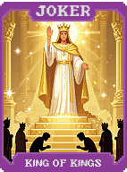 | **Rei dos Reis (King of Kings)** **X5 Multi**. Todas as cartas do baralho contam como **Reis**. |
| 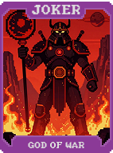 | **Deus da Guerra (God of War)** **X5 Multi**. Cartas jogadas são destruídas. Ganha **+X1** permanente por destruição. |
