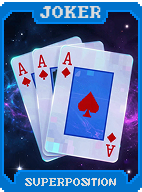
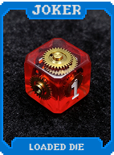
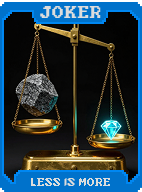
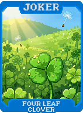

# 🌌 Visão Geral dos Curingas

Os **Curingas (Jokers)** são o coração do Balatro Odyssey. Com mais de 1.000 mecânicas únicas, eles foram meticulosamente organizados em **17 grupos temáticos** fundamentais. Cada grupo oferece um estilo de jogo distinto e sinergias que podem ser exploradas para alcançar pontuações astronômicas.

Nesta página, apresentamos uma visão geral de cada família de Curingas para que você possa planejar sua próxima jornada pelo cosmos.

---

## 🌌 1. [Singularidade (Singularity)](jokers/singularity.md)

**Foco:** Poder Individual e Slots Vazios.
Estes Curingas recompensam o jogador solitário. Eles oferecem bônus massivos se você tiver poucos Curingas, slots vazios ou se este for o único Curinga de uma determinada raridade. É o caminho perfeito para quem prefere qualidade extrema em vez de quantidade.

## ⚡ 2. [Quântico (Quantum)](jokers/quantum.md)

**Foco:** Incerteza e Superposição.
No reino quântico, nada é estático. Estes Curingas mudam seus valores, raridades ou até mesmo seus efeitos a cada mão jogada. Prepare-se para lidar com o "Colapso de Onda" e a "Superposição", onde a sorte é uma variável que você deve aprender a navegar.

## 🌀 3. [Temporal](jokers/temporal.md)

**Foco:** Manipulação do Tempo e Rodadas.
O tempo é seu aliado. Curingas deste grupo permitem ganhar mãos extras, descartes permanentes ou escalas de poder baseadas em quanto tempo a rodada ou a partida está durando. Ideal para quem gosta de controlar o ritmo do jogo.

## 🔮 4. [Dimensional](jokers/dimensional.md)

**Foco:** Espacialidade e Adjacência.
Estes curingas alteram a geometria do tabuleiro. Eles podem afetar Curingas que não estão ao seu lado, criar "slots fantasmagóricos" ou até mesmo mudar como as cartas são pontuadas com base na posição em que são jogadas.

## ☄️ 5. [Celestial](jokers/celestial.md)

**Foco:** Planetas e Mãos de Pôrquer.
Conectados diretamente às estrelas, estes Curingas buffam intensamente cartas de Planeta e oferecem multiplicadores gigantescos para tipos específicos de mãos de pôquer, transformando um simples Par em uma explosão estelar.

## 🎲 6. [Caos (Chaos)](jokers/chaos.md)

**Foco:** Imprevisibilidade e Recompensas Aleatórias.
O Caos não é apenas desordem; é oportunidade. Estes Curingas oferecem efeitos aleatórios potentes a cada ativação, desde ganhar dinheiro inesperado até transformar cartas do baralho de forma caótica.

## 👾 7. [Glitch](jokers/glitch.md)

**Foco:** Erros de Sistema e Quebra de Regras.
Curingas que parecem "quebrar" o código do jogo. Eles podem permitir que você jogue mãos ilegais, ignore restrições dos Blinds ou pontue cartas de maneiras que o Balatro original nunca permitiu.

## ☣️ 8. [Corrupção (Corruption)](jokers/corruption.md)

**Foco:** Risco Absoluto e Poder Proibido.
A Corrupção oferece o multiplicador mais alto do jogo, mas a um custo terrível. Estes Curingas podem destruir suas próprias cartas, consumir seu dinheiro ou até "corromper" outros Curingas, tornando-os negativos ou inúteis após um tempo.

## 🌀 9. [Paradoxo (Paradox)](jokers/paradox.md)

**Foco:** Regras Invertidas e Loops Lógicos.
O grupo Paradoxo subverte as regras de Balatro. Com efeitos que invertem valores, recompensam o fracasso e criam loops lógicos, estes Curingas forçam o jogador a pensar de forma não linear para extrair o máximo potencial do baralho.

## 🌀 10. [Anomalia (Anomaly)](jokers/anomaly.md)

**Foco:** Modificação de Atributos e Estados.
As Anomalias alteram as propriedades básicas das cartas e dos próprios Curingas, criando estados que desafiam a lógica convencional do jogo.

## 🔥 11. [Elemental (Elemental)](jokers/elemental.md)

**Foco:** Sinergia de Naipes e Combinações da Natureza.
Os Curingas Elementais canalizam as forças do Fogo, Água, Terra e Ar, focando em sinergias puras de naipes e combinações elementares poderosas.

## ⚔️ 12. [Tribal (Tribal)](jokers/tribal.md)

**Foco:** Classes de Personagem e Ranks Específicos.
O grupo Tribal organiza o baralho em classes (Guerreiro, Mago, Ladrão), focando em bônus para cartas de Figura e ranks numéricos específicos.

## 🛠️ 13. [Profissões (Professions)](jokers/professions.md)

**Foco:** Utilidade e Geração de Recursos.
Cadeiras de trabalho que oferecem utilidades variadas, desde Mineiros que criam Cartas de Pedra até Médicos que previnem a derrota.

## 💰 14. Economia (Economy)

**Foco:** Acúmulo de Dinheiro e Juros.
Curingas que transformam cada jogada em lucro, permitindo que você acumule fortunas para gastar na loja e em cupons.
**Foco:** Contradições e Loops.
Estes Curingas criam situações onde o impossível acontece. Se você jogar a mesma mão duas vezes, ou se não jogar nenhuma carta pontuável, o Paradoxo ativa bônus que desafiam a lógica matemática do jogo.

## ⚠️ 10. Anomalia (Anomaly)

**Foco:** Condições Únicas e Estágios Críticos.
As Anomalias ativam quando o jogo está em situações extremas: muito dinheiro ou nenhum, muitas cartas no deck ou pouquíssimas. Eles são os "coringas de segurança" que brilham no limite.

## 🔥 11. Elemental

**Foco:** Naipes e Aprimoramentos.
Divididos entre Fogo, Gelo, Terra e Ar, estes Curingas dão poder total aos naipes. Combinar Curingas Elementais com Aprimoramentos de cartas (como Rubi ou Esmeralda) é a chave para a vitória.

## ⚔️ 12. Tribal

**Foco:** Famílias de Cartas e Ranks.
Foca em grupos específicos de cartas (todas as Realezas, todos os números ímpares, todas as cartas de um único rank). Perfeito para baralhos altamente especializados e customizados.

## 🛠️ 13. Profissões (Professions)

**Foco:** Sinergias de Utilidade e Loja.
Curingas como o "Ferreiro" ou o "Alquimista" que melhoram sua experiência na loja, diminuem custos ou aumentam a eficácia de Tarôs e Espectrais enquanto você os carrega.

## 💰 14. Economia (Economy)

**Foco:** Acúmulo de Dinheiro e Juros.
Para os jogadores que querem ficar ricos. Estes Curingas transformam cada dólar em poder de pontuação ou garantem que você nunca saia da loja de mãos vazias.

## ⏳ 15. [Tempo e Turnos](jokers/time.md)

**Foco:** Gestão de Rodadas e Pulos.
Curingas que manipulam o ritmo das apostas, oferecendo bônus por velocidade ou permitindo pular rodadas com benefícios.

## 🃏 16. [Mãos e Descartes](jokers/hands.md)

**Foco:** Mecânicas de Descarte e Seleção.
Curingas que bonificam o uso estratégico de descartes ou modificam o comportamento das mãos jogadas.

## 🍀 17. [Sorte e Probabilidade](jokers/luck.md)

**Foco:** Chance Verde e Apostas.
Curingas que aumentam as chances de efeitos aleatórios ou garantem que a sorte esteja sempre do seu lado.

## 🦋 18. [Transformações](jokers/transformations.md)

**Foco:** Mutação de Cartas e Ranks.
Curingas que mudam as propriedades das cartas, alterando seus naipes, ranks ou até mesmo transformando-as em outras formas.

## 🗣️ 19. [Meta](jokers/meta.md)

**Foco:** Quarta Parede e Cultura Gamer.
Curingas que interagem com a interface do jogo, o tempo real ou referenciam a comunidade de Balatro.

## 📐 20. [Posicionamento](jokers/positioning.md)

**Foco:** Adjacência e Ordem dos Curingas.
A ordem dos fatores altera o produto. Estes Curingas dependem de seus vizinhos para maximizar o poder.

## 🏁 21. [Condições](jokers/conditions.md)

**Foco:** Gatilhos e Eventos Específicos.
Curingas que esperam o momento certo para brilhar. Eles ativam bônus massivos quando condições específicas do jogo são atendidas.

## 🏆 22. [Final](jokers/final.md)

**Foco:** Conclusão e Poder Absoluto.
A última linha de defesa. Estes Curingas são projetados para o Ante 8 e além, oferecendo poder incalculável para aqueles que chegam ao fim da jornada.

---

### Próximos Passos
Agora que você conhece os grupos, mergulhe na [Lista Completa de Curingas](jokers_reference.md) para ver cada carta em detalhes ou confira nossas [Estratégias Avançadas](../strategies/singularity-mastery.md).
