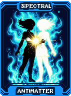
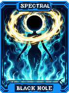
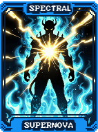
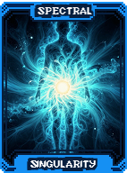
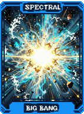
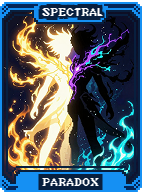

# 👻 Visão Geral dos Espectrais

As **Cartas Espectrais** representam as forças mais raras e voláteis do Balatro Odyssey. Com um baralho de **100 Espectrais**, estas cartas oferecem modificações que desafiam a realidade, muitas vezes exigindo um sacrifício significativo em troca de um poder sem precedentes.

Diferente dos Tarôs, os Espectrais raramente aparecem em Pacotes de Arcanos, sendo encontrados principalmente em **Pacotes Espectrais** ou através de Curingas específicos.

---

## 🌌 Categorias de Espectrais

Os 100 Espectrais de Odyssey são organizados por seus impactos na "física" da partida:

### 1. 💥 Eventos Cósmicos
Representam os fenômenos mais destrutivos e energéticos do universo.
*   **Foco:** Destruição de mão/Curingas em troca de Edições Negativas ou Policromáticas.
*   **Exemplos:**
      

### 2. ⚛️ Leis da Física e Teoria
Alteram as regras básicas de como o jogo processa informações e cálculos.
*   **Foco:** Buffs permanentes de XMult, fusão de Curingas e reinício de Antes.
*   **Exemplos:**
      
*   **Destaque:** **Zero Absoluto** (X5 Mult permanente, mas impede modificações futuras no deck) e **Singularidade** (Funde dois Curingas em um só).

### 3. 🔭 O Observatório e Probabilidade (IDs 30-39)
Cartas que concedem visão do futuro ou manipulam a sorte.
*   **Foco:** Revelar cartas do baralho, próximos Bosses ou dobrar efeitos de consumíveis.
*   **Destaque:** **Schrodinger** (50% de chance de dobrar seu dinheiro) e **Webb** (Revela todos os futuros Boss Blinds).

### 4. 🧬 Legado da Ciência (IDs 40-67)
Homenagens aos maiores cientistas da humanidade, com efeitos baseados em seus trabalhos.
*   **Foco:** Evolução de cartas, imunidade a debuffs e algoritmos de pontuação.
*   **Destaque:** **Darwin** (Cartas aumentam de rank ao pontuar) e **Pasteur** (Torna suas cartas imunes a debuffs de bosses).

### 5. 🚀 Pioneiros Espaciais (IDs 68-90+)
Inspirados na corrida espacial e nos avanços tecnológicos modernos.
*   **Foco:** Saltos de Ante, Vouchers raros e buffs para categorias específicas de cartas.
*   **Destaque:** **Armstrong** (Salta 2 Antes imediatamente) e **Gagarin** (Concede o lendário Voucher Tier 3).

---

## ⚠️ O Risco Espectral

Lembre-se: Quase todo Espectral poderoso possui um custo.
*   **Custos de Dinheiro:** Muitas cartas definem seu dinheiro para $0. Use-as *depois* de gastar tudo na loja.
*   **Custos de Estrutura:** Destruir Curingas ou reduzir slots de mão pode encerrar uma run se você não tiver um plano de backup.
*   **Imutabilidade:** Algumas cartas (como *Zero Absoluto*) impedem que você altere seu deck depois de usadas. Certifique-se de que seu baralho está "perfeito" antes de selar o destino.

---

### Próximos Passos
Consulte a [Lista de Espectrais](spectrals_reference.md) para ver a lista completa de efeitos ou aprenda como gerar estas cartas no [Guia de Geração Espectral](spectral_generation_guide.md).
