# 👺 Lista de Blinds (Chefes)

No **Balatro Odyssey**, os Blinds (Cegas) foram expandidos para oferecer desafios temáticos e mecânicos únicos. Cada **Boss Blind** possui uma habilidade passiva que tentará impedir o seu progresso no Ante.

| Imagem | Nome | Multi. | Efeito |
| :---: | :--- | :---: | :--- |
|  | **O Gancho (The Hook)** | **4.0x** | Descarta 2 cartas aleatórias. |
|  | **O Boi (The Ox)** | **4.0x** | Jogar mão mais jogada define dinheiro para $0. |
| 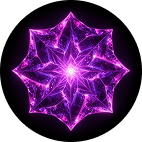 | **A Casa (The House)** | **4.0x** | Primeira mão virada para baixo. |
| 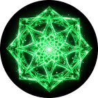 | **A Muralha (The Wall)** | **10.0x** | Pontuação muito alta. |
| 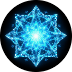 | **A Roda (The Wheel)** | **4.0x** | 1 em 7 cartas viradas para baixo. |
| 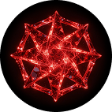 | **O Braço (The Arm)** | **4.0x** | Diminui nível da mão jogada. |
| 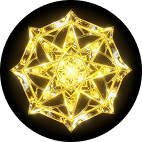 | **O Paus (The Club)** | **4.0x** | Todas as cartas de Paus debuffadas. |
| 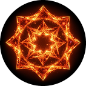 | **O Peixe (The Fish)** | **4.0x** | Cartas compradas viradas para baixo. |
| 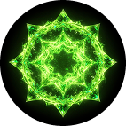 | **O Psíquico (The Psychic)** | **4.0x** | Deve jogar 5 cartas. |
|  | **O Aguilhão (The Goad)** | **4.0x** | Cartas de Espadas debuffadas. |
| 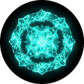 | **A Água (The Water)** | **4.0x** | 0 Descartes. |
| 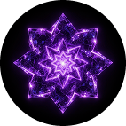 | **A Janela (The Window)** | **4.0x** | Cartas de Ouros debuffadas. |
| 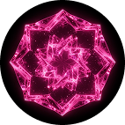 | **A Algema (The Manacle)** | **4.0x** | -1 Tamanho de Mão. |
|  | **O Olho (The Eye)** | **4.0x** | Não pode repetir tipo de mão. |
| 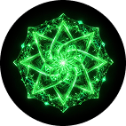 | **A Boca (The Mouth)** | **4.0x** | Deve jogar apenas 1 tipo de mão. |
| 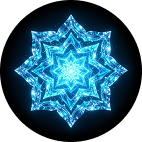 | **A Planta (The Plant)** | **4.0x** | Cartas de Figura debuffadas. |
| 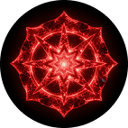 | **A Serpente (The Serpent)** | **4.0x** | Compre 3 cartas ao jogar/descartar. |
| 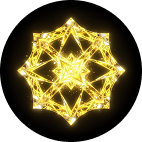 | **O Pilar (The Pillar)** | **4.0x** | Cartas jogadas neste Ante debuffadas. |
| 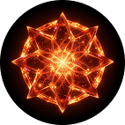 | **A Muralha de Aço (The Steel Wall)** | **20.0x** | Pontuação extremamente alta. |
|  | **O Vampiro (The Vampire)** | **4.0x** | Drena $1 para cada 10.000 pontos marcados. |
| 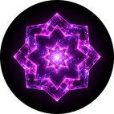 | **A Guilhotina (The Guillotine)** | **4.0x** | Destrói a primeira carta jogada. |
| 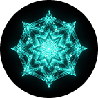 | **O Labirinto (The Labyrinth)** | **4.0x** | Mãos devem ter exatamente 3 cartas. |
| 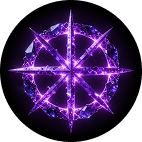 | **A Névoa (The Fog)** | **4.0x** | Não pode ver os pontos das cartas. |
| 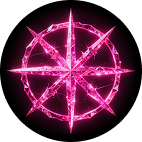 | **O Espelho Quebrado (The Broken Mirror)** | **4.0x** | Mãos jogadas invertem o rank (A vira 2, K vira 3...). |
| 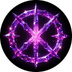 | **A Areia Movediça (The Quicksand)** | **4.0x** | -1 Mão para cada $10 que você possui. |
| 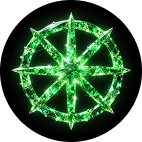 | **O Buraco Negro (The Black Hole)** | **4.0x** | -3 Tamanho de Mão. |
|  | **A Supernova (The Supernova)** | **4.0x** | Descartes custam $5. |
| 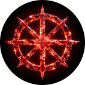 | **O Quasar (The Quasar)** | **4.0x** | Mãos custam $5. |
|  | **O Pulsar (The Pulsar)** | **4.0x** | Cartas jogadas são debuffadas permanentemente. |
| 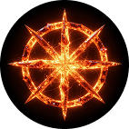 | **O Ímã (The Magnet)** | **4.0x** | Apenas um naipe permitido (outros debuffados). |
| 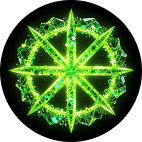 | **O Prisma (The Prism)** | **4.0x** | Apenas um rank permitido (outros debuffados). |
| 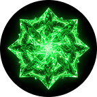 | **O Vazio (The Void)** | **4.0x** | Coringas desativados por 1 rodada a cada mão. |
| 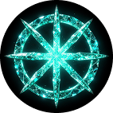 | **O Tempo (The Time)** | **4.0x** | 10 segundos para jogar cada mão. |
|  | **O Espaço (The Space)** | **4.0x** | Tamanho de Mão 10, mas apenas 1 Mão. |
| 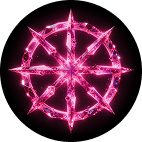 | **A Matéria (The Matter)** | **4.0x** | Cartas não podem ser movidas. |
| 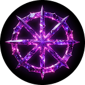 | **A Energia (The Energy)** | **4.0x** | Cartas queimam (são destruídas) após pontuar. |
| 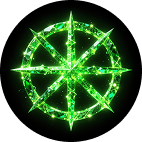 | **A Entropia (The Entropy)** | **4.0x** | Ranks mudam aleatoriamente após cada descarte. |
|  | **O Caos (The Chaos)** | **4.0x** | Naipes mudam aleatoriamente após cada descarte. |
| 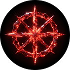 | **A Fortaleza (The Fortress)** | **40.0x** | Pontuação massiva. |
| 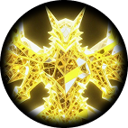 | **O Titã (The Titan)** | **4.0x** | Deve fazer 10% da pontuação em uma única mão. |
| 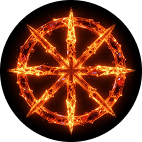 | **O Colosso (The Colossus)** | **4.0x** | Cartas de rank baixo (2-9) não pontuam. |
| 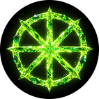 | **A Hidra (The Hydra)** | **4.0x** | Cada descarte adiciona uma carta ruim ao baralho. |
| 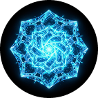 | **O Basilisco (The Basilisk)** | **4.0x** | Jogar cartas de Figura petrifica (debuffa) o resto da mão. |
| 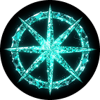 | **A Quimera (The Chimera)** | **4.0x** | Naipes alternam a cada mão (Copas -> Espadas -> ...). |
|  | **O Grifo (The Griffin)** | **4.0x** | Não pode jogar a mesma mão duas vezes seguidas. |
|  | **O Kraken (The Kraken)** | **4.0x** | Tentáculos seguram 2 slots de Joker (Desativados). |
| 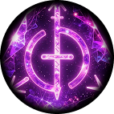 | **O Leviatã (The Leviathan)** | **4.0x** | Mãos de 5 cartas são proibidas. |
| 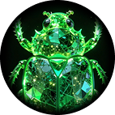 | **O Behemoth (The Behemoth)** | **4.0x** | Mãos de menos de 5 cartas são proibidas. |
| 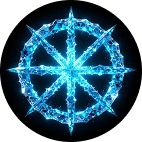 | **A Esfinge (The Sphinx)** | **4.0x** | Primeira mão jogada deve ser a mesma mão que a última do Ante anterior. |
| 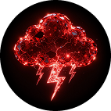 | **O Minotauro (The Minotaur)** | **4.0x** | Descartes são aleatórios (você não escolhe o que descartar). |
| 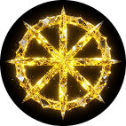 | **A Fênix (The Phoenix)** | **4.0x** | Ressuscita (reinicia os pontos) uma vez ao atingir 0 HP. |
| 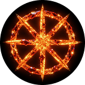 | **A Iara (The Siren)** | **4.0x** | Seduz (debuffa) 1 Joker aleatório a cada mão. |
| 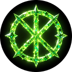 | **O Cíclope (The Cyclops)** | **4.0x** | Cartas são viradas para baixo se você tiver mais de 5 cartas na mão. |
| 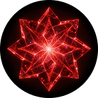 | **O Golem (The Golem)** | **4.0x** | Cartas de Ouro e Edição são debuffadas. |
| 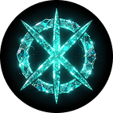 | **A Gargoyle (The Gargoyle)** | **4.0x** | Ganha +1.0x de Multiplicador para cada mão jogada. |
| 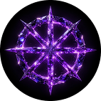 | **O Espectro (The Wraith)** | **4.0x** | Consumíveis são destruídos ao serem usados. |
| 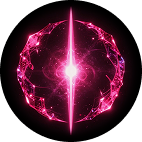 | **O Zumbi (The Zombie)** | **4.0x** | Cartas descartadas voltam para o baralho. |
|  | **O Fantasma (The Ghost)** | **4.0x** | Não pode ver o valor das cartas até jogá-las. |
| 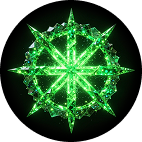 | **A Cidadela (The Citadel)** | **80.0x** | Pontuação colossal. |
|  | **A Singularidade (The Singularity)** | **4.0x** | Pontos por carta são invertidos (A vale 1, 2 vale 11). |
| 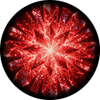 | **A Dimensão X (The Dimension X)** | **4.0x** | Multiplicadores de Joker são ignorados. |
| 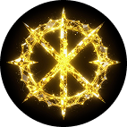 | **O Horizonte de Eventos (Event Horizon)** | **4.0x** | Não pode comprar cartas (mão não repõe). |
| 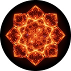 | **A Teoria das Cordas (String Theory)** | **4.0x** | Cartas adjacentes na mão são debuffadas juntas. |
|  | **A Relatividade (Relativity)** | **4.0x** | Ordem de pontuação da mão é aleatória. |
|  | **A Dualidade (Duality)** | **4.0x** | Deve alternar entre Flush e Full House. |
|  | **A Incerteza (Uncertainty)** | **4.0x** | Probabilidades (1 em X) nunca ocorrem. |
|  | **O Emaranhamento (Entanglement)** | **4.0x** | Jogar uma carta debuffa outra carta idêntica no baralho. |
|  | **A Superposição (Superposition)** | **4.0x** | Cartas podem ser dois naipes ao mesmo tempo (aleatório). |
|  | **O Verme de Meda (Wormhole)** | **4.0x** | Pula para o próximo Ante se você vencer na 1ª mão. |
|  | **A Antimatéria (Antimatter)** | **4.0x** | Cartas Negativas ou Policromáticas debuffadas. |
|  | **O Taquião (Tachyon)** | **4.0x** | Rodada termina automaticamente em 30 segundos. |
|  | **A Gravidade Zero (Zero Gravity)** | **4.0x** | Chips das cartas não contam, apenas o Multi. |
|  | **O Big Bang (The Big Bang)** | **4.0x** | Primeira mão jogada ganha +100 Multi, mãos seguintes perdem 50. |
|  | **O Destino (The Fate)** | **4.0x** | Cartas com Selo (Seal) são debuffadas. |
|  | **O Oráculo (The Oracle)** | **4.0x** | Próximas 3 cartas do baralho são visíveis, mas debuffadas. |
|  | **O Arcanista (The Arcanist)** | **4.0x** | Cartas de Tarô reduzem a pontuação se usadas agora. |
|  | **O Astrônomo (The Astronomer)** | **4.0x** | Cartas de Planeta não dão bônus nesta rodada. |
|  | **O Alquimista (The Alchemist)** | **4.0x** | Transmuta metade do seu dinheiro em Chips. |
|  | **O Olimpo (The Olympus)** | **160.0x** | Pontuação Divina. |
|  | **Zeus (Zeus)** | **4.0x** | Raios debuffam 1 carta aleatória toda vez que você pontua. |
|  | **Hades (Hades)** | **4.0x** | Cartas destruídas este Ante dão Multi negativo. |
|  | **Poseidon (Poseidon)** | **4.0x** | Inunda a mão com 3 cartas de Rank 2 extras. |
|  | **Atena (Athena)** | **4.0x** | Apenas mãos complexas (Straight ou melhor) pontuam. |
|  | **Ares (Ares)** | **4.0x** | Cada bônus de Multi é reduzido pela metade. |
|  | **Afrodite (Aphrodite)** | **4.0x** | Cartas de Figura "beijam" (debuffam) as cartas vizinhas. |
|  | **Hermes (Hermes)** | **4.0x** | Descartes são bloqueados por 2 mãos. |
|  | **Apolo (Apollo)** | **4.0x** | Não pode ver o Blind até a primeira mão ser jogada. |
|  | **Artemis (Artemis)** | **4.0x** | Cartas de naipe único (Flush) debuffadas. |
|  | **Hefesto (Hephaestus)** | **4.0x** | Aprimoramentos de cartas (Aço, Vidro, etc.) são ignorados. |
|  | **Dionísio (Dionysus)** | **4.0x** | A tela fica "bêbada" (cartas balançam e trocam de lugar). |
|  | **Gaia (Gaia)** | **4.0x** | Cartas de Pedra (Stone) não dão Chips. |
|  | **Cronos (Cronus)** | **4.0x** | Inverte o tempo (perde Multi a cada segundo). |
|  | **O Eclipse (The Eclipse)** | **4.0x** | Toda a mão fica virada para baixo após um descarte. |
|  | **A Nebulosa (The Nebula)** | **4.0x** | Você não pode ver o Multi atual durante a mão. |
|  | **A Galáxia (The Galaxy)** | **4.0x** | Cada carta pontua uma cor aleatória diferente. |
|  | **O Multiverso (The Multiverse)** | **4.0x** | Cria uma cópia temporária do seu Joker mais forte. |
|  | **A Eternidade (The Eternity)** | **4.0x** | Boss volta à vida 3 vezes com 25% de vida. |
|  | **A Odisseia Final (The Final Odyssey)** | **1000.0x** | O desafio supremo. Tudo ou nada. |
