# 🃏 Baralhos (Decks) e Edições

O **Balatro Odyssey** adiciona 100 baralhos únicos com mecânicas que mudam o modo como você joga cada partida. Cada baralho oferece uma vantagem (ou desafio) temática.

## 🃏 1. Lista de Baralhos (100 Baralhos)

| Imagem | Nome | Efeito |
| :---: | :--- | :--- |
| 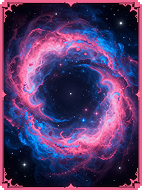 | **Baralho Nebulosa** | Começa com o Cupom Telescópio. |
| 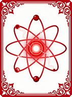 | **Baralho de Prótons** | +1 Tamanho de Mão. |
| 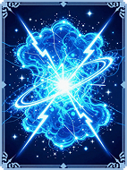 | **Baralho de Elétrons** | +1 Descarte por rodada. |
| 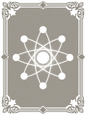 | **Baralho de Nêutrons** | Sem cartas de Figura no baralho inicial. +2 Slots de Curinga. |
| 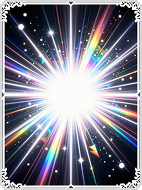 | **Baralho de Fótons** | Todas as cartas do baralho inicial são aprimoradas para Ouros. |
| 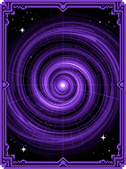 | **Baralho Gravitacional** | A primeira carta jogada em cada mão é reativada 1 vez. |
|  | **Baralho Horizonte de Eventos** | Destruir cartas concede +0.5 Multi permanente. |
| 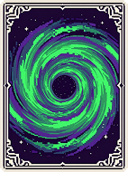 | **Baralho Buraco de Minhoca** | Pular um Blind concede uma Tag Dupla adicional. |
| 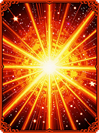 | **Baralho Supernova** | Se o dinheiro exceder $50, ele reseta para $0, mas você ganha X3 Multi permanentemente. |
| 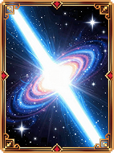 | **Baralho Quasar** | Começa com +20 Multi Base. Não ganha Juros. |
|  | **Baralho Energia Escura** | Curingas Negativos aparecem 4x mais frequentemente na loja. |
| 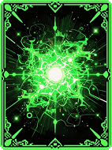 | **Baralho Antimatéria** | Começa com uma Tag Negativa. |
| 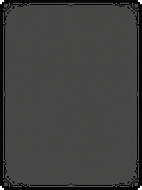 | **Baralho Vácuo** | Lojas não têm Reroll. Lojas têm 6 slots de cartas. |
|  | **Baralho Teoria das Cordas** | Classes podem conectar com lacunas de 1 (ex: 2 conecta com 4). |
| 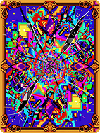 | **Baralho do Caos** | O baralho inicial tem naipes e classes totalmente aleatórios. |
| 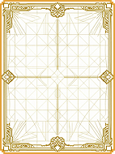 | **Baralho da Ordem** | O baralho inicial é perfeitamente ordenado. Mãos jogadas em ordem dão bônus. |
| 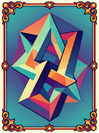 | **Baralho do Paradoxo** | Começa no Ante 0. Blinds escalam mais rápido. |
|  | **Baralho da Linha do Tempo** | 10% da pontuação da mão anterior é adicionada à mão atual. |
| 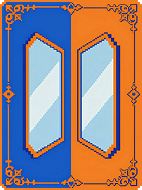 | **Baralho Paralelo** | +2 Mãos, -2 Descartes. |
| 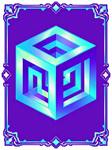 | **Baralho Dimensional** | Baralho inicial tem 78 cartas (52 padrão + 26 aleatórias). |
| 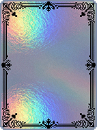 | **Baralho Holográfico** | Começa com um Curinga Holográfico aleatório. |
| 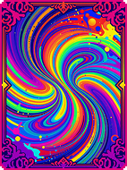 | **Baralho Policromático** | Começa com um Curinga Policromático aleatório. |
| 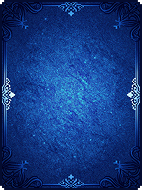 | **Baralho Foil** | Começa com um Curinga Foil aleatório. |
|  | **Baralho Negativo** | Começa com um Curinga Negativo aleatório. |
| 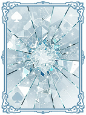 | **Baralho de Vidro** | Todas as cartas iniciais são de Vidro. |
|  | **Baralho de Borracha** | Todas as cartas iniciais são de Borracha. |
| 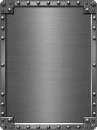 | **Baralho de Aço** | Todas as cartas iniciais são de Aço. |
| 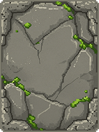 | **Baralho de Pedra** | Todas as cartas iniciais são de Pedra. |
| 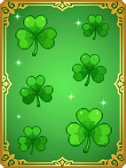 | **Baralho da Sorte** | Todas as cartas iniciais são de Sorte. |
| 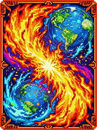 | **Baralho Selvagem** | Todas as cartas iniciais são de Naipes Coringa. |
| 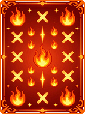 | **Baralho Multiplicador** | Todas as cartas iniciais são Multi. |
| 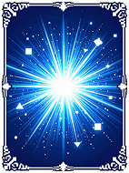 | **Baralho de Bônus** | Todas as cartas iniciais são de Bônus. |
|  | **Baralho Duplo** | Baralho inicial tem 104 cartas (2 cópias de cada). |
| 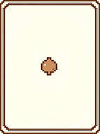 | **Baralho Minúsculo** | Baralho inicial tem 26 cartas (Apenas Naipes Vermelhos). |
|  | **Baralho da Ascensão** | Blinds requerem 2x mais pontos. Todas as mãos pontuam X2. |
| 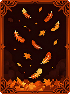 | **Baralho da Queda** | Blinds requerem 0.5x pontos. Todas as mãos pontuam 0.5x. |
| 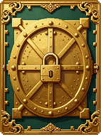 | **Baralho da Avareza** | Ganha $10 fixos ao final da rodada. Juros desativados. |
|  | **Baralho da Pobreza** | Começa com $0. Juros máximos aumentados para $10. |
|  | **Baralho da Gula** | +2 Slots de Curinga, -2 Slots de Consumível. |
| 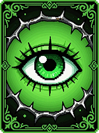 | **Baralho da Inveja** | Começa com o Curinga Mímico. |
| 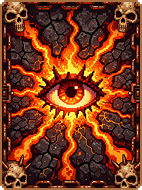 | **Baralho da Ira** | Descartes custam $1. Mãos dão $1. |
| 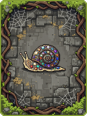 | **Baralho da Preguiça** | 1 Mão/rodada, 0 Descartes. X3 Multi. |
|  | **Baralho da Luxúria** | Copas dão X1.2 Multi. |
| 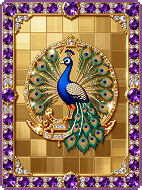 | **Baralho do Orgulho** | Cartas de Figura dão +30 Fichas. |
|  | **Baralho Alfa** | Apenas A, 2, 3, 4, 5. |
| 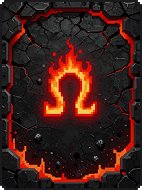 | **Baralho Ômega** | Apenas 10, J, Q, K, A. |
| 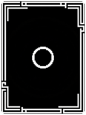 | **Baralho Zero** | Apenas 2-9. |
| 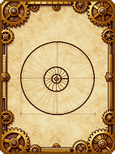 | **Baralho Fibonacci** | Apenas 1, 2, 3, 5, 8. |
| 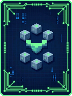 | **Baralho Primo** | Apenas 2, 3, 5, 7, J, K. |
| 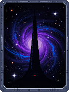 | **Baralho Odisseia** | Começa com um Curinga Lendário aleatório. |
| 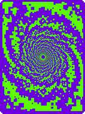 | **Baralho Fractal** | Ao jogar 5 cartas iguais, cria uma cópia no baralho. |
| 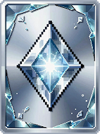 | **Baralho Espelho** | Mãos jogadas da direita para esquerda pontuam dobro. |
|  | **Baralho Fantasma** | Cartas jogadas não são descartadas (voltam para mão). -2 Mãos. |
| 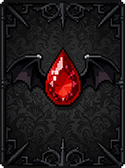 | **Baralho Vampiro** | Destrói cartas jogadas para ganhar Multi permanente. |
| 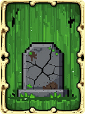 | **Baralho Zumbi** | Pode jogar cartas descartadas (uma vez por rodada). |
| 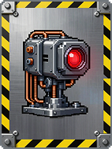 | **Baralho Ciborgue** | Começa com 2 Curingas Automatizados. |
|  | **Baralho Alien** | Naipes são substituídos por símbolos alienígenas (4 novos naipes). |
| 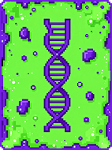 | **Baralho Mutante** | Naipes mudam a cada rodada. |
| 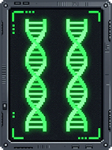 | **Baralho Clone** | Começa com 52 Ases de Espadas. |
|  | **Baralho Invisível** | Cartas são jogadas viradas para baixo. X4 Multi. |
|  | **Baralho Etéreo** | Cartas espectrais aparecem na loja normalmente. |
| 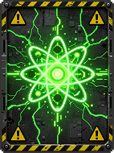 | **Baralho Radioativo** | Cartas na mão decaem (mudam rank) a cada rodada. |
| 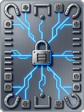 | **Baralho Magnético** | Cartas de mesmo rank se atraem (sempre compradas juntas). |
| 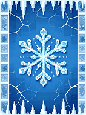 | **Baralho Congelado** | Primeira mão sempre debuffada. +2 Mãos. |
| 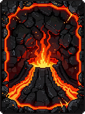 | **Baralho Vulcânico** | Descarta mão inteira após jogar. +$5 por mão. |
| 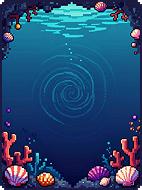 | **Baralho Oceânico** | Apenas naipes Pretos. Flush vale 2x. |
|  | **Baralho Solar** | Apenas naipes Vermelhos. Flush vale 2x. |
|  | **Baralho Lunar** | Fases da lua afetam pontuação (Ciclo de 4 rodadas). |
|  | **Baralho Estelar** | Começa com 5 cartas de Planeta aleatórias. |
|  | **Baralho Místico** | Começa com 5 cartas de Tarô aleatórias. |
|  | **Baralho Tecnológico** | Começa com $100. Lojas são 2x mais caras. |
|  | **Baralho Primitivo** | Sem lojas. Ganha recompensas de blind dobradas. |
|  | **Baralho Arcano** | Arcana Packs são gratuitos. |
|  | **Baralho Celestial** | Planet Packs são gratuitos. |
|  | **Baralho Espectral** | Spectral Packs são gratuitos. |
|  | **Baralho Padrão (Standard)** | Standard Packs são gratuitos. |
|  | **Baralho Bobo (Buffoon)** | Buffoon Packs são gratuitos. |
|  | **Baralho Mercenário** | Não ganha dinheiro de blinds. Ganha $5 por Curinga vendido. |
|  | **Baralho Investidor** | Juros não têm limite. |
|  | **Baralho Minimalista II** | Mão tamanho 3. X5 Multi. |
|  | **Baralho Maximalista II** | Mão tamanho 10. 0 Descartes. |
|  | **Baralho Caótico II** | Boss Blinds têm efeitos dobrados. X2 Pontuação necessária para vencer. |
|  | **Baralho Ordenado II** | Boss Blinds não têm efeito. 0.5x Pontuação necessária. |
|  | **Baralho Sortudo II** | Probabilidades são sempre 1 em 1. Inimigos 4x Pontos. |
|  | **Baralho Azarado** | Probabilidades são 1 em 1000. Inimigos 0.25x Pontos. |
|  | **Baralho Rei Midas** | Tudo vira Ouro (Cartas, Curingas). |
|  | **Baralho Rei Arthur** | Começa com Excalibur (Curinga Lendário). |
|  | **Baralho Merlin** | Começa com 3 Poções (Consumíveis). |
|  | **Baralho Dragão** | Bosses têm 10x HP. Você cospe fogo (X10 Multi). |
|  | **Baralho Fênix** | Se morrer, renasce no Ante 1 com tudo mantido (1 vez). |
|  | **Baralho Hidra** | Vencer Blind gera 2 novos Blinds extras. |
|  | **Baralho Quimera** | Baralho misto de 4 baralhos diferentes. |
|  | **Baralho Grifo** | Pula automaticamente Small Blinds. |
|  | **Baralho Unicórnio** | Começa com um Curinga Místico aleatório. |
|  | **Baralho Kraken** | Tentáculos seguram seus Curingas (Não pode vender). |
|  | **Baralho Leviatã** | Mãos de 5 cartas dão +1000 Fichas. |
|  | **Baralho Behemoth** | Mãos de 1 carta dão X5 Multi. |
|  | **Baralho Titã** | Cartas gigantes (ocupam 2 slots de mão). |
|  | **Baralho Gnomo** | Cartas minúsculas (ocupam 0.5 slots). |
|  | **Baralho O Criador** | Modo Criativo desbloqueado. |

## 💎 2. Edições Personalizadas

As Edições são efeitos visuais e mecânicos aplicados a cartas e Curingas.

| Nome | Efeito | Tema |
| :--- | :--- | :--- |
| **Glitch** | **Retrigger Aleatório** (50% de chance de reativar). | Caos, Erro Digital. |
| **Sombria (Umbral)** | **+X0.2 Mult** para cada Curinga que você possui. | Escuridão, Vazio. |
| **Radiante** | Ganha **+$1** ao jogar/pontuar. | Luz, Energia Solar. |
| **Etérea** | **50% de chance** de não ser destruída/vendida. | Fantasmas, Proteção. |
| **Quântica** | **Conta como duas cartas** (Duplica triggers). | Ciência de Partículas. |
| **Cósmica** | **+1 Nível de Mão** ao pontuar. | Universo, Galáxias. |
| **Maldita** | **X3 Multi**, mas 1 em 4 chance de se destruir. | Corrupção, Sangue. |
| **Temporal** | **Retrigger Garantido (1x)**. | Tempo, Loops. |
