# ⚠️ Grupo Anomalia (Anomaly)

As **Anomalias** são falhas na estrutura fundamental do Balatro. Elas alteram as propriedades básicas das cartas (naipes, ranks e estados) e desafiam a lógica convencional, permitindo combates que ignoram as limitações físicas do baralho.

| Imagem | Detalhes do Curinga |
| :---: | :--- |
| 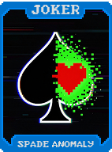 | **Anomalia de Espadas (Spade Anomaly)** Cartas de **Espadas** contam como **Copas** para Flushes. **+10 Multi**. |
| 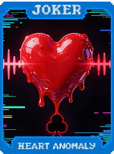 | **Anomalia de Copas (Heart Anomaly)** Cartas de **Copas** contam como **Paus** para Flushes. **+10 Multi**. |
| 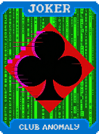 | **Anomalia de Paus (Club Anomaly)** Cartas de **Paus** contam como **Ouros** para Flushes. **+10 Multi**. |
| 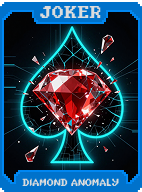 | **Anomalia de Ouros (Diamond Anomaly)** Cartas de **Ouros** contam como **Espadas** para Flushes. **+10 Multi**. |
| 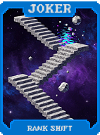 | **Mudança de Rank (Rank Shift)** **Ases** contam como **2s** e vice-versa. |
| 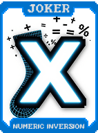 | **Inversão Numérica (Numeric Inversion)** Cartas **Pares** dão Multi, Cartas **Ímpares** dão Fichas. |
| 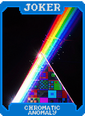 | **Anomalia Cromática (Chromatic Anomaly)** Cartas **Polychrome** aparecem com mais frequência na loja. |
|  | **Anomalia de Material (Material Anomaly)** Cartas de **Pedra** contam como **Ouro** (dão **$3**). |
| 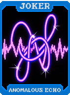 | **Eco Anômalo (Anomalous Echo)** A última carta jogada é reativada se for de um naipe diferente da primeira. |
| 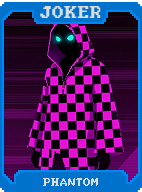 | **Fantasma (Phantom)** **+20 Multi**. Este Curinga permite ter **+1 slot** de Curinga extra. |
| 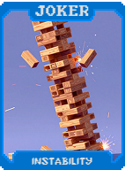 | **Instabilidade (Instability)** **+15 Multi**. A cada rodada, muda o naipe alvo para ativação. |
| 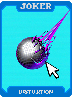 | **Distorção (Distortion)** **+50 Fichas**. Cartas jogadas ficam visualmente "em branco". |
| 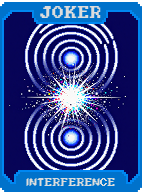 | **Interferência (Interference)** **+10 Multi**. Se tiver outro Curinga "Anomalia", ganha **+20 Multi** extra. |
| 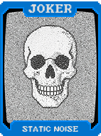 | **Ruído Estático (Static Noise)** **1 em 4** chance de ganhar **$5** ao jogar uma mão. |
| 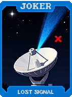 | **Sinal Perdido (Lost Signal)** Se descartar 5 cartas de uma vez, ganhe **+1 Mão** (1x por rodada). |
| 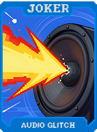 | **Glitch de Áudio (Audio Glitch)** **+30 Fichas**. Toca sons distorcidos durante a pontuação. |
| 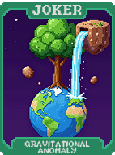 | **Anomalia Gravitacional (Gravitational Anomaly)** Cartas baixas (2-5) são movidas para a esquerda. **+20 Multi** se jogar só elas. |
| 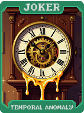 | **Anomalia Temporal (Temporal Anomaly)** Pula o Blind atual (vence instantaneamente), ganha $0 e se destrói. |
| 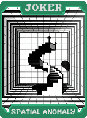 | **Anomalia Espacial (Spatial Anomaly)** **+2 Cartas** no tamanho da mão, mas **-1 Slot** de Curinga. |
| 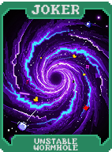 | **Buraco de Minhoca Instável (Unstable Wormhole)** **X2 Multi**. **1 em 10** chance de destruir um Curinga adjacente. |
| 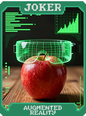 | **Realidade Aumentada (Augmented Reality)** Cartas de **Vidro** perdem a chance de quebrar. |
| 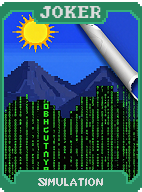 | **Simulação (Simulation)** Se a mão jogada for idêntica à anterior (mesmos ranks), **X4 Multi**. |
| 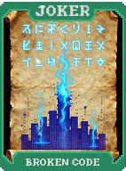 | **Código Quebrado (Broken Code)** **+100 Fichas**. O nome da mão jogada fica ilegível. |
| 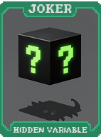 | **Variável Oculta (Hidden Variable)** **+X0.5 Multi** para cada Curinga do grupo "Anomalia" que você possuir. |
| 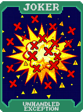 | **Exceção Não Tratada (Unhandled Exception)** Se tentar descartar com 0 descartes restantes, ganhe **$10**. |
| 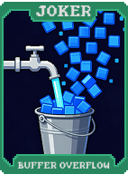 | **Buffer Overflow (Buffer Overflow)** Ao jogar 5 cartas, reativa a carta central **2 vezes**. |
| 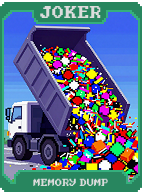 | **Memory Dump (Memory Dump)** Ao vender, gera 3 cartas aleatórias na sua mão. |
| 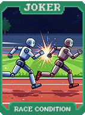 | **Race Condition (Race Condition)** **+50 Multi** se jogar a mão nos primeiros 5 segundos da rodada. |
| 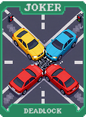 | **Deadlock (Deadlock)** Se não tiver descartes nem mãos (apenas a atual), **X3 Multi**. |
| 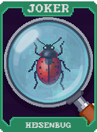 | **Heisenbug (Heisenbug)** Muda de efeito (Multi, Fichas ou $) sempre que você seleciona cartas. |
| 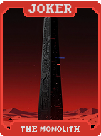 | **O Monólito (The Monolith)** **X4 Multi**. Indestrutível e não pode ser vendido. |
| 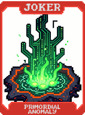 | **Anomalia Primordial (Primordial Anomaly)** Cria um Curinga **Lendário** se vencer o Boss sem usar descartes. |
| 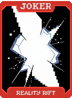 | **Fenda na Realidade (Reality Rift)** **+1 Slot** de Consumível e **+1 Slot** de Curinga. |
| 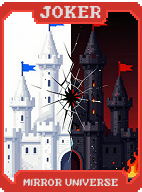 | **Universo Espelho (Mirror Universe)** Dobra todo dinheiro ganho e todo dinheiro perdido. |
| 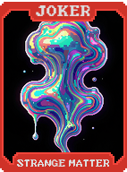 | **Matéria Estranha (Strange Matter)** Transforma cartas jogadas em **Cartas de Ouro** após pontuarem. |
| 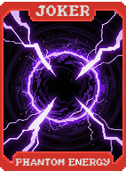 | **Energia Fantasma (Phantom Energy)** **+1 Slot** de Curinga e Consumível, **-2 Tamanho de Mão**. |
| 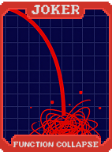 | **Colapso de Função (Function Collapse)** **X3 Multi**. Todas as cartas de Realeza perdem seu naipe. |
| 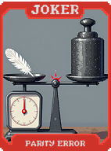 | **Erro de Paridade (Parity Error)** Se jogar 5 cartas só Pares ou só Ímpares, ganhe **$20**. |
| 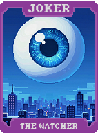 | **O Observador (The Watcher)** Revela a ordem exata de todas as cartas do baralho. **X3 Multi**. |
| 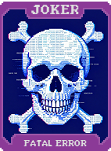 | **Erro Fatal (Fatal Error)** Simula um travamento e concede **X10 Multi** e **Dinheiro Infinito** na mão atual. |
