# ☄️ Grupo Celestial (Celestial)

Conectados diretamente às estrelas, os Curingas do grupo **Celestial** focam em fortalecer cartas de Planeta, mãos de pôquer específicas e mecânicas que utilizam o tamanho do baralho e a raridade galáctica.

| Imagem | Detalhes do Curinga |
| :---: | :--- |
|  | **Estrela Cadente (Shooting Star)** **+4 Multi**. Ganha **+2 Multi** quando você usa uma carta de Planeta. |
|  | **Constelação (Constellation)** **X1.5 Multi** se a mão jogada contiver 3 ou mais cartas de Figura. |
| 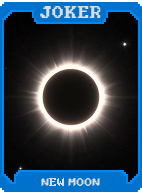 | **Lua Nova (New Moon)** **1 em 4** chance de reativar cartas de Figura. |
|  | **Sol Nascente (Rising Sun)** **+15 Multi** na primeira mão da rodada. |
| 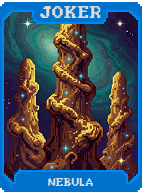 | **Nebulosa (Nebula)** Cria uma carta de **Planeta** aleatória se a mão jogada for uma **Carta Alta**. |
| 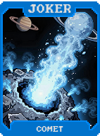 | **Cometa (Comet)** **+10 Fichas** para cada carta restante no seu baralho. |
| 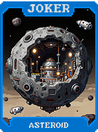 | **Asteroide (Asteroid)** **+50 Fichas**. **-5 Fichas** por carta jogada nesta rodada. |
| 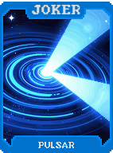 | **Pulsar (Pulsar)** **+10 Multi**. Ganha **+10 Multi** a cada 3 mãos jogadas (Reseta após Boss). |
| 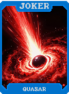 | **Quasar (Quasar)** **+40 Fichas**. **+5 Fichas** por descarte usado nesta rodada. |
| 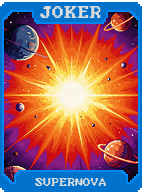 | **Supernova (Supernova)** **X2 Multi**. Reseta para X1 se você jogar uma **Carta Alta**. |
| 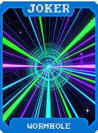 | **Buraco de Minhoca (Wormhole)** Descartar uma **Carta de Figura** dá **$1**. |
| 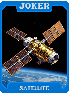 | **Satélite (Satellite)** Ganhe **$1** no final da rodada para cada **$10** que você tem (Max $5). |
| 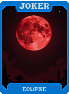 | **Eclipse (Eclipse)** **X1.5 Multi** se a mão jogada **não contiver cartas de Figura**. |
| 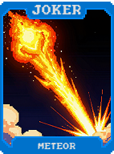 | **Meteoro (Meteor)** **+40 Fichas**. **+4 Fichas** por carta segurada na mão. |
| 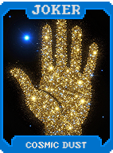 | **Poeira Cósmica (Cosmic Dust)** **+2 Multi** para cada carta no seu baralho acima de 52. |
| 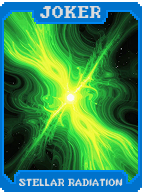 | **Radiação Estelar (Stellar Radiation)** Cartas jogadas dão **+5 Fichas** ao pontuar. |
| 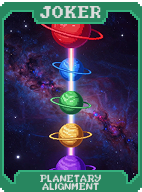 | **Alinhamento Planetário (Planetary Alignment)** **X3 Multi** se a mão jogada contiver exatamente uma de cada naipe (4 naipes diferentes). |
| 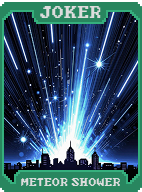 | **Chuva de Meteoros (Meteor Shower)** Reativa a **primeira carta** jogada na mão de pontuação. |
| 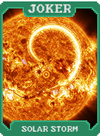 | **Tempestade Solar (Solar Storm)** Descartar **Espadas** dá **+3 Multi** para esta rodada (Cumulativo). |
| 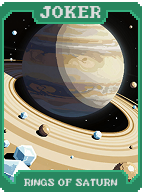 | **Anéis de Saturno (Rings of Saturn)** **8s** jogados dão **+20 Multi** ao pontuar. |
| 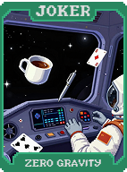 | **Gravidade Zero (Zero Gravity)** Sequências podem "dar a volta" (ex: K-A-2-3-4). |
| 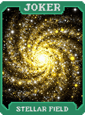 | **Campo Estelar (Stellar Field)** **X2 Multi** se a mão jogada contiver exatamente 5 cartas. |
| 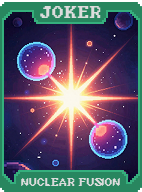 | **Fusão Nuclear (Nuclear Fusion)** Destrua um **Par** jogado para criar uma **Carta de Pedra** na mão. |
| 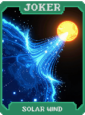 | **Vento Solar (Solar Wind)** Reativa a carta jogada mais à direita. |
| 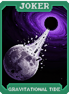 | **Maré Gravitacional (Gravitational Tide)** **+1 Tamanho de Mão**, mas **-1 Descarte**. |
| 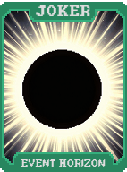 | **Horizonte de Eventos (Event Horizon)** Destrua a primeira carta descartada a cada rodada e ganhe **+3 Multi** permanente. |
| 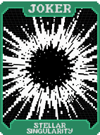 | **Singularidade Estelar (Stellar Singularity)** **+X0.2 Multi** por slot de Curinga vazio. |
| 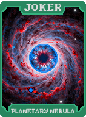 | **Nebulosa Planetária (Planetary Nebula)** Cria uma carta de **Planeta** quando você derrotar um Boss Blind. |
| 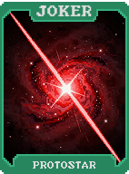 | **Proto-estrela (Protostar)** Começa em **X1 Multi**. Ganha **X0.1 Multi** por rodada jogada. |
| 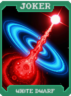 | **Anã Branca (White Dwarf)** **X3 Multi**. Não pode ganhar Multi de outras fontes. |
| 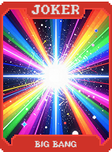 | **Big Bang (Big Bang)** Ao ser vendido, destrua todos os Curingas e crie **5 Curingas Comuns** aleatórios. |
| 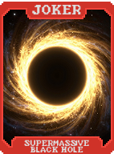 | **Buraco Negro Supermassivo (Supermassive Black Hole)** **X4 Multi**. Destrói uma carta aleatória na mão por mão jogada. |
| 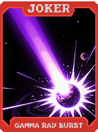 | **Explosão de Raios Gama (Gamma Ray Burst)** **X10 Multi** por uma mão. Destrói este Curinga após a pontuação. |
| 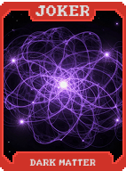 | **Matéria Escura (Dark Matter)** **X3 Multi** se você tiver **0 Descartes** restantes. |
| 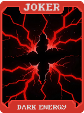 | **Energia Escura (Dark Energy)** **+1 Slot de Curinga**. |
| 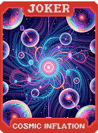 | **Inflação Cósmica (Cosmic Inflation)** **Dobre seu dinheiro** (até $50 de lucro) ao derrotar um Boss Blind. |
| 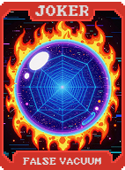 | **Falso Vácuo (False Vacuum)** **X5 Multi**. **1 em 20** chance de zerar seu dinheiro ao fim da rodada. |
| 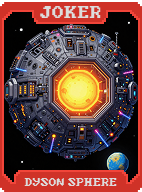 | **Esfera de Dyson (Dyson Sphere)** Os juros acumulam até o limite de **$100**. |
| 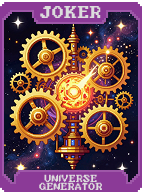 | **Gerador de Universos (Universe Generator)** Ao selecionar um Blind, cria um **Curinga Lendário** e se destrói. |
| 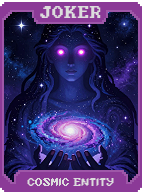 | **Entidade Cósmica (Cosmic Entity)** **X4 Multi**. Reativa todas as cartas jogadas. |
