# 🎲 Grupo Caos (Chaos)

O grupo **Caos** abraça a incerteza. Com efeitos baseados em probabilidades, valores aleatórios e transformações imprevisíveis, estes Curingas podem ser a diferença entre uma derrota humilhante e uma vitória estratosférica... se a sorte estiver do seu lado.

| Imagem | Detalhes do Curinga |
| :---: | :--- |
|  | **Dado Viciado (Loaded Die)** **1 em 6** chance de ganhar **+30 Multi**. |
|  | **Moeda da Sorte (Lucky Coin)** **50%** chance de ganhar **+15 Multi**. |
| 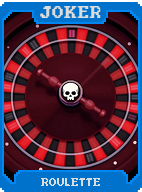 | **Roleta (Roulette)** **1 em 20** chance de ganhar **X4 Multi**. |
| 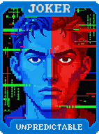 | **Imprevisível (Unpredictable)** Dá entre **+0** e **+20 Multi** aleatoriamente a cada mão. |
| 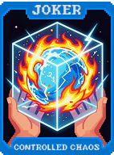 | **Caos Controlado (Controlled Chaos)** **+10 Multi**. Muda para **+50 Fichas** se o naipe da mão for Copas ou Ouros. |
| 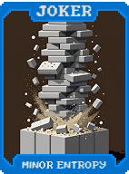 | **Entropia Menor (Minor Entropy)** **+4 Multi** para cada carta com rank ímpar na mão (A, 3, 5, 7, 9). |
| 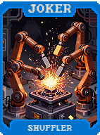 | **Embaralhador (Shuffler)** **+50 Fichas**. Reordena as cartas na sua mão após jogar. |
|  | **Curinga Selvagem (Wild Joker)** **+10 Multi**. **1 em 5** chance de mudar o naipe de uma carta jogada aleatoriamente. |
|  | **Sorte de Principiante (Beginner's Luck)** **X2 Multi** se for a primeira mão. **1 em 3** chance de não ativar. |
| 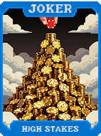 | **Aposta Alta (High Stakes)** **+20 Multi**, mas perde **$1** ao jogar a mão. |
| 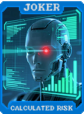 | **Risco Calculado (Calculated Risk)** **+15 Multi** se você tiver **0 Descartes** restantes. |
| 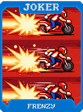 | **Frenesi (Frenzy)** **+5 Multi** cumulativo por mão jogada na rodada. Reseta ao descartar. |
| 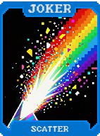 | **Dispersão (Scatter)** Cartas jogadas dão aleatoriamente entre **+0** e **+10 Fichas**. |
| 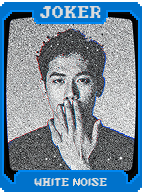 | **Ruído Branco (White Noise)** **+10 Multi**. **1 em 10** chance de transformar uma carta jogada em **Carta de Pedra**. |
| 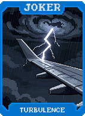 | **Turbulência (Turbulence)** **+40 Fichas**. Se a mão tiver 5 cartas, **-10 Fichas**. |
| 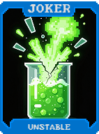 | **Instável (Unstable)** **X1.5 Multi**. **1 em 10** chance de ser destruído no fim da rodada. |
| 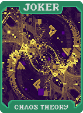 | **Teoria do Caos (Chaos Theory)** **X2 Multi** se a mão tiver cartas de **4 naipes diferentes**. |
| 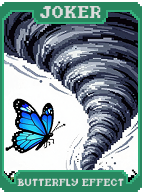 | **Efeito Borboleta (Butterfly Effect)** A primeira carta jogada define o naipe de todas as outras para a pontuação. |
| 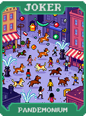 | **Pandemônio (Pandemonium)** Reativa uma carta aleatória da mão **3 vezes**. |
|  | **Discordia (Discord)** **+30 Multi** se a mão jogada **não** for sua mais usada. |
| 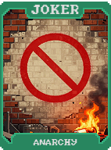 | **Anarquia (Anarchy)** **X0.5** a **X3.0 Multi** aleatoriamente a cada mão. |
| 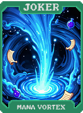 | **Vórtice de Mana (Mana Vortex)** Cria um **Tarô** aleatório, mas destrói um Curinga Comum. |
| 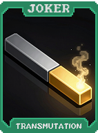 | **Transmutação (Transmutation)** Ao ser vendido, transforma-se em um Curinga Incomum aleatório. |
| 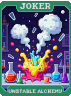 | **Alquimia Instável (Unstable Alchemy)** **+4 de Ouro** ao jogar um Flush de Ouros. |
| 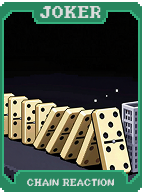 | **Reação em Cadeia (Chain Reaction)** **+5 Multi** para cada habilidade de Curinga ativada nesta mão. |
| 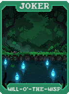 | **Fogo Fátuo (Will-o'-the-Wisp)** Cria uma cópia **Negativa** de um consumível ao derrotar um Boss Blind. |
|  | **Caixa de Pandora (Pandora's Box)** Ao comprar, dá **$20**. Define o Multi para **0** na próxima mão. |
| 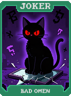 | **Mau Presságio (Bad Omen)** **X3 Multi**. **1 em 4** chance de dar **X0.5 Multi** em vez disso. |
| 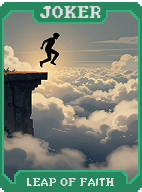 | **Salto de Fé (Leap of Faith)** **X3 Multi** na última mão se você tiver apenas 1 de Vida. |
| 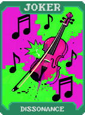 | **Dissonância (Dissonance)** **+100 Fichas** se a mão jogada for apenas **Carta Alta**. |
| 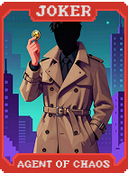 | **Agente do Caos (Agent of Chaos)** **X3 Multi**. Força uma seleção aleatória para descarte ao jogar uma mão. |
| 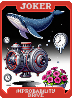 | **Motor de Improbabilidade (Improbability Drive)** **1 em 100** chance de ganhar **$100** ao jogar uma mão. |
| 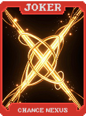 | **Nexus do Acaso (Chance Nexus)** Aumenta todas as probabilidades listadas em **25%**. |
| 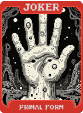 | **Forma Primordial (Primal Form)** Transforma toda a mão em **Ases** por uma mão e se destrói. |
| 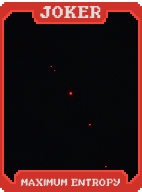 | **Entropia Máxima (Maximum Entropy)** **X4 Multi**. Ao final da rodada, **destrói** um Curinga aleatório. |
| 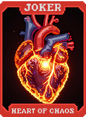 | **Coração do Caos (Heart of Chaos)** Copia a habilidade do Curinga à direita a cada mão. |
| 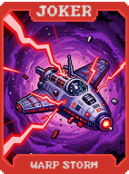 | **Tempestade de Warp (Warp Storm)** **+10 Multi** para cada naipe diferente no baralho. |
| 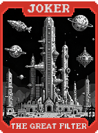 | **O Grande Filtro (The Great Filter)** Se jogar **5 de um tipo** (5 of a Kind), ganhe **X5 Multi** permanente. |
| 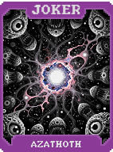 | **Azathoth (Azathoth)** **X10 Multi**. Destrói uma carta aleatória do baralho a cada rodada. |
| 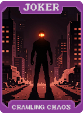 | **O Caos Rastejante (Crawling Chaos)** **X2 Multi**. Ganha **+X0.5 Multi** por mão jogada (reseta se perder). |
