# 🏁 Grupo Condições e Gatilhos (Conditions)

O grupo **Condições** foca em "se... então...". Estes Curingas permanecem inativos ou concedem bônus mínimos até que uma condição específica seja atendida na mesa ou no jogo. Eles recompensam o planejamento e a paciência, permitindo picos de pontuação quando os gatilhos certos são ativados.

| Imagem | Detalhes do Curinga |
| :---: | :--- |
| 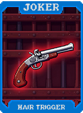 | **Condição Ante (Ante Condition)** Ganha **+10 Multi** a cada vez que você sobe de Ante. |
| 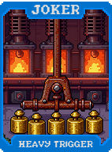 | **Condição Dinheiro (Money Condition)** **X2 Multi** se você tiver exatamente **$50**. |
| 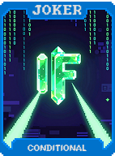 | **Condição Mão (Hand Condition)** **+50 Fichas** se a mão jogada for do seu tipo mais utilizado. |
| 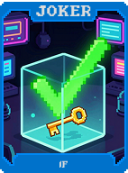 | **Condição Descarte (Discard Condition)** Ganha **+5 Multi** se você não usar nenhum descarte na rodada. |
| 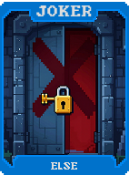 | **Gatilho Crítico (Critical Trigger)** **1 em 4** chance de multiplicar a pontuação da mão por **X3**. |
| 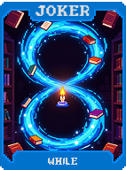 | **Fase da Lua (Moon Phase)** O bônus muda dependendo de quantas mãos você já jogou no Blind atual. |
| 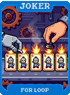 | **Maré Alta (High Tide)** Concede **+30 Multi** apenas nas rodadas ímpares. |
| 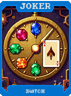 | **Maré Baixa (Low Tide)** Concede **+100 Fichas** apenas nas rodadas pares. |
| 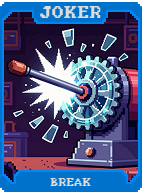 | **Eclipse** **X5 Multi** se for a última mão do Blind e você estiver prestes a vencer. |
| 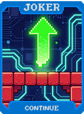 | **Solstício (Solstice)** Ganha um bônus permanente se você vencer um Boss Blind sem descartar. |
| 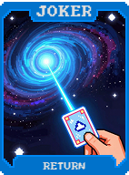 | **Equinócio (Equinox)** Equilibra suas **Fichas** e **Multi** para que fiquem com valores próximos. |
| 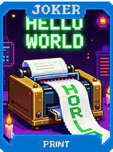 | **Contagem Regressiva (Countdown)** Ativa um efeito poderoso após 10 mãos serem jogadas (acumulativo). |
| 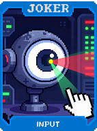 | **Cronômetro (Stopwatch)** Dá bônus com base em quão rápido você tomou a decisão de jogar a mão. |
| 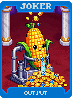 | **Termômetro (Thermometer)** O bônus aumenta conforme sua pontuação se aproxima da meta do Blind. |
| 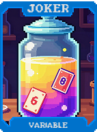 | **Barômetro (Barometer)** Mede a pressão: dá **X2 Multi** se você estiver com apenas 1 mão restante. |
| 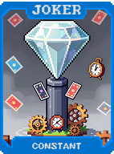 | **Bússola Interna (Inner Compass)** Ganha bônus se você jogar cartas de naipes diferentes na mesma mão. |
| 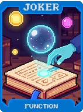 | **Relógio de Areia (Hourglass)** O bônus diminui a cada segundo, mas reseta no início de cada mão. |
| 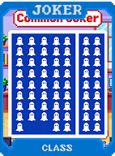 | **Metrônomo (Metronome)** Ganha **X0.2 Multi** para cada mão jogada em um ritmo constante. |
| 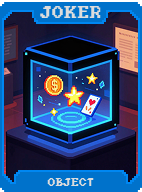 | **Sinalizador (Beacon)** Revela a próxima carta a ser comprada sempre que você joga um Flush. |
| 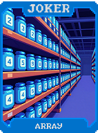 | **Radar** Detecta se há uma Straight no baralho e concede **+20 Multi**. |
| 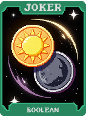 | **Sonar** Encontra cartas de Figura no baralho e as traz para o topo. |
| 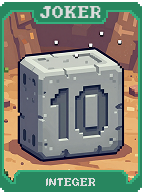 | **Alarme (Alarm)** Emite um som e dá **+50 Multi** se o Boss Blind tiver uma habilidade específica. |
| 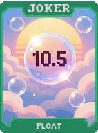 | **Sentinela (Sentinel)** Protege sua pontuação contra reduções causadas por efeitos inimigos. |
| 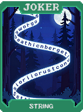 | **Vigilante (Vigilant)** Ganha bônus se você examinar detalhadamente o baralho antes de jogar. |
| 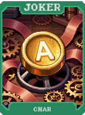 | **Escoteiro (Scout)** Identifica cartas com selos e aumenta seu bônus em **50%**. |
| 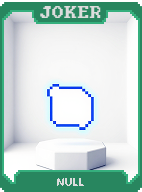 | **Rastreador (Tracker)** Mantém o bônus do último Curinga vendido por mais 2 rodadas. |
| 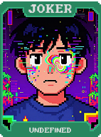 | **Caçador de Recompensas (Bounty Hunter)** Dá **$10** se você vencer o Blind jogando uma mão específica (aleatória). |
| 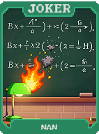 | **Marcador (Marker)** Marca uma carta na sua mão. Se jogada, ela ganha **X3 Multi**. |
| 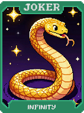 | **Alvo (Target)** **+100 Multi** se a mão jogada pontuar exatamente o valor necessário para vencer. |
| 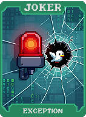 | **Checklist** Gera um Cupom gratuito se você completar 5 condições diferentes em uma rodada. |
| 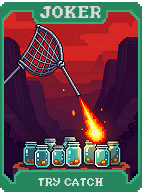 | **Inventário (Inventory)** Ganha **+5 Multi** para cada consumível que você está carregando. |
| 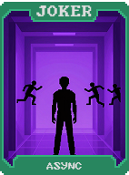 | **Coleção (Collection)** Ganha bônus permanente para cada carta única que você já jogou nesta partida. |
| 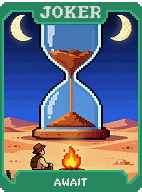 | **Arquivista (Archivist)** Permite ver o histórico de mãos jogadas e recuperar bônus antigos. |
| 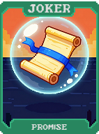 | **Bibliotecário (Librarian)** Ganha **+10 Multi** por cada Carta de Planeta usada nesta partida. |
| 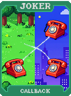 | **Curador (Curator)** Dá **X2 Multi** se todos os seus Curingas tiverem edições diferentes. |
| 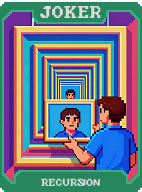 | **Exposição (Exhibit)** Ganha bônus se você tiver uma carta de cada naipe na sua mão atual. |
| 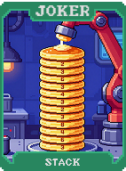 | **Galeria (Gallery)** Transforma cartas de Figura em "Obras de Arte" que dão **+20 Multi**. |
| 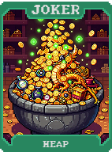 | **Museu (Museum)** Ganha bônus passivo para cada Curinga de raridade Lendária que você já viu. |
| 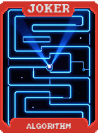 | **Leilão (Auction)** Permite "vender" o bônus de um Curinga para outro por um preço em dinheiro. |
| 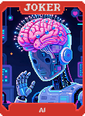 | **Investimento (Investment)** Dobra o bônus de pontuação após você passar por 3 Lojas sem comprar nada. |
| 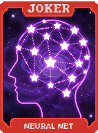 | **Seguro (Insurance)** Paga **$20** se você perder a partida (consome o Curinga). |
|  | **Garantia (Warranty)** Garante que o primeiro Curinga que você comprar na próxima loja seja Gratuito. |
| 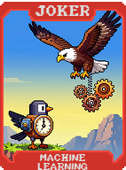 | **Contrato (Contract)** Define uma meta de pontuação. Se atingida, ganha **X3 Multi** por 5 rodadas. |
| 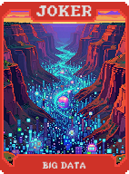 | **Promessa (Promise)** Ganha bônus se você prometer não usar nenhum Tarô na próxima rodada. |
| 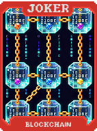 | **Juramento (Oath)** Dá **X4 Multi**, mas destrói este Curinga se você jogar um Par Simples. |
| 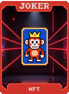 | **Voto (Vote)** Escolha entre dois bônus no início de cada Aposta. |
|  | **Referendo (Referendum)** Permite que você mude a raridade de um Curinga aleatório na loja. |
| 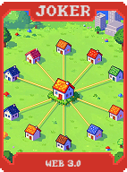 | **Lei (Law)** Impede o uso de descartes, mas dobra o ganho de fichas de todas as mãos. |
|  | **Decreto (Decree)** Torna uma mão específica a única que pontua, mas concede **X10 Multi**. |
| 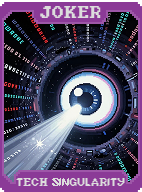 | **Constituição (Constitution)** Estabelece regras fixas que garantem **+100 Multi** se seguidas à risca. |
