# 🔥 Grupo Elemental (Elemental)

Os **Curingas Elementais** canalizam as forças da natureza: Fogo, Água, Terra e Ar. Este grupo foca em sinergias puras de naipes e combinações elementares (Vapor, Lava, Tempestade) para criar multiplicadores poderosos baseados na composição do baralho.

| Imagem | Detalhes do Curinga |
| :---: | :--- |
| 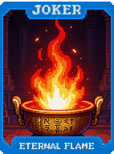 | **Chama Eterna (Eternal Flame)** **+4 Multi** para cada carta de **Copas** jogada. |
| 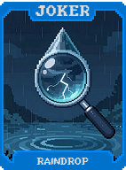 | **Gota de Chuva (Raindrop)** **+20 Fichas** para cada carta de **Espadas** jogada. |
| 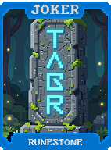 | **Pedra Rúnica (Runestone)** **+4 Multi** para cada carta de **Ouros** jogada. |
| 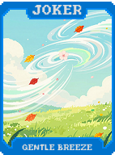 | **Brisa Suave (Gentle Breeze)** **+20 Fichas** para cada carta de **Paus** jogada. |
| 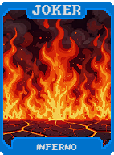 | **Inferno (Inferno)** **+15 Multi**. Se jogar 5 cartas de Copas, ganhe **+2 Multi** permanente. |
| 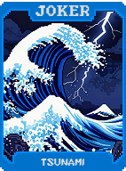 | **Tsunami (Tsunami)** **+50 Fichas**. Se jogar 5 cartas de Espadas, ganhe **+10 Fichas** permanente. |
| 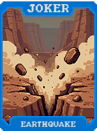 | **Terremoto (Earthquake)** **+10 Multi**. Destrói cartas de Ouros descartadas para ganhar **$2**. |
|  | **Tornado (Tornado)** **+10 Multi**. Reordena sua mão por naipe automaticamente. |
| 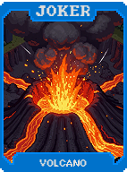 | **Vulcão (Volcano)** **1 em 4** chance de destruir cartas de Copas jogadas e ganhar **X2 Multi**. |
|  | **Iceberg (Iceberg)** Cartas de Espadas dão **+10 Fichas** e **+2 Multi**. |
| 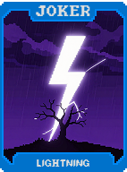 | **Raio (Lightning)** **+30 Multi** se a mão contiver cartas de Paus e Ouros. |
| 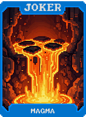 | **Magma (Magma)** Cartas de Copas e Ouros contam como o mesmo naipe (Vermelho). |
| 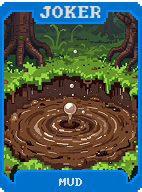 | **Lama (Mud)** Cartas de Espadas e Paus contam como o mesmo naipe (Preto). |
| 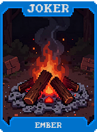 | **Brasa (Ember)** **+5 Multi**. Aumenta em **+1** a cada Flush de Copas jogado. |
| 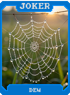 | **Orvalho (Dew)** **+20 Fichas**. Aumenta em **+5** a cada Flush de Espadas jogado. |
| 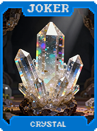 | **Cristal (Crystal)** **X1.5 Multi** se jogar apenas cartas de Ouros. |
| 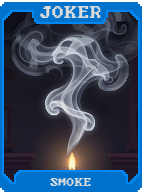 | **Fumaça (Smoke)** **1 em 3** chance de evitar o debuff do Boss se jogar Paus. |
| 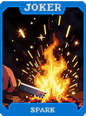 | **Faísca (Spark)** **+10 Multi** na primeira mão se for composta por cartas Vermelhas. |
| 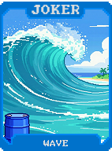 | **Onda (Wave)** **+40 Fichas** na primeira mão se for composta por cartas Pretas. |
| 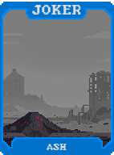 | **Cinzas (Ash)** Se descartar 5 cartas Vermelhas, ganhe **$3**. |
| 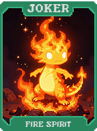 | **Espírito do Fogo (Fire Spirit)** **X2 Multi** para Flushes de Copas. |
| 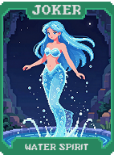 | **Espírito da Água (Water Spirit)** **X2 Multi** para Flushes de Espadas. |
| 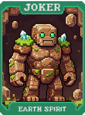 | **Espírito da Terra (Earth Spirit)** **X2 Multi** para Flushes de Ouros. |
|  | **Espírito do Ar (Air Spirit)** **X2 Multi** para Flushes de Paus. |
| 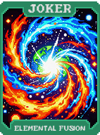 | **Fusão Elemental (Elemental Fusion)** **X3 Multi** se jogar uma mão com os 4 naipes diferentes. |
| 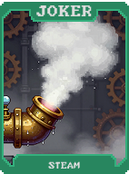 | **Vapor (Steam)** Cartas de Copas e Espadas jogadas juntas concedem **+15 Multi**. |
| 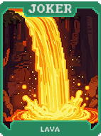 | **Lava (Lava)** Cartas de Copas e Ouros jogadas juntas concedem **+15 Multi**. |
| 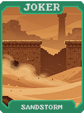 | **Tempestade de Areia (Sandstorm)** Cartas de Ouros e Paus jogadas juntas concedem **+15 Multi**. |
| 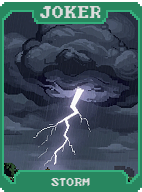 | **Tempestade (Storm)** Cartas de Espadas e Paus jogadas juntas concedem **+15 Multi**. |
| 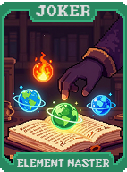 | **Mestre dos Elementos (Element Master)** **+10 Multi** para cada naipe diferente presente no seu baralho. |
| 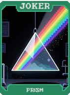 | **Prisma (Prism)** Aprimora o bônus de cartas Polychrome para **X2 Multi**. |
| 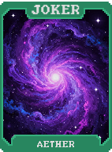 | **Éter (Aether)** Cartas sem naipe (Pedra, etc.) concedem **+50 Multi**. |
| 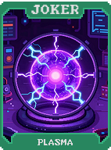 | **Plasma (Plasma)** **X0.5 Multi** para cada carta de Copas ou Espadas jogada (Multiplicativo). |
| 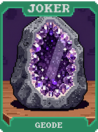 | **Geodo (Geode)** Cartas de Pedra têm chance de conceder **$5** ou **+20 Multi**. |
| 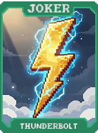 | **Relâmpago (Thunderbolt)** Destrói a carta central de um Straight Flush para ganhar **X3 Multi**. |
| 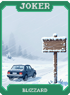 | **Nevasca (Blizzard)** Ao jogar 5 Espadas, congela o Blind (Aposta não sobe na próxima rodada). |
| 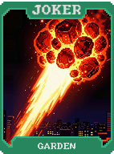 | **Meteoro de Fogo (Fire Meteor)** **+100 Fichas** e **+10 Multi** por carta de Copas na mão. |
|  | **Jardim (Garden)** Cartas de Ouros na mão ganham **+1 Ficha** base por rodada. |
| 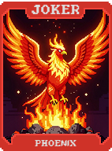 | **Fênix (Phoenix)** Descartar um Flush de Copas o retorna ao baralho com **+1 Multi** permanente. |
| 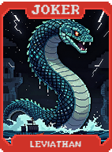 | **Leviatã (Leviathan)** Ao jogar um Flush de Espadas de 5 cartas, ganhe **+1 Mão** máxima. |
|  | **Behemoth (Behemoth)** Ao jogar um Flush de Ouros de 5 cartas, ganhe **+1 Slot de Curinga** (temporário). |
| 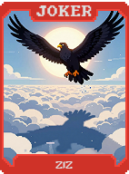 | **Ziz (Ziz)** Ao jogar um Flush de Paus de 5 cartas, ganhe **+1 Descarte** e **$5**. |
| 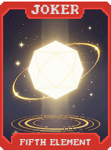 | **Quinto Elemento (Fifth Element)** Se possuir 4 Curingas Elementais diferentes, ganhe **X5 Multi**. |
| 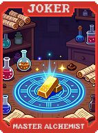 | **Alquimista Mestre (Master Alchemist)** Transforma cartas da mão em **Ouros** ao enfrentar um Boss Blind. |
|  | **Coração do Mundo (Heart of the World)** **X3 Multi**. Torna você imune a debuffs de naipe. |
| 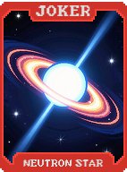 | **Estrela de Nêutrons (Neutron Star)** Cartas de Aço, Ouro e Pedra concedem **+20 Multi** adicionais cada. |
| 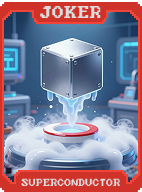 | **Supercondutor (Superconductor)** Cartas de Ouro ativam seus próprios bônus **2 vezes**. |
| 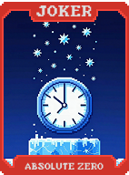 | **Zero Absoluto (Absolute Zero)** Se a mão pontuar 0 (debuffada), concede **X10 Multi** na mão seguinte. |
|  | **Avatar (Avatar)** **X4 Multi**. Permite fazer Flushes com qualquer combinação de naipes. |
| 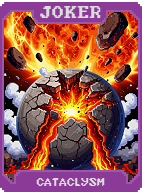 | **Cataclismo (Cataclysm)** **X10 Multi**. Remove permanentemente um naipe inteiro do seu baralho ao ser adquirido. |
