# 🏆 Grupo Conclusão e Finais (Final)

O grupo **Final** contém os Curingas mais poderosos e definitivos de Balatro Odyssey. Muitos deles são projetados para encerrar a partida com chave de ouro, oferecendo multiplicadores absurdos ou mecânicas que garantem a vitória no Ante final. Eles são raros, caros e extremamente impactantes.

| Imagem | Detalhes do Curinga |
| :---: | :--- |
| 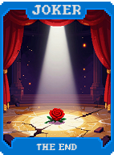 | **Ômega (Omega)** **X10 Multi**. O bônus final. Aparece apenas no Ante 8 ou superior. |
| 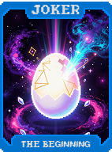 | **Alfa e Ômega (Alpha & Omega)** **X2 Multi** para cada Curinga de raridade Comum e Lendária que você possui. |
| 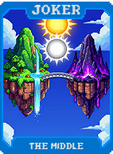 | **Apocalipse (Apocalypse)** Destrói todos os seus outros Curingas e ganha **X1 Multi** por cada um. |
| 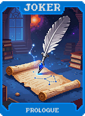 | **Juízo Final (Doomsday)** Impõe um limite de 1 única mão para vencer o Blind, mas concede **X50 Multi**. |
| 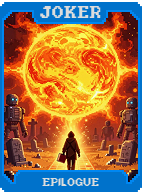 | **Armagedom (Armageddon)** Transforma todas as cartas do seu baralho em Cartas de Fogo por uma única rodada. |
| 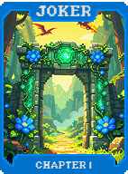 | **Ragnarök** Invoca "Curingas Fantasmas" que lutam ao seu lado por 3 mãos (bônus temporários massivos). |
| 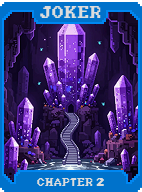 | **Nirvana** Reduz o custo de todos os itens na loja para **$0** permanentemente. |
| 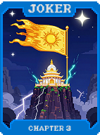 | **Ascensão (Ascension)** Transforma este Curinga em uma versão Lendária aleatória após vencer o Boss do Ante 8. |
| 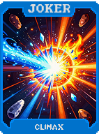 | **Transcendência (Transcendence)** Permite que você continue jogando além do Ante 8 com multiplicadores infinitos. |
| 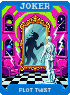 | **Eternidade (Eternity)** Torna todos os seus Curingas atuais "Eternos" e concede **X1.2 Multi** por cada um. |
| 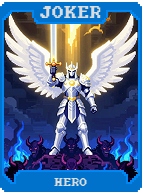 | **Legado (Legacy)** Permite que você leve um Curinga (exceto este) para o próximo "New Game+". |
| 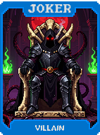 | **Herança (Heritage)** Ganha bônus com base em quantas vitórias totais você tem no perfil do jogo. |
| 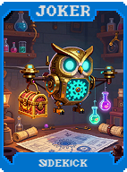 | **Testamento (Will)** Ao ser vendido, distribui seu bônus de **Multi** permanentemente entre seus outros Curingas. |
|  | **Memória (Memory)** Recorda o efeito do Curinga mais poderoso que você já possuiu nesta partida. |
| 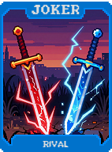 | **Destino (Destiny)** Garante que a próxima carta comprada seja exatamente a que você precisa para uma Straight Flush. |
| 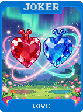 | **Profecia (Prophecy)** Revela todos os Boss Blinds dos próximos 3 Antes e concede **+20 Multi**. |
| 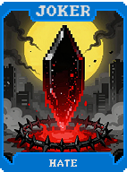 | **Fatalismo (Fatalism)** **X3 Multi**. Se você perder, tem **50% de chance** de sobreviver com 1 de vida. |
| 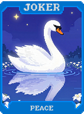 | **Karma** Ganha bônus de pontuação com base em quantas cartas você "ajudou" (usando Tarôs nelas). |
| 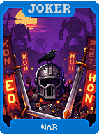 | **Reencarnação (Reincarnation)** Se vendido, gera um Curinga aleatório de raridade superior. |
| 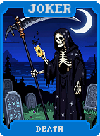 | **Renascimento (Rebirth)** Reinicia o Ante atual, mas mantém toda a pontuação e dinheiro acumulados. |
| 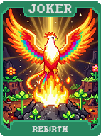 | **A Fênix (The Phoenix)** Se este Curinga for destruído por efeito de outro, ele volta com o dobro do bônus. |
| 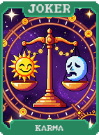 | **Ouroboros** Cria um ciclo infinito onde o último Curinga da lista alimenta o primeiro. |
| 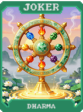 | **Infinito (Infinity)** **X1.01 Multi** para cada carta restante no seu baralho. |
| 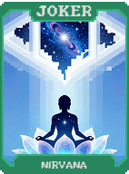 | **Singularidade Final (Final Singularity)** Colapsa todos os seus bônus em um único valor astronômico de **X100 Multi**. |
| 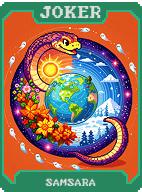 | **Big Bang** Explode! Causa danos massivos ao Blind atual e gera 5 novos Curingas aleatórios. |
| 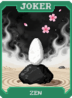 | **Buraco Negro (Black Hole)** Consome todos os consumíveis e cartas da mão para gerar **X10 Multi**. |
| 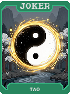 | **Supernova** Aumenta seu bônus de **Multi** em **+10** por cada mão jogada nesta partida. |
| 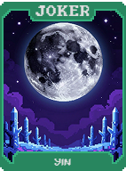 | **Estrela Cadente (Shooting Star)** Concede um desejo: escolha entre **$100**, **X5 Multi** ou **5 Cupons**. |
| 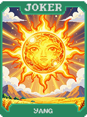 | **Cosmos** **X1.1 Multi** para cada Curinga com tema espacial (Celestial, Galáxia, etc.) que você possui. |
| 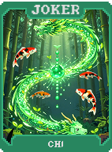 | **Universo (Universe)** Dobra o efeito de todos os bônus passivos do jogo (juros, cupons, etc.). |
| 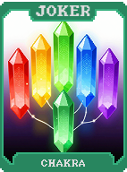 | **Multiverso (Multiverse)** Permite que você jogue com dois baralhos diferentes alternadamente. |
| 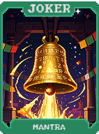 | **Omniverso (Omniverse)** Unifica todos os naipes em um único "Naipe Universal" que faz Flush com tudo. |
|  | **Realidade (Reality)** Transforma todos os bônus temporários em bônus permanentes. |
| 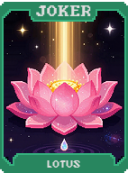 | **Simulação (Simulation)** Revela que o jogo é uma simulação e permite editar os valores das cartas na mão. |
| 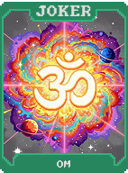 | **Matrix** Desvia de todas as restrições de Boss Blind e concede **X1.5 Multi**. |
| 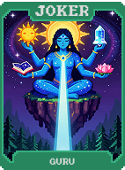 | **Escolha do Destino (Choice of Destiny)** Permite escolher qual será o próximo Curinga a aparecer na loja. |
|  | **Livre Arbítrio (Free Will)** Remove todas as probabilidades negativas (azedas) dos seus Curingas. |
| 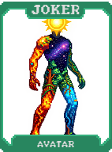 | **Determinismo (Determinism)** Fixa a ordem das cartas no baralho para que você sempre saiba o que virá. |
| 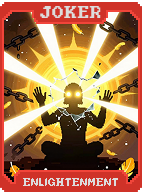 | **Causa e Efeito (Cause & Effect)** Cada descarte gera um bônus de **+10 Multi** para a próxima mão. |
|  | **Entropia (Entropy)** Aumenta o bônus de **Fichas** conforme a partida se torna mais caótica. |
|  | **Ordem no Caos (Order in Chaos)** **X5 Multi** se todas as cartas da sua mão forem de naipes diferentes. |
|  | **Zen** Ganha bônus por não fazer nada (pular rodadas ou não usar descartes). |
| 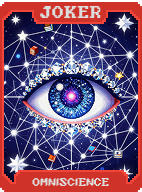 | **Iluminação (Enlightenment)** Revela todas as cartas viradas para baixo e concede **+30 Multi**. |
|  | **Divindade (Divinity)** **X7 Multi**. Transforma o Blind atual em uma "Oferenda" que dá bônus dobrados. |
| 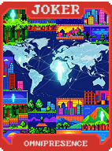 | **O Criador (The Creator)** Gera um Curinga customizado com base nas suas necessidades atuais. |
| 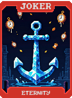 | **A Criação (The Creation)** Adiciona uma nova carta vazia ao seu baralho que você pode personalizar. |
| 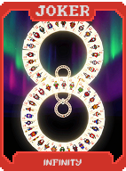 | **O Fim (The End)** Encerra a rodada imediatamente e vence o Blind, mas se autodestrói. |
| 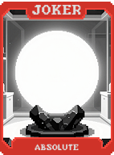 | **O Começo (The Beginning)** Reinicia sua partida com todos os bônus acumulados de rodadas anteriores. |
|  | **Eterno Retorno (Eternal Return)** Um loop infinito. O jogo nunca acaba, as apostas apenas aumentam para sempre. |
| 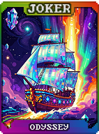 | **A Odisséia (The Odyssey)** **Bônus Final Incalculável**. A recompensa por chegar ao milésimo Curinga. Vitória Instantânea. |
