# 👾 Grupo Glitch (Glitch)

Curingas que parecem "quebrar" o código do jogo. O grupo **Glitch** foca em erros de sistema, comportamentos anômalos, manipulação de slots e quebra de regras fundamentais que o Balatro original nunca permitiu.

| Imagem | Detalhes do Curinga |
| :---: | :--- |
| 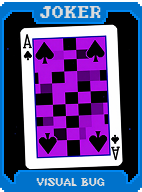 | **Bug Visual (Visual Bug)** **+10 Multi**. As cartas jogadas aparecem viradas para baixo (mas pontuam normalmente). |
| 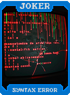 | **Erro de Sintaxe (Syntax Error)** **+50 Fichas**. Se a mão for **Carta Alta**, ganha **$2**. |
| 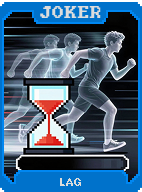 | **Lag (Lag)** O bônus deste Curinga ativa na **próxima** mão jogada. (**+20 Multi**). |
|  | **Pixel Morto (Dead Pixel)** Uma carta aleatória não pontua, mas o Curinga dá **+15 Multi**. |
| 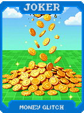 | **Glitch de Dinheiro (Money Glitch)** **1 em 10** chance de ganhar **$5** ao jogar uma mão. |
| 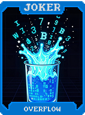 | **Overflow (Overflow)** Se a mão pontuar mais de **100 Fichas base**, ganhe **+10 Multi**. |
| 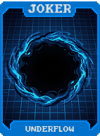 | **Underflow (Underflow)** Se a mão pontuar menos de **20 Fichas base**, ganhe **+30 Multi**. |
| 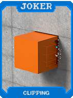 | **Clipping (Clipping)** Permite selecionar **6 cartas**, mas a carta mais à direita é descartada automaticamente. |
| 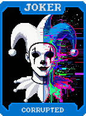 | **Corrompido (Corrupted)** **+15 Multi**. A arte da carta muda aleatoriamente. |
| 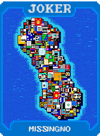 | **MissingNo (MissingNo)** **X? Multi**. O multiplicador muda a cada mão (entre **X1 e X3**). |
| 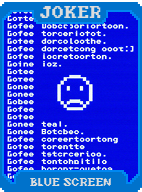 | **Tela Azul (Blue Screen)** Se descartar 5 cartas do mesmo naipe, ganhe **$4**. |
| 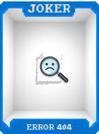 | **Erro 404 (Error 404)** **+40 Fichas**. Se jogar uma **Carta Alta**, ganha **+40 Multi**. |
| 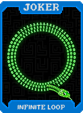 | **Loop Infinito (Infinite Loop)** **+5 Multi**. Aumenta em **+1 Multi** a cada ativação na mesma rodada. |
| 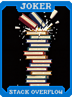 | **Stack Overflow (Stack Overflow)** **+4 Multi** para cada carta segurada na sua mão. |
| 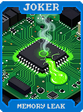 | **Vazamento de Memória (Memory Leak)** **-1 Descarte**. **+20 Multi**. |
| 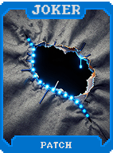 | **Patch (Patch)** **+10 Multi** para cada Curinga **Anulado (Debuffed)** que você possui. |
| 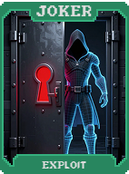 | **Exploit (Exploit)** **X2 Multi** se você jogar a mão que o Boss Blind proíbe ou anula. |
| 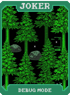 | **Debug Mode (Debug Mode)** **+10 Multi**. Permite ver a próxima carta do baralho. |
| 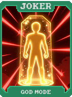 | **God Mode (God Mode)** Previne a derrota **uma vez** e se destrói. |
| 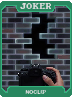 | **Noclip (Noclip)** Cartas de **Realeza** contam como qualquer naipe. |
| 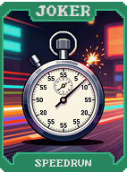 | **Speedrun (Speedrun)** **+50 Multi** se você vencer a rodada na primeira mão. |
| 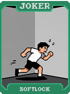 | **Softlock (Softlock)** Se ficar sem descartes e sem dinheiro, ganhe **X3 Multi**. |
| 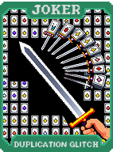 | **Glitch de Duplicação (Duplication Glitch)** **1 em 5** chance de criar uma cópia da carta jogada na sua mão. |
|  | **Código Fonte (Source Code)** Cria uma **Carta de Pedra** ao selecionar o Blind. **+20 Multi** se tiver uma. |
| 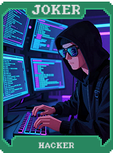 | **Hacker (Hacker)** **X1.5 Multi**. Aumenta o nível da mão jogada temporariamente. |
| 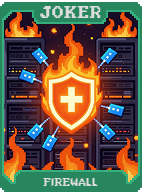 | **Firewall (Firewall)** **X2 Multi** contra **Boss Blinds**. |
| 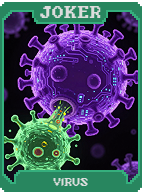 | **Vírus (Virus)** Transforma uma carta da mão no naipe da primeira carta jogada. |
| 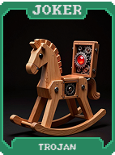 | **Trojan (Trojan)** Aparência de Curinga Comum, mas revela-se **X3 Multi** após 3 rodadas. |
| 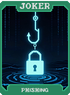 | **Phishing (Phishing)** **1 em 3** chance de roubar **$1** ao descartar uma carta de Realeza. |
|  | **Zero Day (Zero Day)** **X2.5 Multi** na primeira mão da primeira Aposta. |
| 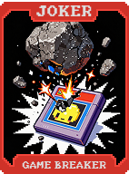 | **Game Breaker (Game Breaker)** **+1 Slot de Curinga**, mas **-2 Tamanho de Mão**. |
| 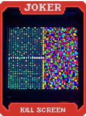 | **Kill Screen (Kill Screen)** Se o Blind for maior que 1 milhão, ganhe **$20** ao fim da rodada. |
| 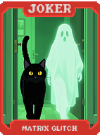 | **Glitch da Matrix (Matrix Glitch)** Reativa todas as cartas jogadas **uma vez extra**. |
|  | **Sobrescrita (Overwrite)** Ao vender um Curinga, transfere sua **Edição** para este aqui. |
|  | **Hex Editor (Hex Editor)** Cartas descartadas têm seus Ranks e Naipes **randomizados**. |
| 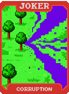 | **Corruption (Corruption)** Todos os Curingas dão **X1.5 Multi**, mas têm **10%** chance de serem destruídos. |
| 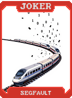 | **Segfault (Segfault)** **X5 Multi** se jogar mais de 5 cartas. |
| 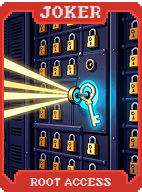 | **Root Access (Root Access)** Desbloqueia todos os slots de consumíveis (permite carregar 5). |
|  | **O Arquiteto (The Architect)** **X2 Multi**. Os Rerolls na loja são **grátis**. |
|  | **Singularidade Digital (Digital Singularity)** **X5 Multi**. Ganha **+X1 Multi** para cada outro Curinga **Glitch**. |
