# 🃏 Grupo Mãos e Descartes (Hands & Discards)

Este grupo foca na gestão ativa das cartas durante a rodada. Seja aumentando o número de jogadas disponíveis, recompensando descartes estratégicos ou permitindo que cartas voltem para a mão após serem jogadas, este conjunto é vital para quem busca consistência e controle sobre o baralho.

| Imagem | Detalhes do Curinga |
| :---: | :--- |
| 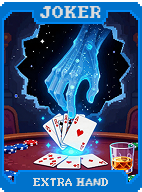 | **Mão Extra (Extra Hand)** **+1 Mão** por rodada. |
| 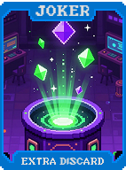 | **Descarte Extra (Extra Discard)** **+1 Descarte** por rodada. |
| 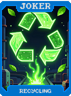 | **Reciclagem (Recycling)** Ganhe **+1 Descarte** a cada 2 mãos jogadas. |
| 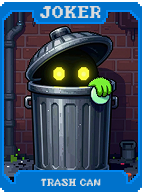 | **Lixeira (Trash Can)** Ganhe **$1** ao usar seu último descarte. |
| 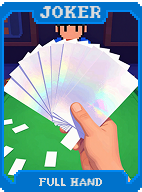 | **Mão Cheia (Full Hand)** **+20 Fichas** se a mão tiver 5 cartas. |
| 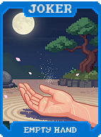 | **Mão Vazia (Empty Hand)** **+20 Multi** se a mão tiver 1 ou 2 cartas. |
| 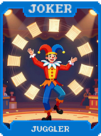 | **Malabarista (Juggler)** **+1 Tamanho de Mão**. |
|  | **Mágico de Rua (Street Magician)** Ao descartar, **20%** chance de ganhar **$2**. |
| 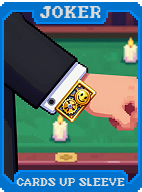 | **Cartas na Manga (Cards Up Sleeve)** **1 em 4** chance de comprar uma carta extra ao jogar. |
|  | **Dealer (Dealer)** **+10 Multi**. Facilita a visualização das melhores combinações na mão. |
| 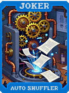 | **Embaralhador Automático (Auto Shuffler)** Reordena o baralho para colocar cartas boas no topo. |
| 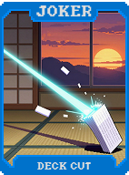 | **Corte de Deck (Deck Cut)** Descarta as 5 primeiras cartas do baralho no início da rodada. **+15 Multi**. |
| 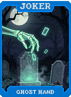 | **Mão Fantasma (Ghost Hand)** Permite jogar uma mão extra que não conta para o limite (não gera dinheiro). |
| 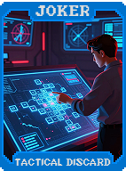 | **Descarte Tático (Tactical Discard)** Se descartar apenas 1 carta, ganhe **+10 Multi** na próxima mão. |
| 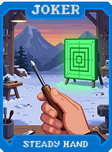 | **Mão Firme (Steady Hand)** Se não usar descartes, **X1.5 Multi**. |
| 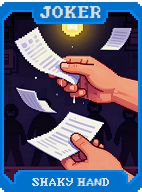 | **Mão Trêmula (Shaky Hand)** Se usar todos os descartes, **+50 Fichas**. |
| 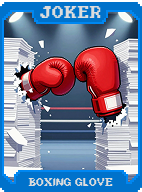 | **Luva de Boxe (Boxing Glove)** **+10 Fichas** por carta na mão. |
| 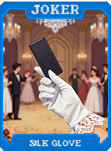 | **Luva de Seda (Silk Glove)** **+5 Multi** por descarte restante. |
|  | **Manopla (Gauntlet)** **+50 Fichas**, **-1 Descarte**. |
| 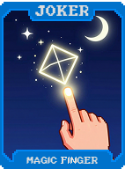 | **Dedo Mágico (Magic Finger)** Permite selecionar 6 cartas, mas joga 5. |
| 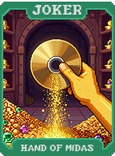 | **Mão de Midas (Hand of Midas)** Se jogar 5 cartas de Ouro, ganhe **$10**. |
| 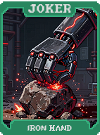 | **Mão de Ferro (Iron Hand)** Se jogar 5 cartas de Aço, ganhe **+100 Multi**. |
| 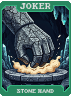 | **Mão de Pedra (Stone Hand)** Se jogar 5 cartas de Pedra, ganhe **+200 Fichas**. |
|  | **Mão de Vidro (Glass Hand)** Se jogar 5 cartas de Vidro, **X4 Multi**, mas todas quebram. |
| 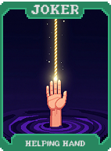 | **Mão Amiga (Helping Hand)** Se jogar uma mão de **Carta Alta**, ela ganha **+1 nível** permanentemente. |
| 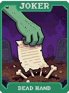 | **Mão Morta (Dead Hand)** Se jogar uma mão com 0 pontos (cartas debuffadas), ganhe **$5**. |
| 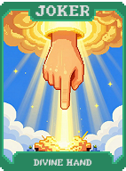 | **Mão Divina (Divine Hand)** A primeira mão da rodada tem **X2 Multi**. |
| 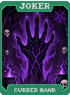 | **Mão Maldita (Cursed Hand)** **-1 Mão**, mas **X3 Multi**. |
| 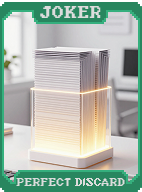 | **Descarte Perfeito (Perfect Discard)** Se descartar 5 cartas do mesmo naipe, ganhe **$4**. |
| 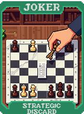 | **Descarte Estratégico (Strategic Discard)** Se descartar uma sequência (Straight), ganhe **+20 Multi** na próxima mão. |
| 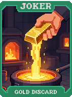 | **Descarte de Ouro (Gold Discard)** Descartar cartas de Ouro dá **$4** cada. |
| 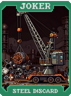 | **Descarte de Aço (Steel Discard)** Descartar cartas de Aço dá **+5 Multi** permanente para este Curinga. |
| 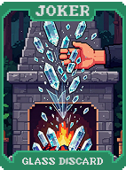 | **Descarte de Vidro (Glass Discard)** Descartar cartas de Vidro tem **50%** chance de criar uma nova carta de Vidro. |
| 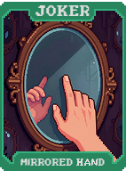 | **Mão Espelhada (Mirrored Hand)** Pontua as cartas duas vezes (da esquerda para a direita e vice-versa). |
| 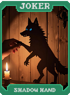 | **Mão Sombria (Shadow Hand)** Cartas jogadas não são descartadas, voltam para a mão (1x por rodada). |
| 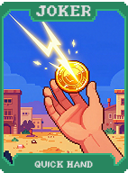 | **Mão Rápida (Quick Hand)** **+2 Mãos**, **-2 Descartes**. |
|  | **Mão Lenta (Slow Hand)** **-1 Mão**, **+2 Descartes**, **+20 Multi**. |
| 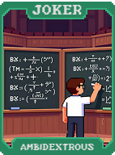 | **Ambidestro (Ambidextrous)** Permite selecionar e jogar até 10 cartas (pontuando as 5 melhores). |
|  | **Mão de Deus (Hand of God)** **X1 Multi** para cada carta comprada na loja nesta partida. |
| 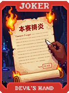 | **Mão do Diabo (Devil's Hand)** Destrói a carta mais alta da mão ao jogar. **X3 Multi**. |
| 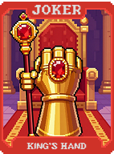 | **Mão do Rei (King's Hand)** Se a mão tiver um **Rei**, reativa todas as cartas de Figura. |
| 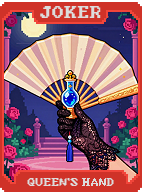 | **Mão da Rainha (Queen's Hand)** Se a mão tiver uma **Dama**, ganhe **$5** e **+10 Multi**. |
|  | **Mão do Valete (Jack's Hand)** Se a mão tiver um **Valete**, ganhe **+50 Fichas** por carta jogada. |
| 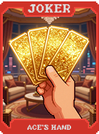 | **Mão do Ás (Ace's Hand)** Se a mão tiver um **Ás**, transforma todas as outras cartas em Ases temporariamente. |
| 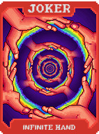 | **Mão Infinita (Infinite Hand)** Cartas jogadas voltam para o baralho imediatamente. |
| 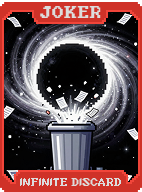 | **Descarte Infinito (Infinite Discard)** Descartes não gastam contagem, mas custam **$1**. |
| 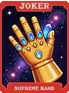 | **Mão Suprema (Supreme Hand)** Se a mão for um **Royal Flush**, vence o Blind instantaneamente. |
| 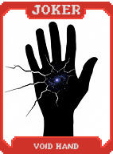 | **Mão do Vazio (Void Hand)** Ganha **X10 Multi** se jogar uma mão "vazia" (via efeitos especiais). |
| 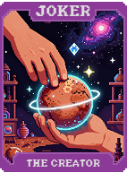 | **O Criador (The Creator)** **+3 Tamanho de Mão**, **+2 Mãos**, **+2 Descartes**. |
| 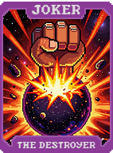 | **O Destruidor (The Destroyer)** **-2 Tamanho de Mão**, **X6 Multi**. |
