# 🍀 Grupo Sorte e Probabilidade (Luck & Probability)

Para quem gosta de apostar tudo na chance, este grupo é o paraíso. Focado em manipular as probabilidades do jogo, aumentar a eficácia de Cartas de Sorte e garantir que o "1 em 4" se torne um "1 em 1", os Curingas de Sorte transformam Balatro em um cassino onde a casa nem sempre vence.

| Imagem | Detalhes do Curinga |
| :---: | :--- |
|  | **Trevo de 4 Folhas (Four Leaf Clover)** Aumenta probabilidades em **10%** (aditivo). |
|  | **Pata de Coelho (Rabbit's Foot)** **1 em 2** chance de ganhar **+5 Multi**. |
| 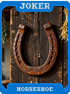 | **Ferradura (Horseshoe)** **+10 Fichas** para cada **Carta de Sorte** no baralho. |
| 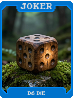 | **Dado D6 (D6 Die)** Dá entre **+1 e +6 Multi** por carta jogada. |
| 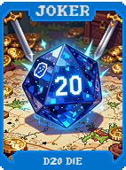 | **Dado D20 (D20 Die)** Dá entre **+1 e +20 Fichas** por carta jogada. |
| 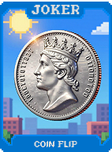 | **Cara ou Coroa (Coin Flip)** **50%** chance de **X2 Multi**, **50%** chance de nada. |
| 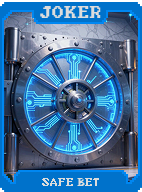 | **Aposta Segura (Safe Bet)** **+10 Multi** (efeito garantido). |
| 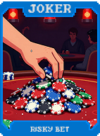 | **Aposta Arriscada (Risky Bet)** **1 em 4** chance de ganhar **+40 Multi**. |
| 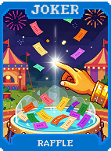 | **Sorteio (Raffle)** No final da rodada, **1 em 10** chance de ganhar um Curinga Comum. |
| 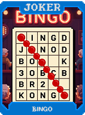 | **Bingo (Bingo)** Se jogar uma **Sequência (Straight)** de 5 cartas, ganhe **$5**. |
| 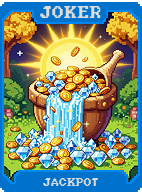 | **Jackpot (Jackpot)** Se jogar a combinação 7-7-7, ganhe **$20**. |
| 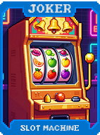 | **Slot Machine** Se jogar 3 cartas iguais, ganhe **+15 Multi**. |
|  | **Loteria Esportiva (Sports Betting)** Se vencer em exatamente 2 mãos, ganhe **$10**. |
| 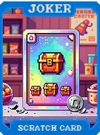 | **Raspadinha (Scratch Card)** Ao vender, tem chance de ganhar entre **$0 e $20**. |
| 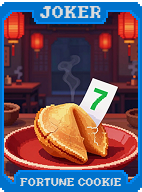 | **Biscoito da Sorte (Fortune Cookie)** **+5 Multi**. Aumenta a chance de aparecerem boas cartas de Tarô. |
| 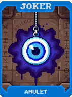 | **Amuleto (Amulet)** Previne que cartas de Vidro quebrem (**50%** de chance). |
|  | **Talismã (Talisman)** Melhora a confiabilidade de efeitos de sorte aleatórios. |
| 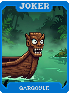 | **Carranca (Gargoyle)** **+20 Fichas**. Torna cartas de Pedra mais produtivas. |
| 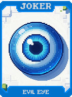 | **Olho Grego (Evil Eye)** Oferece proteção contra debuffs de Boss Blinds. |
| 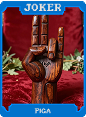 | **Figa (Figa)** **+10 Multi** se você terminar a rodada com 0 descartes. |
| 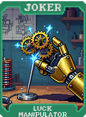 | **Manipulador de Sorte (Luck Manipulator)** Melhora todas as probabilidades de "1 em X" para "1 em X-1". |
| 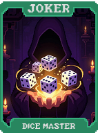 | **Mestre dos Dados (Dice Master)** Curingas baseados em dados (D6, D20) sempre rolam o valor máximo. |
| 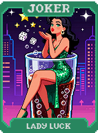 | **Senhora Sorte (Lady Luck)** **Cartas de Sorte** ativam suas habilidades 2 vezes. |
| 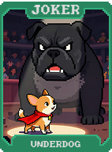 | **Azarão (Underdog)** Se a probabilidade de vencer a rodada for baixa (<10%), ganhe **X3 Multi**. |
| 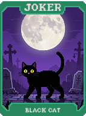 | **Gato Preto (Black Cat)** **X2 Multi**, mas dobra as chances de efeitos negativos (como quebra de vidro). |
| 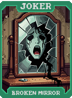 | **Espelho Quebrado (Broken Mirror)** **7 anos de azar**: Garante falhas em probabilidades, mas concede **X4 Multi**. |
| 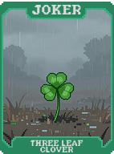 | **Trevo de 3 Folhas (Three Leaf Clover)** Diminui probabilidades, mas concede bônus de **+30 Multi**. |
| 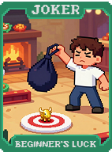 | **Sorte de Principiante (Beginner's Luck)** **X2 Multi** durante a primeira Aposta da partida. |
| 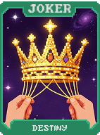 | **Destino (Destiny)** Aumenta a probabilidade de comprar cartas que completam sua mão atual. |
| 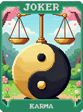 | **Karma (Karma)** Sempre que um efeito negativo de sorte ocorre, ganha **+5 Multi** permanente. |
| 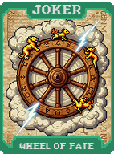 | **Roda do Destino (Wheel of Fate)** **1 em 4** chance de tornar um Curinga aleatório **Policromado** no fim da rodada. |
| 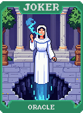 | **Oráculo (Oracle)** Permite prever os resultados de probabilidades antes que elas ocorram. |
| 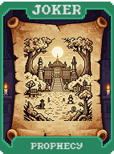 | **Profecia (Prophecy)** Se você prever corretamente o tipo da mão vencedora, ganha **X2 Multi**. |
| 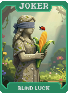 | **Sorte Cega (Blind Luck)** **+50 Multi** se jogar com as cartas viradas para baixo. |
| 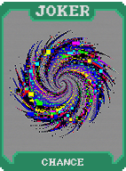 | **Acaso (Chance)** **1 em 2** chance de reativar o efeito de qualquer outro Curinga. |
| 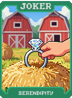 | **Serendipidade (Serendipity)** Faz com que Curingas Raros apareçam com mais frequência na loja. |
| 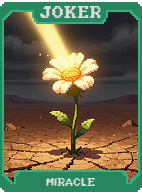 | **Milagre (Miracle)** **1 em 1000** chance de vencer o Blind instantaneamente com qualquer mão. |
| 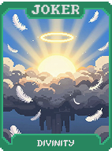 | **Divindade (Divinity)** **Cartas de Sorte** concedem **+20 Multi** adicional ao serem ativadas. |
| 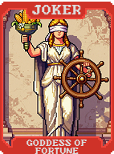 | **Deusa da Fortuna (Goddess of Fortune)** Todas as probabilidades de "1 em X" tornam-se certas (**1 em 1**). |
| 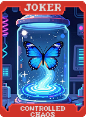 | **Caos Controlado (Controlled Chaos)** Permite escolher o resultado de certas probabilidades via menu. |
| 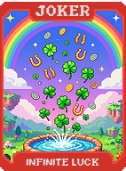 | **Sorte Infinita (Infinite Luck)** **Cartas de Sorte** sempre ativam bônus máximos de dinheiro e Multi. |
| 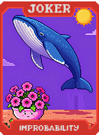 | **Improbabilidade (Improbability)** Permite que situações impossíveis ocorram no jogo. Concede **X3 Multi**. |
| 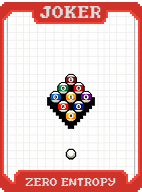 | **Entropia Zero (Zero Entropy)** Remove a aleatoriedade do jogo, usando valores fixos baseados em médias. |
| 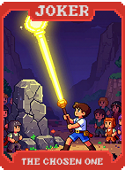 | **O Escolhido (The Chosen One)** **X5 Multi**. Previne falhas em todos os efeitos de sorte. |
| 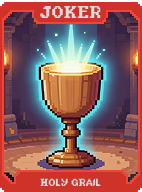 | **Santo Graal (Holy Grail)** **X3 Multi** e gera **$10** de renda por rodada. |
| 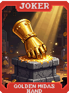 | **Mão de Midas Dourada (Golden Midas Hand)** Transforma cartas e Curingas tocados em versões de **Ouro**. |
| 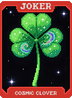 | **Trevo Cósmico (Cosmic Clover)** **+100 Fichas** para cada carta de rank 7 no baralho. |
| 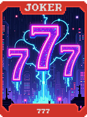 | **777** Se possuir três 7s na mão, ganhe **$77** e **X7 Multi**. |
| 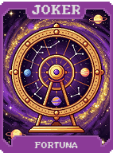 | **Fortuna (Fortuna)** **X5 Multi**. Todos os rerolls na loja tornam-se gratuitos. |
| 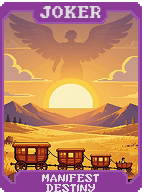 | **Destino Manifesto (Manifest Destiny)** Permite escolher exatamente quais cartas comprar via menu de seleção. |
