# 📐 Grupo Posicionamento e Adjacência (Positioning)

O grupo **Posicionamento** exige atenção constante à ordem dos seus Curingas. Estes cards não apenas dão bônus, mas dependem de quem está ao seu lado (esquerda ou direita) para ativar seus efeitos máximos. Dominar a geometria da sua barra de Curingas é a chave para o sucesso aqui.

| Imagem | Detalhes do Curinga |
| :---: | :--- |
| 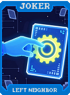 | **Vizinho da Esquerda (Left Neighbor)** Copia o bônus de **Multi** do Curinga à sua esquerda. |
| 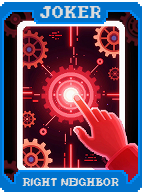 | **Vizinho da Direita (Right Neighbor)** Copia o bônus de **Fichas** do Curinga à sua direita. |
| 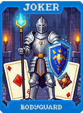 | **Sanduíche (Sandwich)** **X2 Multi** se este Curinga estiver entre dois Curingas da mesma raridade. |
| 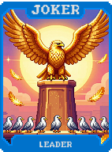 | **Ponta Esquerda (Leftmost)** Concede **+20 Multi** se este for o primeiro Curinga da sua lista. |
| 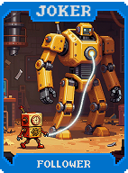 | **Ponta Direita (Rightmost)** Concede **+100 Fichas** se este for o último Curinga da sua lista. |
| 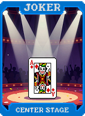 | **Centralizador (Centerpiece)** **X1.5 Multi** se este Curinga estiver exatamente no meio da sua lista. |
| 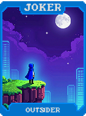 | **Aperto de Mão (Handshake)** Dobra o efeito de adjacência de todos os Curingas vizinhos. |
| 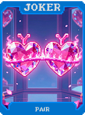 | **Distância Social (Social Distance)** **+25 Multi** se não houver Curingas adjacentes a este (espaços vazios). |
| 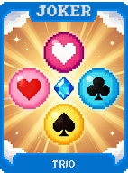 | **Invasor (Invader)** Empurra o Curinga adjacente para uma nova posição e ganha **+10 Multi**. |
| 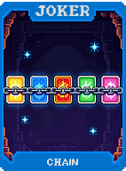 | **Guarda-costas (Bodyguard)** Impede que os Curingas adjacentes sejam destruídos ou desativados. |
| 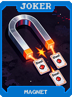 | **Link** Cria um "link" entre o primeiro e o último Curinga, compartilhando seus efeitos. |
| 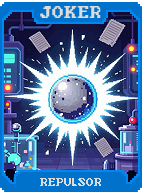 | **Corrente (Chain)** **+5 Multi** para cada Curinga consecutivo que possua o selo de "Edição". |
| 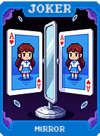 | **Espelho (Mirror)** Inverte a ordem de todos os seus Curingas após cada rodada. |
| 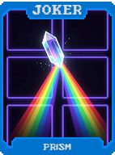 | **Sombra (Shadow)** Assume a aparência e o efeito do Curinga à sua esquerda, mas com **+5 Multi**. |
|  | **Eco (Echo)** Repete o efeito de ativação do último Curinga que agiu nesta rodada. |
| 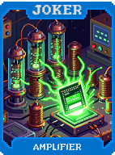 | **Atrair (Attract)** Move-se uma posição para a esquerda a cada mão jogada. Ganha **$1** por movimento. |
| 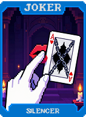 | **Repelir (Repel)** Move-se uma posição para a direita a cada descarte. Ganha **+2 Multi** por movimento. |
| 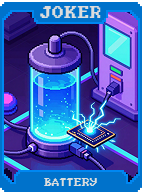 | **Magnetismo (Magnetism)** Puxa os Curingas de maior raridade para ficarem ao seu lado. Concede **+15 Fichas**. |
| 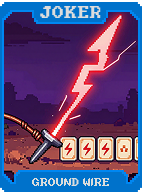 | **Gravidade (Gravity)** Ganha **+1 Multi** para cada posição que ele se moveu durante a partida. |
|  | **Órbita (Orbit)** Faz com que os Curingas adjacentes "orbitem" (troquem de lugar) a cada turno. |
| 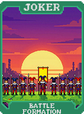 | **Inércia (Inertia)** Concede **X2 Multi** se este Curinga não mudar de posição por 5 rodadas. |
| 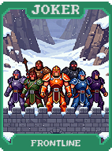 | **Tetris** Ganha bônus massivos se você organizar seus Curingas por cores ou naipes. |
| 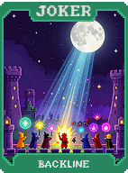 | **Dominó (Domino)** Se o Curinga à esquerda pontuar, este aqui ativa um bônus de **+10 Multi**. |
| 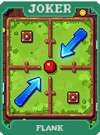 | **Quebra-cabeça (Puzzle)** Só ativa seu efeito final quando está posicionado corretamente entre peças específicas. |
| 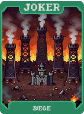 | **Engrenagem (Gear)** Transmite o bônus de **Multi** através de uma linha de Curingas adjacentes. |
| 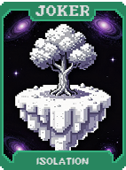 | **Transmissão (Broadcast)** Aplica seu próprio efeito a todos os Curingas que não estão adjacentes a ele. |
|  | **Ponte (Bridge)** Conecta dois Curingas distantes, permitindo sinergias de adjacência entre eles. |
| 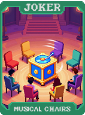 | **Muralha (Wall)** Bloqueia efeitos negativos que tentem mover ou alterar seus Curingas. |
| 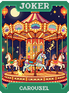 | **Portal** Permite que efeitos de adjacência "atravessem" para o lado oposto da lista de Curingas. |
| 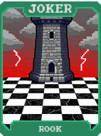 | **Espeto (Skewer)** **+5 Multi** por cada Curinga que ele "atravessa" ao ser movido manualmente. |
| 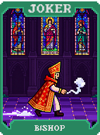 | **Fila (Queue)** Os Curingas à direita deste recebem um bônus gradual de **+2 Multi**. |
| 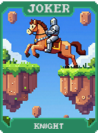 | **Pilha (Stack)** Empilha bônus de fichas com base em quantos Curingas estão à sua esquerda. |
| 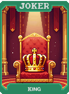 | **Pirâmide (Pyramid)** O bônus aumenta conforme ele se aproxima do centro da lista de Curingas. |
| 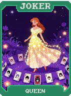 | **Âncora (Anchor)** Não pode ser movido, mas concede **X1.5 Multi** permanente. |
| 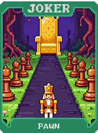 | **Bússola (Compass)** Sempre aponta para o Curinga que dará o maior bônus na rodada atual. |
| 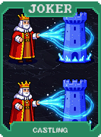 | **Norte (North)** Ganha **+10 Multi** se estiver na metade superior (esquerda) da lista. |
| 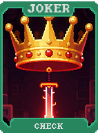 | **Sul (South)** Ganha **+50 Fichas** se estiver na metade inferior (direita) da lista. |
| 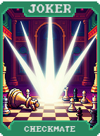 | **Leste (East)** Move-se uma posição para a direita a cada turno. Ganha **$2** ao chegar no fim. |
| 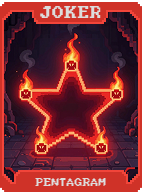 | **Oeste (West)** Move-se uma posição para a esquerda a cada turno. Dá **+5 Multi** ao chegar no início. |
| 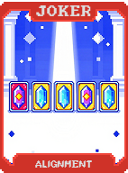 | **Coordenada (Coordinate)** **X2 Multi** se sua posição na lista coincidir com o número do Ante atual. |
| 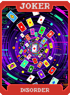 | **Latitude** Ganha bônus com base na distância entre este Curinga e o Curinga mais raro. |
| 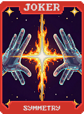 | **Longitude** Ganha bônus com base em quantos espaços de Curinga você desbloqueou no total. |
| 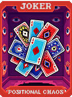 | **Escala (Scale)** Aumenta ou diminui seu tamanho visual e seu bônus de **Multi** proporcionalmente. |
|  | **Rotação (Rotation)** Faz com que o efeito dos Curingas adjacentes mude a cada 3 rodadas. |
| 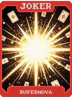 | **Simetria (Symmetry)** **X2 Multi** se os Curingas nas extremidades da sua lista forem idênticos em raridade. |
| 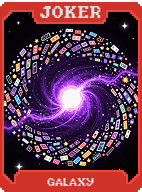 | **Fractal** Cria uma "sub-lista" de efeitos adjacentes dentro de um único espaço de Curinga. |
| 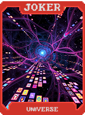 | **Vetor (Vector)** Define uma direção (esquerda/direita) e dobra todos os bônus naquela direção. |
| 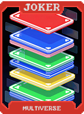 | **Módulo (Module)** Conecta-se a outros Curingas "Módulo" para criar uma rede de bônus compartilhados. |
| 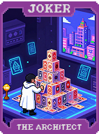 | **Nó (Node)** Atua como um ponto central onde todos os efeitos adjacentes são amplificados em **50%**. |
| 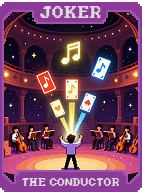 | **Bússola Mestra (Master Compass)** Ignora todas as restrições de posicionamento e ativa todos os efeitos de adjacência. |
