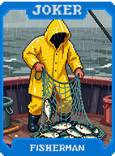
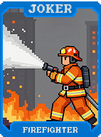
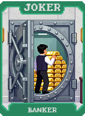
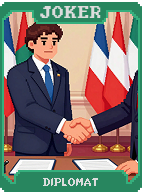
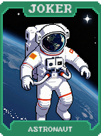
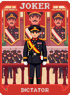
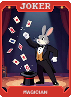
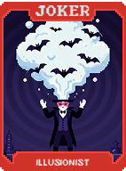

# 🛠️ Grupo Profissões (Professions)

O grupo **Profissões** traz utilidade prática ao Balatro. Cada Curinga representa um ofício que gera recursos específicos, previne desastres ou altera as regras do jogo a seu favor, sendo fundamentais para estabilizar uma partida difícil ou escalar recursos.

| Imagem | Detalhes do Curinga |
| :---: | :--- |
|  | **Mineiro (Miner)** **1 em 4** chance de encontrar uma **Carta de Pedra** ao descartar. |
|  | **Fazendeiro (Farmer)** **+2 Multi** para cada carta 2, 3, 4 ou 5 presente no seu baralho. |
|  | **Pescador (Fisherman)** **1 em 3** chance de "pescar" uma carta aleatória ao jogar uma mão. |
|  | **Cozinheiro (Chef)** Garante um Curinga de **Comida** (tipo Gros Michel) se houver espaço. |
|  | **Médico (Doctor)** Restaura **1 Mão** se você fosse perder (1x por Aposta). Se destrói após o uso. |
|  | **Engenheiro (Engineer)** **+1 Slot de Curinga** na próxima rodada se vencer em apenas 1 mão. |
|  | **Arquiteto (Architect)** Aumenta permanentemente o seu **Tamanho de Mão em +1**. |
|  | **Astrônomo (Astronomer)** Cartas de **Planeta** na loja passam a custar **$0**. |
|  | **Bibliotecário (Librarian)** **+10 Fichas** para cada vez que você visualizou seu baralho na partida. |
|  | **Carteiro (Mailman)** Ganha **$1** para cada carta descartada que seja um **Ás**. |
|  | **Bombeiro (Firefighter)** Torna você imune a Bosses que limitam ou proíbem descartes. |
|  | **Policial (Police)** Se jogar uma mão que não seja de pôquer (mão ilegal), ganhe **$5**. |
|  | **Juiz (Judge)** **+10 Multi** se a mão tiver exatamente 5 cartas. |
|  | **Advogado (Lawyer)** **+15 Multi**. Permite jogar mãos de 4 cartas como se fossem 5. |
|  | **Professor (Teacher)** **+2 Multi** permanente para cada mão de **Carta Alta** jogada. |
|  | **Aluno (Student)** Ganha **+1 Multi** por rodada. Torna-se **X2 Multi** após 10 rodadas. |
|  | **Cientista (Scientist)** **1 em 4** chance de aplicar um aprimoramento aleatório à carta jogada. |
|  | **Artista (Artist)** Cartas de Realeza concedem **+10 Fichas** adicionais cada. |
|  | **Músico (Musician)** **+10 Multi** se a mão for uma sequência (**Straight**). |
|  | **Ator (Actor)** Copia o efeito exato do Curinga posicionado à sua direita. |
|  | **Cirurgião (Surgeon)** Combina duas cartas da mão em uma única (ranks somados). |
|  | **Químico (Chemist)** Transforma **Cartas de Ouro** em **Cartas de Aço** (e vice-versa). |
|  | **Geólogo (Geologist)** Cartas de **Pedra** passam a conceder **+50 Fichas**. |
|  | **Botânico (Botanist)** Cartas de **Paus** (natureza) concedem **X1.5 Multi**. |
|  | **Zoólogo (Zoologist)** Concede bônus baseados em cartas de "animais" (ou cartas Pares). |
|  | **Arqueólogo (Archaeologist)** Cartas no fundo do deck ou jogadas há muito tempo dão **X2 Multi**. |
|  | **Historiador (Historian)** Ganha **+1 Multi** por cada rodada total jogada na partida atual. |
|  | **Futurista (Futurist)** **+15 Multi**. Revela qual será o próximo Boss Blind. |
|  | **Investidor (Investor)** Ganha **$5** extras de juros se tiver mais de **$50**. |
|  | **Banqueiro (Banker)** Dobra todo dinheiro recebido como recompensa de rodada. |
|  | **Ladrão de Casaca (Cat Burglar)** Permite roubar 1 Curinga da loja (grátis) se houver espaço (1x por partida). |
|  | **Espião (Spy)** Revela cartas viradas para baixo e dá **+10 Multi**. |
|  | **Diplomata (Diplomat)** Reduz o requisito de pontuação do Blind em **10%**. |
|  | **General (General)** **X2 Multi** se for a primeiríssima mão da rodada. |
|  | **Almirante (Admiral)** **X2 Multi** se for a última mão disponível na rodada. |
|  | **Astronauta (Astronaut)** **+20 Multi**. Imune a efeitos gravitacionais (estético). |
|  | **Mergulhador (Diver)** **+20 Multi** se jogar cartas de naipes pretos (Espadas/Paus). |
|  | **Piloto (Pilot)** Ganha **+1 Descarte** e **+1 Mão** permanente enquanto estiver no inventário. |
|  | **CEO (CEO)** **X3 Multi**. Ganha **$1** para cada Curinga que você possui. |
|  | **Presidente (President)** **X4 Multi**. Ganha **$10** se vencer a rodada sem sofrer dano. |
|  | **Ditador (Dictator)** **X5 Multi**. Limita você a jogar apenas o seu tipo de mão mais frequente. |
|  | **Revolucionário (Revolutionary)** Vender destrói o Curinga mais caro para triplicar o Multi dos outros. |
|  | **Profeta (Prophet)** **X2 Multi**. Permite visualizar as próximas 5 cartas do baralho. |
|  | **Mágico (Magician)** Transforma 3 cartas da mão em **Cartas Selvagens** (Wild) ao entrar na loja. |
|  | **Ilusionista (Illusionist)** **X3 Multi**. Mantém seus Curingas ocultos visualmente. |
|  | **Hipnotizador (Hypnotist)** Cartas de Realeza contam como qualquer rank para completar Sequências. |
|  | **Domador de Feras (Beast Tamer)** Cartas **Selvagens** (Wild Cards) aplicam um bônus de **X2 Multi**. |
|  | **Mestre de Obras (Foreman)** Cria um Slot de Curinga extra permanentemente após 5 rodadas de uso. |
|  | **Mestre da Guilda (Guild Master)** **X3 Multi**. Ganha **+X0.5** para cada outro Curinga de "Profissão". |
|  | **Magnata (Tycoon)** **X5 Multi**. Se tiver mais de **$100**, o bônus sobe para **X10 Multi**. |
