# 🌀 Grupo Temporal (Temporal)

O tempo é uma ferramenta poderosa em Balatro Odyssey. O grupo **Temporal** foca na manipulação de rodadas, mãos passadas, aceleração de ganhos e controle do fluxo da partida (Ante e rodadas).

| Imagem | Detalhes do Curinga |
| :---: | :--- |
|  | **Bifurcação (Bifurcation)** O destino se divide em múltiplas possibilidades. **X1.5 Multi**. |
| 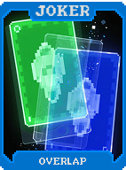 | **Sobreposição (Overlap)** Realidades se sobrepõem e entrelaçam. **+20 Multi**. |
| 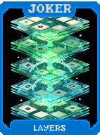 | **Camadas (Layers)** Múltiplas camadas de realidade coexistem. **X1.5 Multi**. |
| 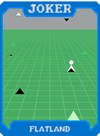 | **Planolândia (Flatland)** Mundo bidimensional de formas planas. **+4 Multi** por carta na mão. |
| 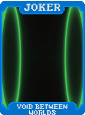 | **Vazio Entre Mundos (Void Between Worlds)** Espaço vazio tem poder. **+10 Multi** por slot vazio. |
|  | **Dimensão Extra (Extra Dimension)** **+1 slot** de Curinga fantasma. Não aparece mas funciona. **+10 Multi**. |
| 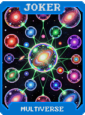 | **Multiverso (Multiverse)** Existe em todas as dimensões simultaneamente. **X1.5 Multi**. |
| 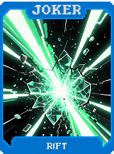 | **Fenda (Rift)** Fenda na realidade entre dimensões. **+50 Multi**. |
| 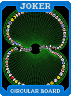 | **Board Circular (Circular Board)** O fim se encontra com o começo. **X1.5 Multi**. |
| 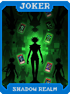 | **Reino das Sombras (Shadow Realm)** Cartas descartadas vão para Reino das Sombras. |
| 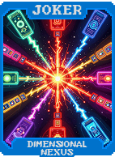 | **Nexus Dimensional (Dimensional Nexus)** Ponto onde todas dimensões se encontram. **X2 Multi**. |
| 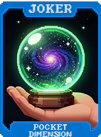 | **Dimensão de Bolso (Pocket Dimension)** **+10 Multi** por carta descartada nesta rodada. |
| 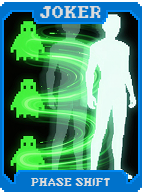 | **Mudança de Fase (Phase Shift)** Alterna entre estados sólido e fantasma. **X2 Multi**. |
| 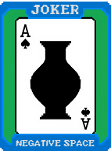 | **Espaço Negativo (Negative Space)** O vazio entre todas as coisas. **+15 Multi**. |
|  | **Plano Astral (Astral Plane)** Dimensão espiritual além do físico. **X2 Multi**. |
|  | **Convergência (Convergence)** Todas as dimensões convergem aqui. **X2.5 Multi**. |
| 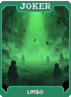 | **Limbo (Limbo)** Entre existir e não existir. **1 em 2** chance de **X3 Multi**. |
| 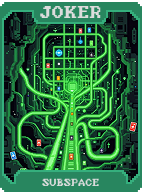 | **Subspace (Subspace)** Abaixo do espaço normal. **+40 Multi**. |
| 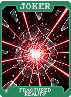 | **Realidade Fraturada (Fractured Reality)** Realidade está quebrada. Efeitos aleatórios extremos. **X1 a X5 Multi**. |
|  | **Omniverso (Omniverse)** Todas as realidades. Todas as dimensões. Todo o poder. |
| 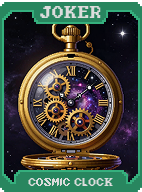 | **Relógio Cósmico (Cosmic Clock)** A cada 3 rodadas, ganhe **X1.5 Multi** permanente. |
|  | **Eco Temporal (Temporal Echo)** **+3 Multi** por descarte não usado esta rodada. |
|  | **Viajante Temporal 2 (Temporal Traveler 2)** Repete o bônus da primeira mão jogada na última mão da rodada. |
| 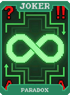 | **Paradoxo (Paradox)** No início da rodada, **1 em 4** chance de ganhar **+1 mão** ou **+1 descarte**. |
| 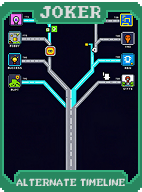 | **Linha Temporal Alternativa (Alternate Timeline)** **X2 Multi**, mas perde 1 mão no início da rodada. |
| 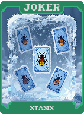 | **Estase (Stasis)** Quando um Blind é derrotado, **1 em 10** chance de ganhar **+1 mão** na próxima rodada. |
|  | **Momento Congelado (Frozen Moment)** Se tiver 2 ou mais de um mesmo rank na mão jogada, ganhe **+20 Multi**. |
| 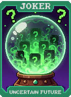 | **Futuro Incerto (Uncertain Future)** Guarda Multi e Fichas da primeira mão. Aplica **X1.5** na última mão da rodada. |
| 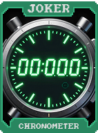 | **Cronômetro (Chronometer)** Ganha **+2 Multi** permanente por cada descarte usado. |
| 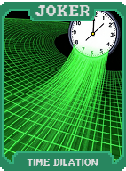 | **Dilatação Temporal (Time Dilation)** **X1.5 Multi** se você jogar o mesmo tipo de mão que a anterior. |
| 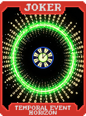 | **Horizonte de Eventos Temporal (Temporal Event Horizon)** Randomiza Multi entre **+5 e +50** a cada mão. |
| 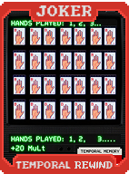 | **Rewind Temporal (Temporal Rewind)** **+10 Multi** por cada mão jogada antes desta nesta rodada. |
| 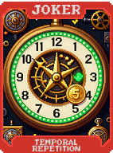 | **Repetição Temporal (Temporal Repetition)** A cada 5 mãos jogadas, ganhe **$3**. |
| 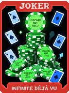 | **Déjà Vu Infinito (Infinite Déjà Vu)** **+25 Fichas** por descarte restante. |
| 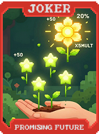 | **Futuro Promissor (Promising Future)** **1 em 5** chance de dar **X3 Multi**, senão **+25 Multi**. |
|  | **Presente Eterno (Eternal Present)** **X1.5 Multi** se não usar descartes nesta mão. |
| 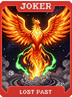 | **Passado Perdido (Lost Past)** Se perder uma rodada, **1 em 5** chance de ganhar **+2 mãos** na próxima. |
| 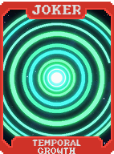 | **Crescimento Temporal (Temporal Growth)** **+1 Multi** permanente por cada mão jogada. |
| 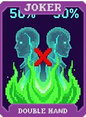 | **Mão Dupla (Double Hand)** Primeira mão de cada rodada conta em dobro para requisitos de mãos. |
| 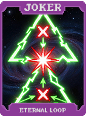 | **Loop Eterno (Eternal Loop)** Se jogar o mesmo tipo de mão 3x seguidas, **X3 Multi**. |
