# 🪐 Lista de Planetas (Planet Cards)

Os Planetas são essenciais para escalar o poder das suas mãos de pôquer. No **Balatro Odyssey**, o sistema astronômico foi expandido para **100 corpos celestes**, incluindo luas e exoplanetas distantes.

| Imagem | Nome | Mão Beneficiada |
| :---: | :--- | :--- |
| 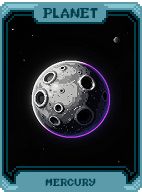 | **Mercúrio (Mercury)** | Melhora: **Par** |
| 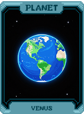 | **Vênus (Venus)** | Melhora: **Trinca** |
| 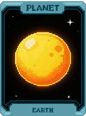 | **Terra (Earth)** | Melhora: **Full House** |
| 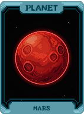 | **Marte (Mars)** | Melhora: **Quadra** |
| 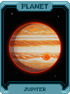 | **Júpiter (Jupiter)** | Melhora: **Flush** |
| 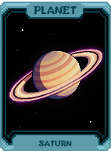 | **Saturno (Saturn)** | Melhora: **Sequência** |
| 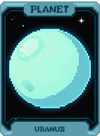 | **Urano (Uranus)** | Melhora: **Dois Pares** |
| 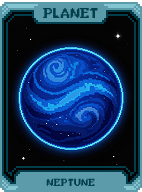 | **Netuno (Neptune)** | Melhora: **Straight Flush** |
| 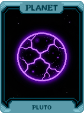 | **Plutão (Pluto)** | Melhora: **Carta Alta** |
| 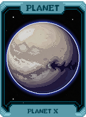 | **Planeta X** | Melhora: **Quinteto** |
| 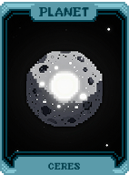 | **Ceres** | Melhora: **Flush House** |
| 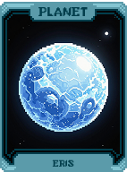 | **Eris** | Melhora: **Flush Five** |
| 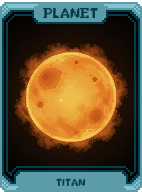 | **Titã (Titan)** | Melhora: **Dois Pares** |
| 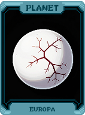 | **Europa** | Melhora: **Trinca** |
| 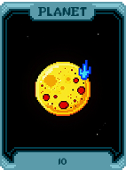 | **Io** | Melhora: **Sequência** |
| 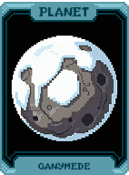 | **Ganimedes (Ganymede)** | Melhora: **Flush** |
| 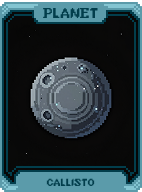 | **Calisto (Callisto)** | Melhora: **Full House** |
| 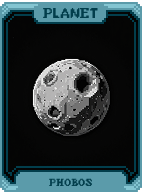 | **Fobos (Phobos)** | Melhora: **Quadra** |
| 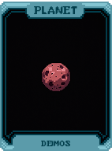 | **Deimos** | Melhora: **Straight Flush** |
| 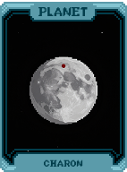 | **Caronte (Charon)** | Melhora: **Royal Flush** |
| 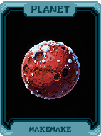 | **Makemake** | Melhora: **Sequência Envolvente** |
| 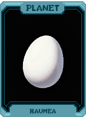 | **Haumea** | Melhora: **Sequência Salteada** |
| 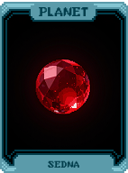 | **Sedna** | Melhora: **Sequência Alternada** |
| 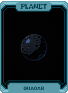 | **Quaoar** | Melhora: **Espectro** |
| 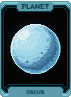 | **Orcus** | Melhora: **Mão de Canto** |
| 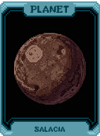 | **Salacia** | Melhora: **Mão do Meio** |
| 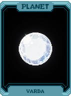 | **Varda** | Melhora: **Mão Prima** |
| 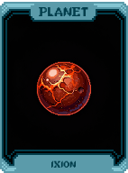 | **Ixion** | Melhora: **Mão Fibonacci** |
| 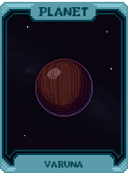 | **Varuna** | Melhora: **Mão Par** |
| 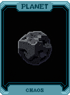 | **Caos (Chaos)** | Melhora: **Mão Ímpar** |
| 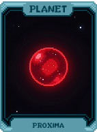 | **Proxima** | Melhora: **Mão Vermelha** |
| 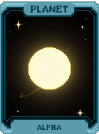 | **Alpha** | Melhora: **Mão Preta** |
|  | **Sirius** | Melhora: **Mão Figura** |
| 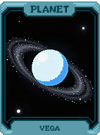 | **Vega** | Melhora: **Mão Numérica** |
| 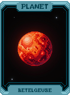 | **Betelgeuse** | Melhora: **Mão Baixa** |
| 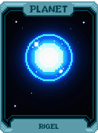 | **Rigel** | Melhora: **Mão Alta** |
| 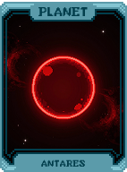 | **Antares** | Melhora: **Mega Sequência** |
| 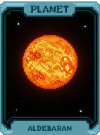 | **Aldebaran** | Melhora: **Mega Flush** |
| 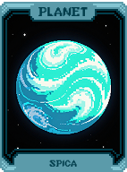 | **Spica** | Melhora: **Mega Full House** |
| 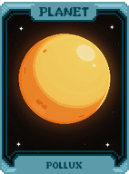 | **Pollux** | Melhora: **Duas Trincas** |
| 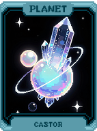 | **Castor** | Melhora: **Três Pares** |
| 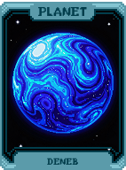 | **Deneb** | Melhora: **Quatro Pares** |
| 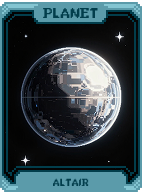 | **Altair** | Melhora: **Cinco Pares** |
| 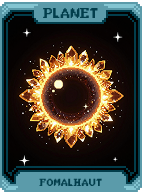 | **Fomalhaut** | Melhora: **Seis de uma Classe** |
| 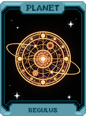 | **Regulus** | Melhora: **Sete de uma Classe** |
| 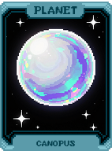 | **Canopus** | Melhora: **Oito de uma Classe** |
| 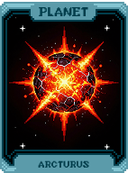 | **Arcturus** | Melhora: **Nove de uma Classe** |
| 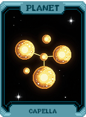 | **Capella** | Melhora: **Dez de uma Classe** |
| 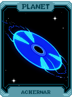 | **Achernar** | Melhora: **Par com Flush** |
| 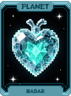 | **Hadar** | Melhora: **Dois Pares com Flush** |
| 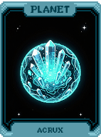 | **Miaplacidus** | Melhora: **Flush de Trinca** |
|  | **Alnair** | Melhora: **Mão do Vazio** |
|  | **Alnitak** | Melhora: **Mão de Matéria** |
|  | **Alnilam** | Melhora: **Mão de Antimatéria** |
|  | **Mintaka** | Melhora: **Mão Quântica** |
|  | **Mirfak** | Melhora: **Mão de Cordas** |
|  | **Dubhe** | Melhora: **Mão de Brane** |
|  | **Merak** | Melhora: **Mão Relativística** |
|  | **Phecda** | Melhora: **Mão de Fermi** |
|  | **Megrez** | Melhora: **Mão de Dirac** |
|  | **Alioth** | Melhora: **Mão de Higgs** |
|  | **Mizar** | Melhora: **Mão de Bóson** |
|  | **Alcor** | Melhora: **Mão de Lépton** |
|  | **Alkaid** | Melhora: **Mão de Quark** |
|  | **Elnath** | Melhora: **Mão de Gluon** |
|  | **Alnilam** | Melhora: **Mão de Fóton** |
|  | **Alkaid** | Melhora: **Mão de Graviton** |
|  | **Sargas** | Melhora: **Mão de Taquião** |
|  | **Kaus** | Melhora: **Mão de Neutrino** |
|  | **Shaula** | Melhora: **Mão de Átomos** |
|  | **Gacrux** | Melhora: **Mão de Moléculas** |
|  | **Bellatrix** | Melhora: **Mão de Células** |
|  | **Elnath** | Melhora: **Mão de Vida** |
|  | **Alnitak** | Melhora: **Mão de Mente** |
|  | **Alnilam** | Melhora: **Mão de Alma** |
|  | **Arneb** | Melhora: **Mão de Espírito** |
|  | **Nihal** | Melhora: **Mão de Sonho** |
|  | **Mintaka** | Melhora: **Mão de Pesadelo** |
|  | **Phad** | Melhora: **Mão de Realidade** |
|  | **Merak** | Melhora: **Mão de Ilusão** |
|  | **Dubhe** | Melhora: **Mão de Verdade** |
|  | **Phecda** | Melhora: **Mão de Mentira** |
|  | **Megrez** | Melhora: **Mão de Justiça** |
|  | **Alioth** | Melhora: **Mão de Caos** |
|  | **Mizar** | Melhora: **Mão de Ordem** |
|  | **Alkaid** | Melhora: **Mão de Tempo** |
|  | **Sargas** | Melhora: **Mão de Espaço** |
|  | **Arneb** | Melhora: **Mão de Destino** |
|  | **Nihal** | Melhora: **Mão de Sorte** |
|  | **Mirzam** | Melhora: **Mão de Azar** |
|  | **Adhara** | Melhora: **Mão de Guerra** |
|  | **Wezen** | Melhora: **Mão de Paz** |
|  | **Aludra** | Melhora: **Mão de Luz** |
|  | **Hadar** | Melhora: **Mão de Sombra** |
|  | **Rigil** | Melhora: **Mão de Fogo** |
|  | **Toliman** | Melhora: **Mão de Gelo** |
|  | **Agena** | Melhora: **Mão de Terra** |
|  | **Menkent** | Melhora: **Mão de Ar** |
|  | **Zubenelgenubi** | Melhora: **Mão de Plasma** |
|  | **Soli-Tudo (Soli-Everything)** | Melhora: **Mão Final** |
