# 👻 Lista de Espectrais (Spectral Cards)

As Cartas Espectrais são as mais raras e poderosas do jogo. Elas possuem efeitos drásticos que podem alterar permanentemente o seu baralho ou seus Coringas, muitas vezes vindo com um custo elevado.

| Imagem | Nome | Efeito |
| :---: | :--- | :--- |
|  | **Supernova** | Destrói todas as cartas na sua mão e concede X3 Mult nesta rodada. |
|  | **Buraco Negro** | Destrói todas as cartas na sua mão e concede +1 de Tamanho de Mão permanentemente. |
| 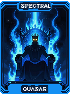 | **Quasar** | Adiciona a Edição Policromática a um Coringa aleatório e destrói todos os outros Coringas. |
| 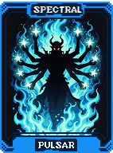 | **Pulsar** | Adiciona a Edição Foil a todas as cartas na sua mão, mas reduz o Tamanho de Mão em 1. |
| 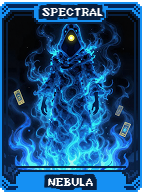 | **Nebulosa** | Adiciona a Edição Holográfica a todas as cartas na sua mão, mas reduz o número de Descartes em 1. |
| 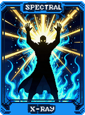 | **Raio Gama** | Transforma todas as cartas na sua mão em Cartas de Diamante, mas define seu dinheiro para $0. |
| 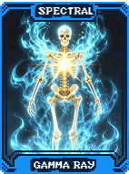 | **Raio X** | Transforma todas as cartas na sua mão em Cartas de Cerâmica, mas remove todos os seus Descartes nesta rodada. |
|  | **Raio Cósmico** | Transforma todas as cartas na sua mão em Cartas de Borracha, mas concede apenas 1 Mão nesta rodada. |
| 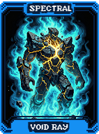 | **Raio Vazio** | Transforma todas as cartas na sua mão em Cartas de Platina, mas destrói todos os seus Coringas. |
|  | **Antimatéria** | Adiciona a Edição Negativa a um Coringa aleatório e define seu dinheiro para $0. |
| 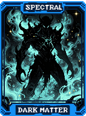 | **Matéria Escura** | Adiciona a Edição Negativa a um consumível aleatório, mas destrói todos os seus Coringas. |
| 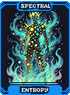 | **Entropia** | Randomiza os ranks de todas as cartas no baralho e ganha $20. |
| 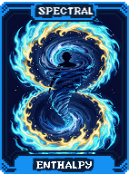 | **Entalpia** | Randomiza os naipes de todas as cartas no baralho e ganha $20. |
| 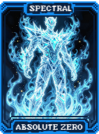 | **Zero Absoluto** | Impede que as cartas do baralho sejam modificadas, mas concede X5 Mult permanentemente. |
| 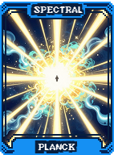 | **Planck** | Define o Tamanho de Mão para 1, mas concede X10 Mult permanentemente. |
| 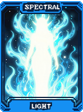 | **Luz** | Remove todos os seus Descartes, mas concede +5 Mãos por rodada. |
| 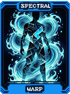 | **Dobra** | Pula o próximo Blind e ganha as Tags, mas não recebe nenhuma recompensa em dinheiro. |
| 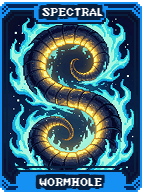 | **Minhoca** | Pula para o próximo Ante, mas define seu dinheiro para $0. |
| 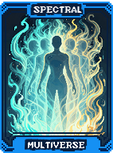 | **Multiverso** | Cria uma cópia de até 2 Coringas selecionados, mas as cópias tornam-se Perecíveis. |
|  | **Paradoxo** | Troca o seu dinheiro atual pela sua pontuação total da rodada anterior (limitado a $100). |
|  | **Singularidade** | Funde dois Coringas selecionados em um só, somando seus efeitos base. |
|  | **Big Bang** | Reinicia a partida do Ante 1, mas mantém todos os Coringas e níveis de mãos atuais. |
| 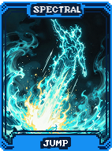 | **Salto** | Salta imediatamente para o Ante 8, mas define seu dinheiro para $0. |
| 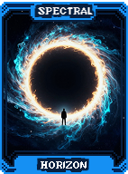 | **Horizonte** | Destrói todas as cartas de Figura no seu baralho e concede +1 espaço de Coringa. |
| 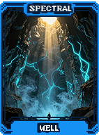 | **Poço** | Destrói todas as cartas Numéricas no seu baralho e concede +1 espaço de Consumível. |
| 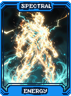 | **Energia** | Transforma todas as cartas na sua mão em Negativas. |
| 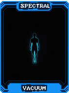 | **Vácuo** | Remove todos os Aprimoramentos e Edições de todas as cartas no baralho e ganha $50. |
| 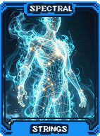 | **Cordas** | Conecta os ranks das cartas (ranks vizinhos contam como sequência com lacuna de 1), mas -2 de Tamanho de Mão. |
| 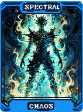 | **Caos** | Randomiza as Edições de todos os seus Coringas atuais. |
| 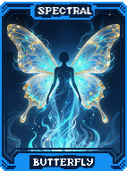 | **Borboleta** | Transforma uma carta selecionada em uma carta aleatória, com Rank e Naipe totalmente novos. |
| 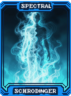 | **Schrodinger** | 50% de chance de dobrar seu dinheiro, 50% de chance de perder todo o seu dinheiro. |
|  | **Heisenberg** | Oculta a pontuação necessária do Blind, mas revela todos os itens da próxima Loja. |
| 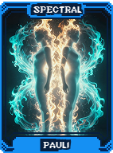 | **Pauli** | Se não houver pares na sua mão atual, ganha $20 imediatamente. |
| 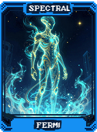 | **Fermi** | Cria um Coringa Alienígena aleatório com a edição Negativa. |
| 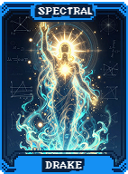 | **Drake** | Mostra 'VITÓRIA GARANTIDA' se a sua mão atual for suficiente para vencer o Blind. |
| 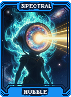 | **Hubble** | Revela a ordem de todas as cartas no seu baralho permanentemente. |
| 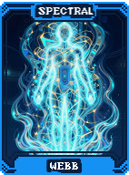 | **Webb** | Revela o efeito e a pontuação de todos os Boss Blinds futuros nesta partida. |
| 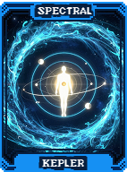 | **Kepler** | Dobra o nível de todas as mãos de poker upadas por Planetas nesta rodada. |
| 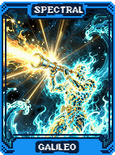 | **Galileu** | Dobra o efeito de todas as cartas de Tarô usadas nesta rodada. |
| 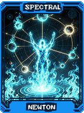 | **Newton** | Cartas jogadas que não pontuarem são descartadas e concedem +1 Mão. |
| 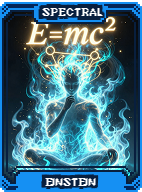 | **Einstein** | Aplica a teoria da relatividade: Converte Fichas em Mult na próxima mão. |
| 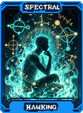 | **Hawking** | Buracos Negros aparecem com muito mais frequência na Loja. |
|  | **Sagan** | Ganha $1 para cada carta no seu baralho que possua um Selo ou Edição. |
|  | **Tyson** | Remove permanentemente o planeta Plutão do jogo e aumenta o nível de todas as outras mãos. |
| 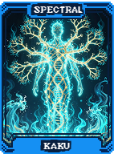 | **Kaku** | Aplica o efeito do Baralho Teoria das Cordas permanentemente. |
| 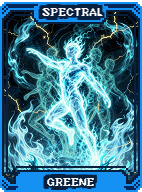 | **Greene** | Cria um Coringa aleatório de uma dimensão paralela. |
| 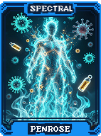 | **Penrose** | Cartas jogadas têm 25% de chance de voltar para a sua mão em vez de serem descartadas. |
| 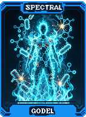 | **Godel** | Torna o próximo Blind impossível de ser vencido normalmente, mas concede uma recompensa massiva. |
| 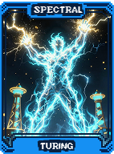 | **Turing** | Uma IA joga a próxima rodada por você, escolhendo as melhores mãos possíveis. |
| 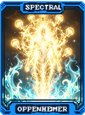 | **Oppenheimer** | Destrói 5 cartas aleatórias, mas concede X10 Mult na próxima mão. |
| 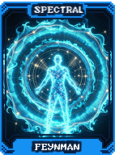 | **Feynman** | Explica a piada: Seus Coringas ganham +10 Mult se você rir. |
| 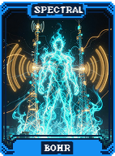 | **Bohr** | As cartas no baralho começam a orbitar (mudam de posição constantemente na mão). |
| 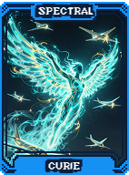 | **Curie** | Todas as suas cartas tornam-se Radioativas (mudam de Rank a cada rodada). |
| 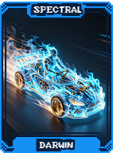 | **Darwin** | Suas cartas evoluem (aumentam o Rank) cada vez que pontuam. |
| 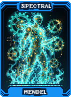 | **Mendel** | Cartas criadas por outras cartas herdam Edições e Aprimoramentos. |
| 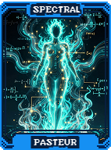 | **Pasteur** | Suas cartas tornam-se Imunes a efeitos de Debuff de Boss Blinds. |
| 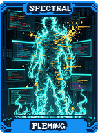 | **Fleming** | Remove todos os efeitos de Debuff atuais de todas as cartas no seu baralho. |
| 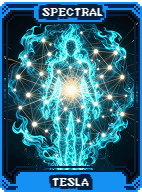 | **Tesla** | Concede Energia ilimitada para todos os seus itens que utilizam cargas. |
| 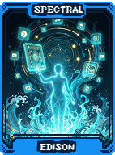 | **Edison** | Cria um Coringa aleatório que você nunca possuiu antes. |
| 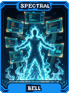 | **Bell** | Permite que você chame um consumível qualquer da coleção imediatamente. |
|  | **Marconi** | Suas cartas transmitem Sinais (cartas iguais no baralho pontuam juntas). |
|  | **Wright** | Suas cartas podem voar (não são afetadas por efeitos negativos que ocorrem no descarte). |
|  | **Ford** | Dobra a sua Velocidade (animações e processamento de pontos acontecem instantaneamente). |
|  | **Babbage** | Realiza cálculos complexos: Garante que a próxima mão pontue o máximo possível. |
|  | **Lovelace** | Aplica uma lógica de Algoritmo ao seu baralho: Cartas são compradas na ordem ideal. |
|  | **Hopper** | Introduz um Bug favorável: 10% de chance de qualquer mão pontuar X100. |
|  | **Berners-Lee** | Conecta todos os seus Coringas: Eles passam a compartilhar e somar seus efeitos. |
|  | **Jobs** | Permite que você toque em qualquer carta para transformá-la em outra aleatória. |
|  | **Gates** | Abre uma Janela de oportunidade: Você pode ver as próximas 5 cartas do baralho. |
|  | **Musk** | Lança um foguete para Marte: Aumenta massivamente o nível da mão Flush. |
|  | **Bezos** | Entrega um Pacote Especial contendo 3 itens aleatórios da Loja. |
|  | **Zuckerberg** | Cria uma Rede Social entre seus Coringas: Eles ganham Mult para cada amigo próximo. |
|  | **Nakamoto** | Seu dinheiro flutua aleatoriamente entre -50% e +50% a cada mão jogada. |
|  | **Vitalik** | Se vencer em 1 mão, ganha $50. Se precisar de mais mãos, perde $20. |
|  | **Armstrong** | Dá um grande passo para a humanidade: Você avança 2 Antes imediatamente. |
|  | **Aldrin** | O segundo homem na Lua: Cria uma cópia exata do seu melhor Coringa. |
|  | **Collins** | Mantém você em Órbita: Seus consumíveis têm 50% de chance de não serem gastos. |
|  | **Gagarin** | O primeiro no Espaço: Concede a você o primeiro Voucher Tier 3 do jogo. |
|  | **Tereshkova** | A primeira mulher no Espaço: Transforma todas as suas Damas em Policromáticas. |
|  | **Laika** | Homenagem à Laika: Seus Coringas de Animais tornam-se Eternos. |
|  | **Ham** | Homenagem ao Ham: Seus Coringas de primatas ganham +100 Fichas permanentemente. |
|  | **Shepard** | Joga Golf no Espaço: Lança sua carta mais fraca para fora do baralho e ganha $10. |
|  | **Glenn** | Completa uma órbita na Terra: Reinicia os níveis de todas as mãos para o nível 1 e ganha $100. |
|  | **Leonov** | Realiza uma Caminhada Espacial: Selecione 2 cartas para flutuarem (serem mantidas) para a próxima rodada. |
|  | **Ride** | Primeira americana no espaço: Concede uma Tag de Cupom e uma Tag de Investimento. |
|  | **Hadfield** | Canta no espaço: Seus Coringas Musicais ganham X2 Mult. |
|  | **Kelly** | Estudo de Gêmeos: Duplica os efeitos de todos os Selos no seu baralho. |
|  | **Pesquet** | Perspectiva da França: Transforma todas as cartas de Copas em Cartas de Cerâmica. |
|  | **Cristoforetti** | Primeiro café no espaço: Suas mãos de poker ganham +5 Mult se jogadas rapidamente. |
|  | **Gerst** | Perspectiva da Alemanha: Transforma todas as cartas de Paus em Cartas de Borracha. |
|  | **Peake** | Perspectiva do Reino Unido: Transforma todas as cartas de Espadas em Cartas de Realeza. |
|  | **Hoshide** | Perspectiva do Japão: Transforma todas as cartas de Ouros em Cartas de Diamante. |
|  | **Yi** | Perspectiva da Coreia: Aumenta o nível das suas 3 mãos mais jogadas em 2 níveis. |
|  | **Yang** | Perspectiva da China: Multiplica a pontuação de todas as suas mãos de 5 cartas por X1.5 . |
|  | **Sharma** | Perspectiva da Índia: Concede $1 por cada Coringa que você possui a cada mão jogada. |
|  | **Al Mansoori** | Perspectiva dos Emirados: Define seu dinheiro para $100 e remove todos os seus Vouchers. |
|  | **Pontes** | Perspectiva do Brasil: Transforma todas as suas cartas em Cartas de Tecido e ganha $15. |
|  | **Vostok** | A Nave Vostok: Garante que você sempre comece a rodada com a mão Flush disponível. |
|  | **Mercury** | A Nave Mercury: Garante que você sempre comece a rodada com a mão Sequência disponível. |
|  | **Gemini** | A Nave Gemini: Garante que você sempre comece a rodada com a mão Dois Pares disponível. |
