# 🔮 Lista Completa de Tarôs (Tarot Cards)

No **Balatro Odyssey**, o baralho de Tarô foi expandido para **100 cartas únicas**, oferecendo uma gama sem precedentes de manipulações para o seu baralho. Abaixo você encontra a lista detalhada de todos os Arcanos.

| Imagem | Nome | Efeito |
| :---: | :--- | :--- |
| 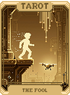 | **O Louco (The Fool)** | Cria o último Tarot ou Planeta usado nesta rodada. |
| 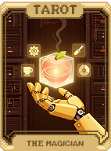 | **O Mago (The Magician)** | Cria 2 cartas com aprimoramento aleatório na sua mão. |
| 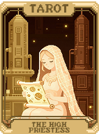 | **A Sacerdotisa (The High Priestess)** | Cria 2 cartas de Planeta aleatórias. |
| 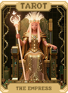 | **A Imperatriz (The Empress)** | Aprimora 2 cartas selecionadas para **Cartas de Rubi** (+15 Multi). |
| 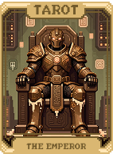 | **O Imperador (The Emperor)** | Cria 2 cartas de Tarô aleatórias. |
| 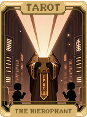 | **O Hierofante (The Hierophant)** | Aprimora 2 cartas selecionadas para **Cartas de Esmeralda** (+50 Fichas). |
| 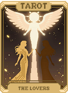 | **Os Amantes (The Lovers)** | Aprimora 1 carta selecionada para **Carta de Tecido** (Cartas de Figura contam como números e vice-versa). |
| 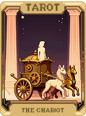 | **A Carruagem (The Chariot)** | Aprimora 1 carta selecionada para **Carta de Borracha** (Pode ser jogada 2 vezes antes de ser destruída). |
| 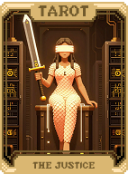 | **A Justiça (The Justice)** | Aprimora 1 carta selecionada para **Carta de Cerâmica** (Chance de auto-destruição). |
| 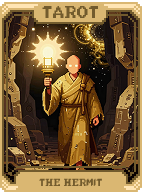 | **O Eremita (The Hermit)** | Dobra seu dinheiro (Máximo de **$20**). |
|  | **A Roda da Fortuna (The Wheel of Fortune)** | **1 em 4** chance de adicionar Edição Holográfica, Policromática ou Brilhante a um Curinga aleatório. |
| 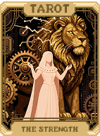 | **A Força (The Strength)** | Aumenta o Rank de até 2 cartas selecionadas em 1. |
| 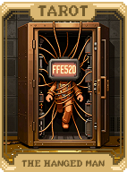 | **O Enforcado (The Hanged Man)** | Remove permanentemente até 2 cartas selecionadas do baralho. |
| 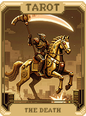 | **A Morte (The Death)** | Transforma a carta à esquerda na carta à direita (Selecione 2). |
| 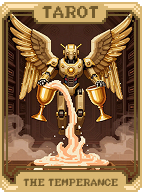 | **A Temperança (The Temperance)** | Dá o valor de venda total de todos os seus Curingas atuais (Máximo de **$50**). |
| 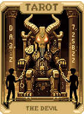 | **O Diabo (The Devil)** | Aprimora 1 carta selecionada para **Carta de Diamante** (Gera dinheiro ao ser jogada). |
| 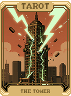 | **A Torre (The Tower)** | Aprimora 1 carta selecionada para **Carta de Platina** (Dura muitas rodadas). |
| 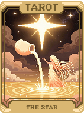 | **A Estrela (The Star)** | Converte até 3 cartas selecionadas para o naipe de **Ouros**. |
| 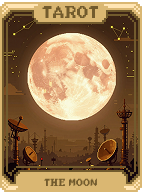 | **A Lua (The Moon)** | Converte até 3 cartas selecionadas para o naipe de **Paus**. |
| 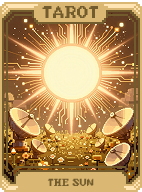 | **O Sol (The Sun)** | Converte até 3 cartas selecionadas para o naipe de **Copas**. |
| 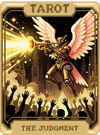 | **O Julgamento (The Judgement)** | Cria um Curinga aleatório (Deve ter espaço livre). |
| 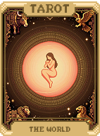 | **O Mundo (The World)** | Converte até 3 cartas selecionadas para o naipe de **Espadas**. |
| 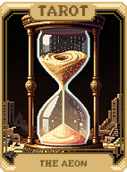 | **O Eon (The Aeon)** | Reinicia o Ante atual para o início. |
| 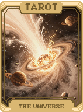 | **O Universo (The Universe)** | Cria uma carta de Planeta para cada tipo de mão de pôquer que você já jogou. |
|  | **O Vazio (The Void)** | Destrói 3 cartas selecionadas e concede **$10**. |
| 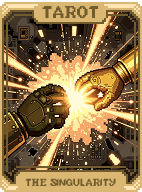 | **A Singularidade (The Singularity)** | Funde 2 cartas selecionadas em uma única carta com ambos os atributos. |
| 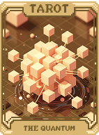 | **O Quantum** | Randomiza o Rank e o Naipe de 3 cartas selecionadas. |
| 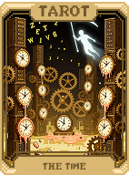 | **O Tempo (The Time)** | Concede **+1 Mão** adicional para o Blind atual. |
| 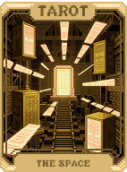 | **O Espaço (The Space)** | Aumenta o **Tamanho da Mão** em +1 para o Blind atual. |
| 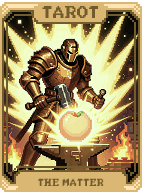 | **A Matéria (The Matter)** | Cria 2 **Cartas de Pedra** na sua mão. |
| 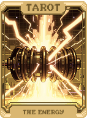 | **A Energia (The Energy)** | Cria 2 **Cartas de Ouro** na sua mão. |
| 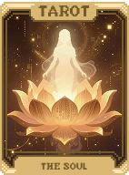 | **A Alma (The Soul)** | Cria um **Curinga Lendário** aleatório (Chance rara). |
| 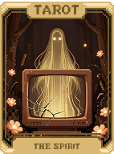 | **O Espírito (The Spirit)** | Cria uma carta **Espectral** aleatória. |
| 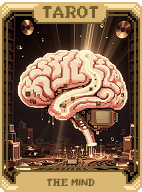 | **A Mente (The Mind)** | Ordena seu baralho inteiro por Rank. |
|  | **O Corpo (The Body)** | Adiciona permanentemente **+50 Fichas** a 2 cartas selecionadas. |
| 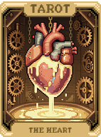 | **O Coração (The Heart)** | Adiciona permanentemente **+10 Multi** a 2 cartas selecionadas. |
| 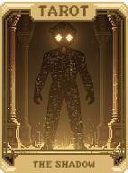 | **A Sombra (The Shadow)** | Aprimora 1 carta selecionada para **Carta de Sombra** (Invisível para Bosses). |
| 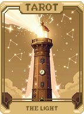 | **A Luz (The Light)** | Aprimora 1 carta selecionada para **Carta de Luz** (Pode ser vista através de cartas viradas). |
| 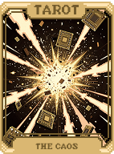 | **O Caos (The Chaos)** | Randomiza completamente a sua mão atual. |
| 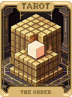 | **A Ordem (The Order)** | Ordena sua mão atual por Naipe. |
| 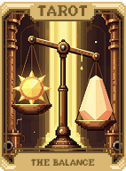 | **O Equilíbrio (The Balance)** | Define seu dinheiro exatamente para **$25**. |
| 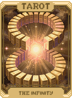 | **O Infinito (The Infinity)** | Adiciona Edição **Policromática** (**X1.5 Multi**) a uma carta selecionada. |
| 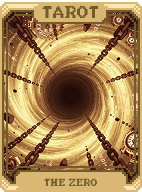 | **O Zero (The Zero)** | Remove a edição (Brilhante, etc.) de um Curinga e ganha **$20**. |
| 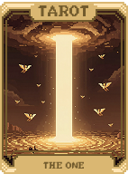 | **O Um (The One)** | Define o Rank de todas as cartas selecionadas para **Ás**. |
| 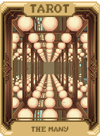 | **Os Muitos (The Many)** | Triplica a carta selecionada no seu baralho (Cria 2 cópias). |
| 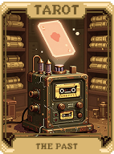 | **O Passado (The Past)** | Cria um Curinga de estilo **Vintage** aleatório. |
| 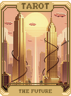 | **O Futuro (The Future)** | Cria um Curinga de estilo **Futurista** aleatório. |
| 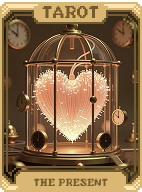 | **O Presente (The Present)** | Cria um Curinga de raridade **Comum** aleatório. |
| 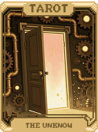 | **O Desconhecido (The Unknown)** | Ativa o efeito de uma carta de Tarô aleatória da lista. |
| 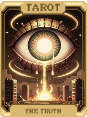 | **A Verdade (The Truth)** | Revela permanentemente todas as cartas no seu baralho. |
| 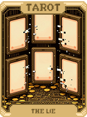 | **A Mentira (The Lie)** | Oculta cartas na mão e ganha **$5** imediatamente. |
| 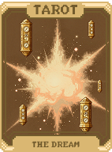 | **O Sonho (The Dream)** | Cria uma **Carta de Sonho** aleatória. |
| 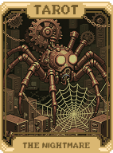 | **O Pesadelo (The Nightmare)** | Cria uma **Carta de Pesadelo** aleatória. |
|  | **A Esperança (The Hope)** | Pula imediatamente para o próximo Ante. |
|  | **O Desespero (The Despair)** | Volta um Ante (Permite farmar mais recursos). |
|  | **O Amor (The Love)** | Duplica todas as cartas de **Copas** na sua mão atual. |
|  | **O Ódio (The Hate)** | Destrói todas as cartas de **Espadas** na sua mão atual. |
|  | **A Guerra (The War)** | Destrói todas as **Cartas de Figura** na sua mão e ganha dinheiro por cada uma. |
|  | **A Paz (The Peace)** | Converte todas as cartas na mão para o naipe mais comum entre elas. |
|  | **A Vida (The Life)** | Revive o último Curinga destruído/vendido nesta partida. |
|  | **A Morte II** | Destrói um Curinga selecionado e ganha **2x** o seu valor de venda. |
|  | **O Rei (The King)** | Cria 2 **Reis** aleatórios na sua mão. |
|  | **A Rainha (The Queen)** | Cria 2 **Damas** aleatórias na sua mão. |
|  | **O Valete (The Jack)** | Cria 2 **Valetes** aleatórios na sua mão. |
|  | **O Ás (The Ace)** | Cria 2 **Ases** aleatórios na sua mão. |
|  | **O Curinga (The Joker)** | Cria uma carta de consumível aleatória. |
|  | **O Mercador (The Merchant)** | Rerrola gratuitamente todos os itens da loja atual. |
|  | **O Ladrão (The Thief)** | Permite "roubar" um item da loja sem custo (Consome o Tarô). |
|  | **O Guarda (The Knight)** | Protege uma carta selecionada de ser destruída por 3 rodadas. |
|  | **O Sábio (The Sage)** | Aumenta o nível de uma mão de pôquer aleatória. |
|  | **O Louco II** | Cria uma cópia do último consumível utilizado nesta partida. |
|  | **O Arquiteto (The Architect)** | Adiciona permanentemente **+1 Slot de Mão**. |
|  | **O Construtor (The Builder)** | Adiciona permanentemente **+1 Slot de Descarte**. |
|  | **O Destruidor (The Destroyer)** | Remove 1 Slot de Mão mas concede **$20**. |
|  | **O Criador (The Creator)** | Cria uma carta de qualquer tipo aleatoriamente. |
|  | **O Observador (The Observer)** | Revela qual será o próximo Boss Blind da partida. |
|  | **O Viajante (The Traveler)** | Troca o Boss Blind atual por outro aleatório. |
|  | **O Peregrino (The Pilgrim)** | Troca a Tag de pulo atual por outra aleatória. |
|  | **O Monge (The Monk)** | Remove permanentemente o efeito de **Debuff** de todas as cartas na mão. |
|  | **O Guerreiro (The Warrior)** | Concede **+100 Fichas** à próxima mão jogada. |
|  | **O Mago II** | Concede **+20 Multi** à próxima mão jogada. |
|  | **O Ladino (The Rogue)** | Concede **X2 Multi** à próxima mão jogada. |
|  | **O Bardo (The Bard)** | Faz com que a próxima mão jogada seja reativada uma vez. |
|  | **O Druida (The Druid)** | Aprimora 1 carta selecionada para **Carta de Planta** (Sinergia com Natureza). |
|  | **O Paladino (The Paladin)** | Aprimora 1 carta selecionada para **Carta Sagrada**. |
|  | **O Necromante (The Necromancer)** | Aprimora 1 carta selecionada para **Carta Morta-Viva**. |
|  | **O Bruxo (The Warlock)** | Aprimora 1 carta selecionada para **Carta Maldita**. |
|  | **O Feiticeiro (The Sorcerer)** | Aprimora 1 carta selecionada para **Carta Mágica**. |
|  | **O Alquimista II** | Transforma uma carta selecionada em **Carta de Diamante**. |
|  | **O Ferreiro (The Blacksmith)** | Transforma uma carta selecionada em **Carta de Borracha**. |
|  | **O Vidreiro (The Glassblower)** | Transforma uma carta selecionada em **Carta de Cerâmica**. |
|  | **O Pedreiro (The Mason)** | Transforma uma carta selecionada em **Carta de Platina**. |
|  | **O Sortudo (The Lucky)** | Transforma uma carta selecionada em **Carta de Madeira**. |
|  | **O Selvagem (The Savage)** | Transforma uma carta selecionada em **Carta de Tecido**. |
|  | **O Multiplicador (The Multiplier)** | Transforma uma carta selecionada em **Carta Multi**. |
|  | **O Bônus (The Bonus)** | Transforma uma carta selecionada em **Carta de Esmeralda**. |
|  | **O Duplicador (The Duplicator)** | Cria uma cópia exata de uma carta selecionada na sua mão. |
|  | **O Removedor (The Remover)** | Remove permanentemente uma carta do baralho. |
|  | **O Transformador (The Transformer)** | Transforma a carta selecionada em outra carta aleatória. |
|  | **O Melhorador (The Improver)** | Aplica um aprimoramento aleatório a uma carta selecionada. |
