# 🎟️ Lista de Cupons (Vouchers)

Os Cupons (Vouchers) fornecem melhorias permanentes para o restante da sua partida. Eles são organizados em pares: ao comprar o primeiro (**Tier 1**), a sua versão evoluída (**Tier 2**) torna-se disponível para aparecer nas lojas futuras.

| ID | Imagem T1 | Nome T1 | Efeito T1 | Imagem T2 | Nome T2 | Efeito T2 |
| :--- | :---: | :--- | :--- | :---: | :--- | :--- |
| 1 | 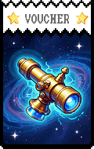 | **Telescópio** | Planetas 2x mais comuns na Loja |  | **Observatório** | Planetas 4x mais comuns na Loja |
| 2 |  | **Asteroide** | Tarôs 2x mais comuns na Loja |  | **Meteoro** | Tarôs 4x mais comuns na Loja |
| 3 | 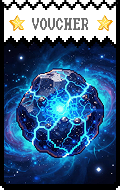 | **Cometa** | Espectrais podem aparecer na Loja |  | **Estrela Cadente** | Espectrais 2x mais comuns na Loja |
| 4 | 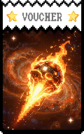 | **Satélite** | +1 Slot de Consumível |  | **Estação Espacial** | +1 Slot de Consumível |
| 5 |  | **Foguete** | +1 Tamanho de Mão | 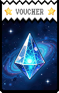 | **Ônibus Espacial** | +2 Tamanho de Mão |
| 6 |  | **Propulsor** | +1 Descarte por rodada | 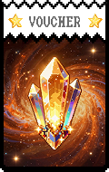 | **Separação** | +1 Descarte por rodada |
| 7 |  | **Tanque de Combustível** | +$10 Limite de Juros | 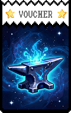 | **Núcleo** | +$10 Limite de Juros |
| 8 | 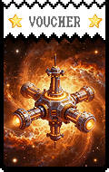 | **Painel Solar** | +$1 por mão jogada no final da rodada | 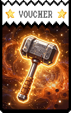 | **Esfera de Dyson** | +$1 por mão jogada no final da rodada |
| 9 |  | **Reciclador** | Reduz custo de Reroll |  | **Conversor** | Reduz custo de Reroll em $2 |
| 10 | 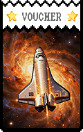 | **Matéria Escura** | Coringas Negativos mais comuns | 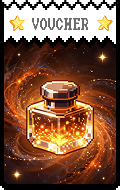 | **Energia Escura** | Coringas Negativos 4x mais comuns |
| 11 | 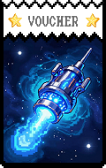 | **Bit Quântico** | Chance de dobrar efeitos de cartas |  | **Qubit** | Garante efeitos duplicados |
| 12 |  | **Cápsula do Tempo** | Permite revisitar Blinds passados | 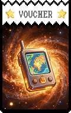 | **Máquina do Tempo** | Permite jogar o Blind atual 2 vezes |
| 13 | 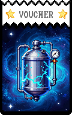 | **Motor de Dobra** | +$5 ao pular Blind | 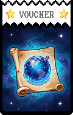 | **Hiperespaço** | +10 ao pular Blind |
| 14 | 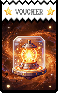 | **Escudo** | Previne a derrota uma vez |  | **Campo de Força** | Previne a derrota e ganha $20 |
| 15 |  | **Laser** | +50 Fichas para cada Carta de Platina |  | **Destruidor** | +100 Fichas para cada Carta de Platina |
| 16 | 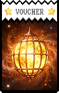 | **Chapeamento de Ouro** | Cartas de Platina dão bônus | 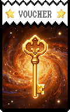 | **Toque de Midas** | Cartas de Platina dão $5 ao pontuar |
| 17 | 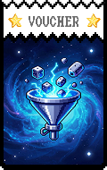 | **Soprador** | Cartas de Cerâmica não quebram |  | **Forja de Cristal** | Cartas de Cerâmica dão X3 Mult |
| 18 | 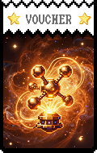 | **Serralheria** | Cartas de Borracha dão 2.5x Mult | 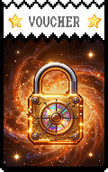 | **Titânio** | Cartas de Borracha dão 3x Mult |
| 19 |  | **Amuleto** | Cartas de Sorte dão 2x mais Mult | 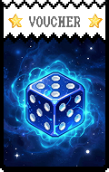 | **Pé de Coelho** | Cartas de Sorte sempre acertam |
| 20 | 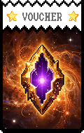 | **Clonagem** | +1 Slot de carta na Loja | 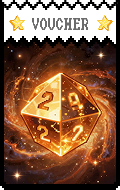 | **Replicador** | +1 Slot de carta na Loja |
| 21 |  | **Mercado Negro** | Coringas Raros 2x mais comuns |  | **Contrabando** | 1% de chance de Coringas Lendários |
| 22 | 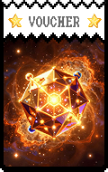 | **Cupom** | Itens da Loja custam 50% menos | 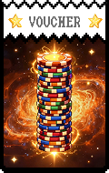 | **Liquidação** | Itens da Loja custam 75% menos |
| 23 | 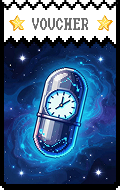 | **Investimento** | Ganha $5 ao comprar um Coringa |  | **Fundo de Proteção** | Ganha $10 ao comprar um Coringa |
| 24 |  | **Seguro** | Perdoa $10 de dívida na Loja |  | **Resgate** | Perdoa $20 de dívida na Loja |
| 25 | 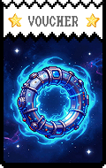 | **Biblioteca** | +1 Espaço de Tarô na Loja |  | **Arquivos** | +2 Espaços de Tarô na Loja |
| 26 | 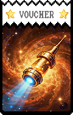 | **Obs. Espaço Profundo** | +1 Espaço de Planeta na Loja |  | **Planetário** | +2 Espaços de Planetas na Loja |
| 27 |  | **Laboratório** | +1 Espaço de Espectral na Loja |  | **Centro de Pesquisa** | +2 Espaços de Espectrais na Loja |
| 28 | 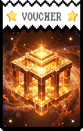 | **Cassino** | Custo de Reroll reduzido |  | **Apostador Alto** | Custo de Reroll muito reduzido |
| 29 | 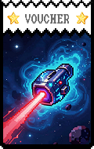 | **Banco** | Juros aumentados no final da rodada | 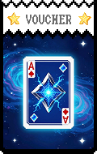 | **Cofre** | Ganha 15% de juros pagos |
| 30 |  | **Paraíso Fiscal** | $10 de juros extras | 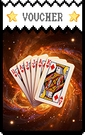 | **Offshore** | $20 de juros extras |
| 31 | 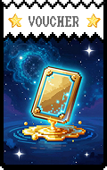 | **Recrutador** | Coringas Incomuns aparecem mais | 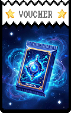 | **Caça-Talentos** | Coringas Raros aparecem mais |
| 32 | 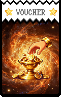 | **Batedor** | Revela o próximo Boss Blind | 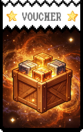 | **Desbravador** | Revela todos os Bosses do Ante |
| 33 | 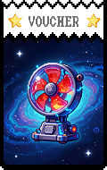 | **Cartógrafo** | Melhora a qualidade das cartas na Loja | 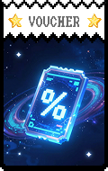 | **Explorador** | Cartas Standard na Loja são melhores |
| 34 | 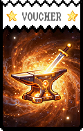 | **Mecânico** | Cartas Aprimoradas aparecem mais |  | **Engenheiro** | Coringas vêm com Edições mais frequentemente |
| 35 | 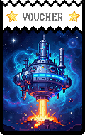 | **Artista** | Edições de Coringas são gratuitas |  | **Obra-Prima** | Todos os Coringas da Loja têm Edições |
| 36 | 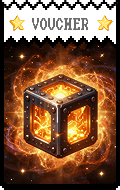 | **Malabarista** | +1 Tamanho de Mão | 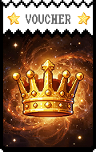 | **Acrobata** | +2 Tamanho de Mão |
| 37 | 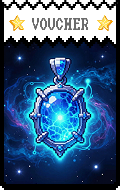 | **Mágico** | Cartas de Tarô dão bônus de dinheiro | 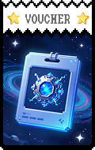 | **Ilusionista** | Cartas de Tarô podem ser usadas 2 vezes |
| 38 |  | **Apostador** | Rerolls dão chance de ganhar $5 | 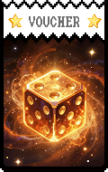 | **Profissional** | Rerolls dão chance de ganhar Coringas |
| 39 | 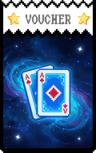 | **Colecionador** | Aumenta o multiplicador baseado na coleção | 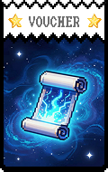 | **Curador** | Aumenta o multiplicador baseado na coleção |
| 40 | 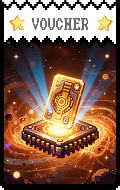 | **Minimalista** | +20 Multi | 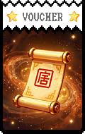 | **Essencialista** | +30 Multi |
| 41 | 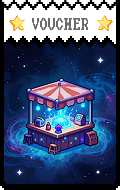 | **Maximalista** | +100 Fichas |  | **Acumulador** | +200 Fichas |
| 42 |  | **Astrônomo** | Planetas na loja são grátis |  | **Cosmólogo** | Planetas podem ser usados na Loja |
| 43 |  | **Alquimista** | Transmuta cartas em Ouro |  | **Transmutador** | Transmuta cartas em Diamante |
| 44 |  | **Arqueólogo** | Encontra itens enterrados nos Blinds |  | **Historiador** | Itens antigos (Vintage) aparecem mais |
| 45 |  | **Futurista** | Reduz o Ante em 1 |  | **Visionário** | Novos Curingas dão X1.5 Multi |
| 46 |  | **Otimista** | Probabilidades sempre a seu favor |  | **Utopista** | Coringas Lendários aparecem na Loja |
| 47 |  | **Pessimista** | Inimigos têm 25% menos vida |  | **Distópico** | Inimigos têm 50% menos vida |
| 48 |  | **Realista** | Lojas sempre têm o que você precisa |  | **Pragmático** | Itens inúteis são removidos das Lojas |
| 49 |  | **Sonhador** | Ganha bônus ao dormir (pular rodada) |  | **Lúcido** | Ganha bônus dobrado ao pular rodada |
| 50 |  | **Semente** | Planta cartas que crescem em edições |  | **Árvore** | Cartas plantadas dão Coringas Negativos |
| 51 |  | **Ímã** | Atrai cartas iguais para sua mão |  | **Eletroímã** | Atrai cartas iguais para sua mão |
| 52 |  | **Lente** | Permite ver o topo do baralho |  | **Microscópio** | Permite ver as próximas 10 cartas |
| 53 |  | **Prisma** | Todos os naipes dão bônus X1.1 |  | **Espectro** | Todos os naipes dão bônus X1.25 |
| 54 |  | **Bigorna** | Melhora o bônus de Cartas de Platina |  | **Martelo** | Cartas de Platina dão +100 Fichas |
| 55 |  | **Pena** | +1 Descarte por rodada |  | **Tinteiro** | +1 Descarte por rodada |
| 56 |  | **Bússola** | Revela cartas ocultas |  | **GPS** | Revela tudo no baralho e loja |
| 57 |  | **Mapa** | +1 escolha em Pacotes |  | **Atlas** | +2 escolhas em Pacotes |
| 58 |  | **Chave** | Abre baús trancados |  | **Chave Mestra** | Abre baús trancados |
| 59 |  | **Cadeado** | Pode trancar Coringas |  | **Caixa Forte** | Coringas trancados dão bônus |
| 60 |  | **Dados** | Custo de Reroll reduzido em $1 |  | **D20** | Custo de Reroll reduzido em $2 |
| 61 |  | **Ficha** | +50 Fichas de bônus base |  | **Pilha** | +100 Fichas de bônus base |
| 62 |  | **Multi** | +5 Multi de bônus base |  | **Mega Multi** | +10 Multi de bônus base |
| 63 |  | **Xmulti** | X1.1 Multi Base |  | **Giga Multi** | X1.5 Multi Base |
| 64 |  | **Coringa** | +1 Slot de Curinga |  | **Circo** | +2 Slots de Curinga |
| 65 |  | **Carta** | +1 Slot de carta na Loja |  | **Baralho** | +2 Slots de cartas na Loja |
| 66 |  | **Pacote** | +1 Slot de pacote na Loja |  | **Caixa** | +2 Slots de pacotes na Loja |
| 67 |  | **Cupom de Ouro** | Itens da Loja custam 50% menos |  | **Bilhete de Ouro** | Todos os itens da loja são $1 |
| 68 |  | **Parceiro** | Copiar Coringas custa 50% menos |  | **VIP** | Rerolls de Pacotes são gratuitos |
| 69 |  | **Membro** | Desconto de $2 na loja |  | **Fundador** | Desconto de $5 na loja |
| 70 |  | **Aprendiz** | +1 Slot de Consumível |  | **Mestre** | +2 Slots de Consumível |
| 71 |  | **Novato** | Bônus de experiência |  | **Veterano** | Blinds precisam de 10% menos pontos |
| 72 |  | **Escudeiro** | Ganha Armadura ao vencer |  | **Cavaleiro** | Começa com Armadura |
| 73 |  | **Peão** | (2-5) dão +10 Fichas |  | **Torre** | (2-5) dão +5 Multi |
| 74 |  | **Bispo** | Realeza dão X1.2 Multi |  | **Rei** | (6-9) dão +20 Fichas |
| 75 |  | **Rainha** | Realeza dão +10 Fichas |  | **Imperatriz** | Realeza dão +20 Fichas |
| 76 |  | **Ás** | Ases dão +20 Fichas |  | **Deus** | Ases dão X2 Multi |
| 77 |  | **Bufão** | Curingas dão +5 Multi |  | **Lobo** | Curingas dão +10 Multi |
| 78 |  | **Mímico** | Copia o efeito do primeiro Voucher |  | **Doppelganger** | Copia o efeito de todos os Vouchers |
| 79 |  | **Espelho Mágico** | Reflete efeitos negativos |  | **Portal** | Pula para o final do Ante |
| 80 |  | **Sombra** | Cartas com Debuff pontuam |  | **Escuridão** | Cartas Negativas dão X1.5 Multi |
| 81 |  | **Luz** | Cartas sem aprimoramento dão +5 Fichas |  | **Brilho** | Cartas sem aprimoramento dão +10 Fichas |
| 82 |  | **Fogo** | Cartas pontuadas dão +2 Multi |  | **Inferno** | Cartas pontuadas dão +5 Multi |
| 83 |  | **Gelo** | Cartas pontuadas não são consumidas |  | **Zero Absoluto** | Cartas pontuadas dão +5 Multi |
| 84 |  | **Vento** | Descartes baralham a mão e dão $1 |  | **Furacão** | Descartes baralham o baralho todo |
| 85 |  | **Terra** | Cartas de rank 2-10 dão +5 Fichas |  | **Montanha** | Cartas de rank 2-10 dão +10 Fichas |
| 86 |  | **Água** | Flushes dão +1 Multi |  | **Oceano** | Flushes dão +5 Multi |
| 87 |  | **Relâmpago** | Começa com 1 Energia |  | **Tempestade** | Começa com Energia máxima |
| 88 |  | **Metal** | Cartas de Platina dão +10 Fichas |  | **Liga** | Cartas de Platina dão +50 Fichas |
| 89 |  | **Madeira** | Cartas de Madeira dão chance de $1 |  | **Floresta** | Cartas de Madeira sempre dão $1 |
| 90 |  | **Plástico** | Cartas de Plástico não quebram |  | **Polímero** | Cartas de Plástico dão X1.1 Multi |
| 91 |  | **Borracha** | Cartas de Borracha dão +1 Multi |  | **Pneu** | Cartas de Borracha dão +5 Multi |
| 92 |  | **Cerâmica** | Cartas de Cerâmica chance de $1 |  | **Vaso** | Cartas de Cerâmica dão $1 |
| 93 |  | **Pano** | Cartas de Pano dão +10 Fichas |  | **Tapeçaria** | Cartas de Pano dão +50 Fichas |
| 94 |  | **Papel** | Cartas de Papel dão +2 Fichas |  | **Origami** | Cartas de Papel são Coringas |
| 95 |  | **Pedra** | Cartas de Pedra dão X1.5 Mult |  | **Rocha** | Cartas de Pedra dão X2 Mult |
| 96 |  | **Vidro** | Cartas de Vidro dão +100 Fichas |  | **Janela** | Cartas de Vidro dão +200 Fichas |
| 97 |  | **Diamante** | Habilita Cartas de Diamante |  | **Joalheria** | Cartas de Diamante dão +$5 |
| 98 |  | **Rubi** | Habilita Cartas de Rubi |  | **Gema** | Cartas de Rubi dão +20 Multi |
| 99 |  | **Esmeralda** | Habilita Cartas de Esmeralda |  | **Cristal** | Cartas de Esmeralda dão +50 Fichas |
| 100 |  | **Platina** | Habilita Cartas de Platina |  | **Irídio** | Cartas de Platina dão X5 Multi |
